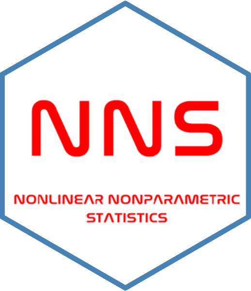

[](https://github.com/OVVO-Financial/NNS/commits/NNS-Beta-Version)   [](https://www.gnu.org/licenses/gpl-3.0.en.html)

<h2 style="margin: 0; padding: 0; border: none; height: 40px;"></h2>

# NNS
Nonlinear nonparametric statistics using partial moments. Partial moments are the [elements of variance](https://www.linkedin.com/pulse/elements-variance-fred-viole) and [asymptotically approximate the area of f(x)](https://doi.org/10.2139/ssrn.2186471). These robust statistics provide the basis for nonlinear analysis while retaining linear equivalences.


NNS offers: 
  - Numerical Integration & Numerical Differentiation
  - Partitional & Hierarchial Clustering
  - Nonlinear Correlation & Dependence
  - Causal Analysis
  - Nonlinear Regression & Classification
  - ANOVA
  - Seasonality & Autoregressive Modeling
  - Normalization 
  - Stochastic Dominance
  - Advanced Monte Carlo Sampling


Companion R-package and datasets to: 
#### Viole, F. and Nawrocki, D. (2013) "*Nonlinear Nonparametric Statistics: Using Partial Moments*" (ISBN: 1490523995)


#### For a quantitative finance implementation of NNS, see [OVVO Labs](https://www.ovvolabs.com)


#### For more hands-on examples, see [NNS Examples](https://github.com/OVVO-Financial/NNS/blob/NNS-Beta-Version/examples/index.md)


## Current Version
Current [](https://cran.r-project.org/package=NNS) CRAN version is  [](https://www.r-pkg.org/badges/version/NNS)

## Installation
[](https://cran.r-project.org/package=NNS) requires [](https://cran.r-project.org/).  See https://cran.r-project.org/ or [](https://cran.r-project.org/package=installr) for upgrading to latest R release.

```r
library(remotes); remotes::install_github('OVVO-Financial/NNS', ref = "NNS-Beta-Version")
```
or via CRAN
```r
install.packages('NNS')
```

## Examples
Please see https://github.com/OVVO-Financial/NNS/blob/NNS-Beta-Version/examples/index.md for basic partial moments equivalences and hands-on statistics, machine learning and econometrics examples.


## Citation
```
@Manual{,
    title = {NNS: Nonlinear Nonparametric Statistics},
    author = {Fred Viole},
    year = {2016},
    note = {R package version 10.9.3},
    url = {https://CRAN.R-project.org/package=NNS},
  }
```

## Thank you for your interest in NNS!


