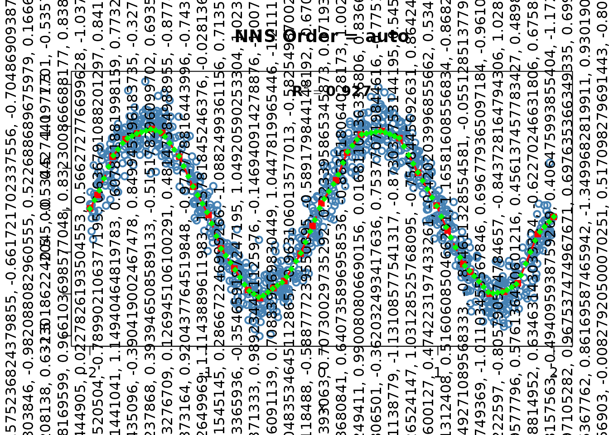
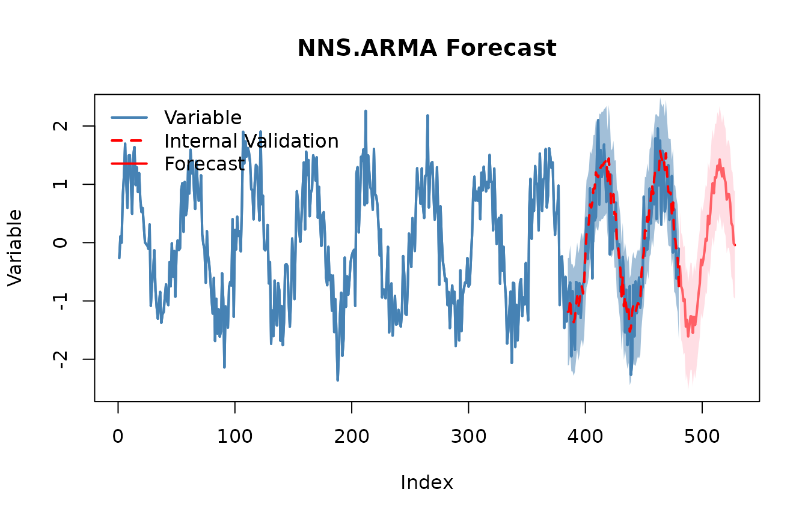

# Getting Started with NNS: Overview

``` r

# Prereqs (uncomment if needed):
# install.packages("NNS")

library(NNS)
```

## Orientation

**Goal.** A complete, hands‑on curriculum for Nonlinear Nonparametric
Statistics (NNS) using **partial moments**. Each section blends
narrative intuition, precise math, and executable code.

**Structure.** 1. Foundations — partial moments & variance decomposition
2. Descriptive & distributional tools 3. Dependence & nonlinear
association 4. Normalization & Rescaling 5. Hypothesis testing, ANOVA &
Stochastic Superiority 6. Regression, boosting, stacking & causality 7.
Time series & forecasting 8. Simulation (max‑entropy) & Monte Carlo 9.
Portfolio & stochastic dominance

**Notation.** For a random variable $`X`$ and threshold/target $`t`$,
the population $`n`$‑th **partial moments** are defined as:

``` math
\operatorname{LPM}(n,t,X) 
= \int_{-\infty}^{t} (t-x)^{n} \, dF_X(x),
\qquad
\operatorname{UPM}(n,t,X) 
= \int_{t}^{\infty} (x-t)^{n} \, dF_X(x).
```

The **empirical** estimators replace $`F_X`$ with the empirical CDF
$`\hat F_n`$ (or, equivalently, use indicator functions):

``` math
\widehat{\operatorname{LPM}}_n(t;X) = \frac{1}{n} \sum_{i=1}^n (t-x_i)^n \, \mathbf{1}_{\{x_i \le t\}},
\qquad
\widehat{\operatorname{UPM}}_n(t;X) = \frac{1}{n} \sum_{i=1}^n (x_i-t)^n \, \mathbf{1}_{\{x_i > t\}}.
```

These correspond to integrals over the measurable subsets
$`\{X \le t\}`$ and $`\{X > t\}`$ in a $`\sigma`$‑algebra; the empirical
sums are discrete analogues of Lebesgue integrals.

------------------------------------------------------------------------

## 1. Foundations — Partial Moments & Variance Decomposition

### 1.1 Why partial moments

- Classical variance treats upside and downside symmetrically. Partial
  moments separate them, allowing **asymmetric risk/reward** analysis
  around a chosen target $`t`$ (often the mean or a benchmark).
- At $`t=\mu_X`$:
  ``` math
  \operatorname{Var}(X) = \operatorname{UPM}(2,\mu_X,X) + \operatorname{LPM}(2,\mu_X,X)\quad\text{(exact empirical identity)}.
  ```
  This **is not** the same as splitting conditional variances around a
  threshold; partial moments use a *global* reference, preserving the
  between‑group contribution.

### 1.2 Core functions and headers

- `LPM(degree, target, variable)`
- `UPM(degree, target, variable)`

### 1.3 Code: variance decomposition & CDF

``` r

set.seed(42)

# Normal sample
y <- rnorm(3000)
mu <- mean(y)
L2 <- LPM(2, mu, y); U2 <- UPM(2, mu, y)
cat(sprintf("LPM2 + UPM2 = %.6f vs var(y)=%.6f\n", (L2+U2)*(length(y) / (length(y) - 1)), var(y)))
```

    ## LPM2 + UPM2 = 1.011889 vs var(y)=1.011889

``` r

# Empirical CDF via LPM.ratio(0, t, x)
for (t in c(-1,0,1)) {
  cdf_lpm <- LPM.ratio(0, t, y)
  cat(sprintf("CDF at t=%+.1f : LPM.ratio=%.4f | empirical=%.4f\n", t, cdf_lpm, mean(y<=t)))
}
```

    ## CDF at t=-1.0 : LPM.ratio=0.1633 | empirical=0.1633
    ## CDF at t=+0.0 : LPM.ratio=0.5043 | empirical=0.5043
    ## CDF at t=+1.0 : LPM.ratio=0.8480 | empirical=0.8480

``` r

# Asymmetry on a skewed distribution
z <- rexp(3000)-1; mu_z <- mean(z)
cat(sprintf("Skewed z: LPM2=%.4f, UPM2=%.4f (expect imbalance)\n", LPM(2,mu_z,z), UPM(2,mu_z,z)))
```

    ## Skewed z: LPM2=0.2780, UPM2=0.7682 (expect imbalance)

**Interpretation.** The equality `LPM2 + UPM2 == var(x)` (Bessel
adjustment used) holds because deviations are measured against the
*global* mean. `LPM.ratio(0, t, x)` constructs an empirical CDF directly
from partial‑moment counts.

------------------------------------------------------------------------

## 2. Descriptive & Distributional Tools

### 2.1 Higher moments from partial moments

Define asymmetric analogues of skewness/kurtosis using
$`\operatorname{UPM}_3`$, $`\operatorname{LPM}_3`$ (and degree 4),
yielding robust tail diagnostics without parametric assumptions.

**Header.**

- `NNS.moments(x)`

``` r

M <- NNS.moments(y)
M
```

    ## $mean
    ## [1] -0.0114498
    ## 
    ## $variance
    ## [1] 1.011552
    ## 
    ## $skewness
    ## [1] -0.007412142
    ## 
    ## $kurtosis
    ## [1] 0.06723772

### 2.2 Mode estimation (no bin‑or‑bandwidth angst)

**Header.**

- `NNS.mode(x)`

``` r

set.seed(23)
multimodal <- c(rnorm(1500,-2,.5), rnorm(1500,2,.5))
NNS.mode(multimodal,multi = TRUE)
```

    ## [1] -2.049405  1.987674

### 2.3 CDF tables via LPM ratios

**Headers.**

- `LPM.ratio(degree = 0, target, variable)` (empirical CDF when
  `degree=0`)
- `UPM.ratio(degree = 0, target, variable)`
- `LPM.VaR(p, degree, variable)` (quantiles via partial‑moment CDFs)
- `UPM.VaR(p, degree, variable)`

``` r

qgrid <- LPM.VaR(seq(0.05,0.95,.1),0,z) # equivalent to quantile(z,probs = seq(0.05,0.95,by=0.1))
CDF_tbl <- data.frame(threshold = as.numeric(qgrid), CDF = LPM.ratio(0,qgrid,z))
CDF_tbl
```

    ##      threshold  CDF
    ## 1  -0.94052127 0.05
    ## 2  -0.83748109 0.15
    ## 3  -0.71317882 0.25
    ## 4  -0.57443327 0.35
    ## 5  -0.41017671 0.45
    ## 6  -0.20424962 0.55
    ## 7   0.06850182 0.65
    ## 8   0.41462712 0.75
    ## 9   0.94307172 0.85
    ## 10  2.09633977 0.95

------------------------------------------------------------------------

## 3. Dependence & Nonlinear Association

### 3.1 Why move beyond Pearson $`r`$

Pearson captures linear monotone relationships. Many structures
(U‑shapes, saturation, asymmetric tails) produce near‑zero $`r`$ despite
strong dependence. Partial‑moment dependence metrics respond to such
structure.

**Headers.**

- `Co.LPM(degree_lpm, x, y, target_x, target_y, degree_y)` /
  `Co.UPM(...)` (co‑partial moments)
- `PM.matrix(LPM_degree, UPM_degree, target=NULL, variable, pop_adj=TRUE)`
- `NNS.dep(x, y)` (scalar dependence coefficient)
- `NNS.copula(X, target=NULL, continuous=TRUE, plot=FALSE, independence.overlay=FALSE)`

### 3.2 Code: nonlinear dependence

``` r

set.seed(1)
x <- runif(2000,-1,1)
y <- x^2 + rnorm(2000, sd=.05)
cat(sprintf("Pearson r = %.4f\n", cor(x,y)))
```

    ## Pearson r = 0.0006

``` r

cat(sprintf("NNS.dep  = %.4f\n", NNS.dep(x,y)$Dependence))
```

    ## NNS.dep  = 0.7097

``` r

X <- data.frame(a=x, b=y, c=x*y + rnorm(2000, sd=.05))
pm <- PM.matrix(1, 1, target = "means", variable=X, pop_adj=TRUE)
pm
```

    ## $cupm
    ##            a          b          c
    ## a 0.17384174 0.05668152 0.10450858
    ## b 0.05668152 0.05566363 0.04414923
    ## c 0.10450858 0.04414923 0.07529373
    ## 
    ## $dupm
    ##              a          b            c
    ## a 0.0000000000 0.05675501 0.0005598221
    ## b 0.0143108307 0.00000000 0.0036839026
    ## c 0.0004239566 0.04430691 0.0000000000
    ## 
    ## $dlpm
    ##              a           b            c
    ## a 0.0000000000 0.014310831 0.0004239566
    ## b 0.0567550147 0.000000000 0.0443069142
    ## c 0.0005598221 0.003683903 0.0000000000
    ## 
    ## $clpm
    ##            a           b           c
    ## a 0.16803827 0.014485430 0.102709867
    ## b 0.01448543 0.037120650 0.003051617
    ## c 0.10270987 0.003051617 0.074865823
    ## 
    ## $cov.matrix
    ##              a             b            c
    ## a 0.3418800141  0.0001011068  0.206234664
    ## b 0.0001011068  0.0927842833 -0.000789973
    ## c 0.2062346637 -0.0007899730  0.150159552

``` r

cop <- NNS.copula(X, continuous=TRUE, plot=FALSE)
cop
```

    ## [1] 0.5692785

### 3.3 Code: copula

``` r

# Data
set.seed(123); x = rnorm(100); y = rnorm(100); z = expand.grid(x, y)

# Plot
rgl::plot3d(z[,1], z[,2], Co.LPM(0, z[,1], z[,2], z[,1], z[,2]), col = "red")

# Uniform values
u_x = LPM.ratio(0, x, x); u_y = LPM.ratio(0, y, y); z = expand.grid(u_x, u_y)

# Plot
rgl::plot3d(z[,1], z[,2], Co.LPM(0, z[,1], z[,2], z[,1], z[,2]), col = "blue")
```

**Interpretation.** `NNS.dep` remains high for curved relationships;
`PM.matrix` collects co‑partial moments across variables; `NNS.copula`
summarizes higher‑dimensional dependence using partial‑moment ratios.
Copulas are returned and evaluated via `Co.LPM` functions.

------------------------------------------------------------------------

## 4. Normalization and Rescaling

NNS provides two main tools for scaling data while preserving rank
structure and distributional shape. Both operate via deterministic
affine transformations.

### 4.1 Normalization

[`NNS.norm()`](https://OVVO-Financial.github.io/NNS/reference/NNS.norm.md)
rescales variables to a common magnitude while preserving distributional
structure. The method can be **linear** (all variables forced to have
the same mean) or **nonlinear** (using dependence weights to produce a
more nuanced scaling). In the nonlinear case, the degree of association
between variables influences the final normalized values.

**Header.**

- `NNS.norm(x, linear=TRUE, chart.type = NULL)`

``` r

A <- rnorm(100, mean = 0, sd = 1)
B <- rnorm(100, mean = 0, sd = 5)
C <- rnorm(100, mean = 10, sd = 1)
D <- rnorm(100, mean = 10, sd = 10)

X <- data.frame(A, B, C, D)

# Linear scaling
lin_norm <- NNS.norm(X, linear = TRUE, chart.type=NULL, location=NULL)
```

**Interpretation.**
[`NNS.norm()`](https://OVVO-Financial.github.io/NNS/reference/NNS.norm.md)
brings variables to a common scale without distorting their
distributional shape. Linear mode equalizes means; nonlinear mode
additionally weights each variable by its dependence with others, so
more correlated variables exert greater influence on the final scaling.

### 4.2 Risk‑neutral rescale (pricing context)

[`NNS.rescale()`](https://OVVO-Financial.github.io/NNS/reference/NNS.rescale.md)
performs one‑dimensional affine transformations.

**Header.**

- `NNS.rescale(x, a, b, method=c("minmax","riskneutral"), T=NULL, type=c("Terminal","Discounted"))`

``` r

px <- 100 + cumsum(rnorm(260, sd = 1))
rn <- NNS.rescale(px, a=100, b=0.03, method="riskneutral", T=1, type="Terminal")
c( target = 100*exp(0.03*1), mean_rn = mean(rn) )
```

    ##   target  mean_rn 
    ## 103.0455 103.0455

**Interpretation.** `riskneutral` shifts the mean to match
$`S_0 e^{rT}`$ (Terminal) or $`S_0`$ (Discounted), preserving
distributional shape.

------------------------------------------------------------------------

## 5. Hypothesis Testing, ANOVA & Stochastic Superiority

### 5.1 Concept

Instead of distributional assumptions, compare groups via **LPM‑based
CDFs**. Output is a *degree of certainty* (not a p‑value) for equality
of populations or means.

**Header.**

- `NNS.ANOVA(control, treatment, means.only=FALSE, medians=FALSE, confidence.interval=.95, tails=c("Both","left","right"), pairwise=FALSE, plot=TRUE, robust=FALSE)`
- `NNS.SS(x, y, ...)`

### 5.2 Code: two‑sample & multi‑group

``` r

ctrl <- rnorm(200, 0, 1)
trt  <- rnorm(180, 0.35, 1.2)
NNS.ANOVA(control=ctrl, treatment=trt, means.only=FALSE, plot=FALSE)
```

    ## $Control
    ## [1] 0.05568255
    ## 
    ## $Treatment
    ## [1] 0.2771257
    ## 
    ## $Grand_Statistic
    ## [1] 0.1605767
    ## 
    ## $Control_CDF
    ## [1] 0.5670595
    ## 
    ## $Treatment_CDF
    ## [1] 0.4385169
    ## 
    ## $Certainty
    ## [1] 0.6905098
    ## 
    ## $Effect_Size_LB
    ##        2.5% 
    ## -0.07055716 
    ## 
    ## $Effect_Size_UB
    ##     97.5% 
    ## 0.5317766 
    ## 
    ## $Confidence_Level
    ## [1] 0.95

``` r

A <- list(g1=rnorm(150,0.0,1.1), g2=rnorm(150,0.2,1.0), g3=rnorm(150,-0.1,0.9))
NNS.ANOVA(control=A, means.only=TRUE, plot=FALSE)
```

    ## Certainty 
    ## 0.6876008

**Math sketch.** For each quantile/threshold $`t`$, compare CDFs built
from `LPM.ratio(0, t, •)` (possibly with one‑sided tails). Aggregate
across $`t`$ to a certainty score.

### 5.3 Stochastic Superiority

Stochastic superiority asks a different question than equality of means
or equality of distributions. Rather than testing whether two samples
came from the same population, or whether they share the same mean or
median, stochastic superiority measures the probability that a random
draw from one distribution exceeds a random draw from another.

For two random variables $`X`$ and $`Y`$, the stochastic superiority
probability is:

``` math
P(X > Y)
```

and with ties accounted for, the tie-adjusted stochastic superiority
measure is:

``` math
P^* = P(X > Y) + \frac{1}{2} P(X = Y)
```

A value of $`P^* = 0.5`$ indicates no directional advantage, values
above $`0.5`$ favor $`X`$, and values below $`0.5`$ favor $`Y`$.

This differs from stochastic dominance. Stochastic superiority is a
pairwise exceedance probability, while stochastic dominance requires one
distribution to be preferred to another over the entire shared support.

Below is an example comparing two distributions with unequal means.

``` r

set.seed(123)
x = rnorm(1000, mean = 0, sd = 1)
y = rnorm(1000, mean = 1, sd = 1)

NNS.SS(x, y)
```

    ## $p_gt
    ## [1] 0.233915
    ## 
    ## $p_tie
    ## [1] 0
    ## 
    ## $p_star
    ## [1] 0.233915

Since $`y`$ was generated with a higher mean, the stochastic superiority
probability for $`x`$ relative to $`y`$ should be less than $`0.5`$,
indicating that a draw from $`x`$ is less likely to exceed a draw from
$`y`$.

We can also obtain confidence intervals for the tie-adjusted superiority
probability using maximum entropy bootstrap replicates.

``` r
NNS.SS(x, y, confidence.interval = TRUE, reps = 999, ci = 0.95)[1:5]

$p_gt
[1] 0.233915

$p_tie
[1] 0

$p_star
[1] 0.233915

$lower
[1] 0.2105631

$upper
[1] 0.2537789
```

This provides an interpretable effect size for directional comparison
between two distributions without requiring identical distributions or
equal variances.

For discrete variables, ties may occur with positive probability, and
the reported `p_tie` and `p_star` values reflect that adjustment
explicitly.

``` r

set.seed(123)
x = sample(1:5, 100, replace = TRUE)
y = sample(1:5, 100, replace = TRUE)

NNS.SS(x, y)
```

    ## $p_gt
    ## [1] 0.3982
    ## 
    ## $p_tie
    ## [1] 0.1992
    ## 
    ## $p_star
    ## [1] 0.4978

------------------------------------------------------------------------

## 6. Regression, Boosting, Stacking & Causality

### 6.1 Philosophy

`NNS.reg` learns **partitioned** relationships using partial‑moment
weights — linear where appropriate, nonlinear where needed — avoiding
fragile global parametric forms.

**Headers.**

- `NNS.reg(x, y, order=NULL, smooth=TRUE, ncores=1, ...)` →
  `$Fitted.xy`, `$Point.est`, …
- `NNS.boost(IVs.train, DV.train, IVs.test, epochs, learner.trials, status, balance, type, folds)`
- `NNS.stack(IVs.train, DV.train, IVs.test, type, balance, ncores, folds)`
- `NNS.caus(x, y)` (directional causality score via conditional
  dependence)

### 6.2 Code: classification via regression + ensembles

``` r

# Example 1: Nonlinear regression
set.seed(123)
x_train <- runif(1000, -2, 2)
y_train <- sin(pi * x_train) + rnorm(1000, sd = 0.2)

x_test <- seq(-2, 2, length.out = 100)

NNS.reg(x = x_train, y = y_train, order = NULL, point.est = x_test)
```



    ## $R2
    ## [1] 0.9270126
    ## 
    ## $SE
    ## [1] 0.2014571
    ## 
    ## $Prediction.Accuracy
    ## NULL
    ## 
    ## $equation
    ## NULL
    ## 
    ## $x.star
    ## NULL
    ## 
    ## $derivative
    ##   Coefficient X.Lower.Range X.Upper.Range
    ## 1   2.5013241     -1.998139     -1.934371
    ## 2   3.5169373     -1.934371     -1.804387
    ## 3   1.8605016     -1.804387     -1.692769
    ## 4   0.6783073     -1.692769     -1.590916
    ## 5   0.4272848     -1.590916     -1.465816
    ## 6  -0.5144026     -1.465816     -1.376465
    ## ---
    ## 28  -1.5047059      1.218812      1.279774
    ## 29  -1.5723118      1.279774      1.445980
    ## 30   0.1804598      1.445980      1.571629
    ## 31   0.8726461      1.571629      1.689537
    ## 32   3.4198918      1.689537      1.860999
    ## 33   1.4928388      1.860999      1.997618
    ## --- [ 33 rows x 3 cols ]; showing first and last 6. Use as.data.frame(x) for all. ---
    ## 
    ## $Point.est
    ##   [1]  0.01716652  0.11823012  0.23470933  0.37680781  0.51890629  0.65039140
    ##   [7]  0.72556318  0.80073496  0.85698998  0.88439634  0.91180269  0.93033285
    ##  [13]  0.94759688  0.96486091  0.95248720  0.93170326  0.87827479  0.79996720
    ##  [19]  0.72165961  0.64335202  0.52449573  0.40285499  0.28121424  0.17901835
    ##  [25]  0.07715655 -0.02470525 -0.15949123 -0.31038828 -0.45880078 -0.54309006
    ##  [31] -0.62737935 -0.71234468 -0.80041101 -0.88847734 -0.96331853 -1.00089554
    ##  [37] -1.03847254 -1.02090671 -0.97905116 -0.93719561 -0.89956805 -0.86273975
    ##  [43] -0.79660165 -0.70265879 -0.60871593 -0.51258327 -0.38342834 -0.25427341
    ##  [49] -0.11829230  0.02443074  0.13442845  0.22276171  0.31109496  0.42473203
    ##  [55]  0.56535922  0.69718932  0.76992246  0.84265560  0.90432326  0.91359751
    ##  [61]  0.92287175  0.93214599  0.94142023  0.92794242  0.90521445  0.88248648
    ##  [67]  0.85975852  0.76020581  0.65704511  0.55388442  0.45072372  0.35051056
    ##  [73]  0.25044944  0.15038831  0.04930377 -0.07695325 -0.20321027 -0.32495818
    ##  [79] -0.44464525 -0.56433232 -0.66432673 -0.72512293 -0.78817431 -0.85170206
    ##  [85] -0.91522981 -0.97875756 -0.99186193 -0.98457062 -0.97727932 -0.95314667
    ##  [91] -0.91788824 -0.88262981 -0.77697785 -0.63880041 -0.50062296 -0.36244551
    ##  [97] -0.25854775 -0.19823103 -0.13791431 -0.07759759
    ## 
    ## $pred.int
    ## NULL
    ## 
    ## $regression.points
    ##           x          y
    ## 1 -1.998139 0.02182248
    ## 2 -1.934371 0.18132707
    ## 3 -1.804387 0.63847051
    ## 4 -1.692769 0.84613612
    ## 5 -1.590916 0.91522399
    ## 6 -1.465816 0.96867700
    ## ---
    ##           x           y
    ## 29 1.279774 -0.73572553
    ## 30 1.445980 -0.99705336
    ## 31 1.571629 -0.97437872
    ## 32 1.689537 -0.87148709
    ## 33 1.860999 -0.28510334
    ## 34 1.997618 -0.08115337
    ## --- [ 34 rows x 2 cols ]; showing first and last 6. Use as.data.frame(x) for all. ---
    ## 
    ## $Fitted.xy
    ##            x          y      y.hat NNS.ID   gradient   residuals
    ## 1 -0.8496899 -0.5752368 -0.4984314     11 -2.0861598  0.07680538
    ## 2  1.1532205 -0.6617217 -0.4496971     27 -2.9622550  0.21202465
    ## 3 -0.3640923 -0.7048691 -0.8815695     15  0.9115004 -0.17670040
    ## 4  1.5320696 -0.8447168 -0.9815176     30  0.1804598 -0.13680080
    ## 5  1.7618691 -0.9820881 -0.6241175     32  3.4198918  0.35797057
    ## 6 -1.8177740  0.5226887  0.5913898      2  3.5169373  0.06870110
    ## ---
    ##               x          y      y.hat NNS.ID   gradient    residuals
    ## 995   0.2618615  0.5142993  0.7685458     21  1.8001452  0.254246501
    ## 996   1.3184955 -0.7988901 -0.7966085     29 -1.5723118  0.002281548
    ## 997   0.5684553  1.1554781  0.9150041     23 -0.5625172 -0.240473993
    ## 998  -0.4340050 -0.7748325 -0.9473089     14  1.0359249 -0.172476359
    ## 999   0.8383194  0.7041960  0.4257159     25 -2.4765129 -0.278480031
    ## 1000 -1.5647037  0.9467853  0.9264240      5  0.4272848 -0.020361366
    ## --- [ 1000 rows x 6 cols ]; showing first and last 6. Use as.data.frame(x) for all. ---
    ## 
    ## $class.levels
    ## NULL

``` r

# Simple train/test for boosting & stacking
test.set = 141:150
 
boost <- NNS.boost(IVs.train = iris[-test.set, 1:4], 
              DV.train = iris[-test.set, 5],
              IVs.test = iris[test.set, 1:4],
              epochs = 10, learner.trials = 10, 
              status = FALSE, balance = TRUE,
              type = "CLASS", folds = 5)


mean(boost$results == as.numeric(iris[test.set,5]))
# [1] 1


boost$feature.weights; boost$feature.frequency

stacked <- NNS.stack(IVs.train = iris[-test.set, 1:4], 
                     DV.train = iris[-test.set, 5],
                     IVs.test = iris[test.set, 1:4],
                     type = "CLASS", balance = TRUE,
                     ncores = 1, folds = 1)
mean(stacked$stack == as.numeric(iris[test.set,5]))
# [1] 1
```

### 6.3 Code: directional causality

``` r

NNS.caus(mtcars$hp,  mtcars$mpg)  # hp -> mpg
```

    ## Causation.x.given.y Causation.y.given.x           C(x--->y) 
    ##           0.2607148           0.3863580           0.3933374

``` r

NNS.caus(mtcars$mpg, mtcars$hp)   # hp -> mpg
```

    ## Causation.x.given.y Causation.y.given.x           C(y--->x) 
    ##           0.3863580           0.2607148           0.3933374

**Interpretation.** Examine asymmetry in scores to infer direction. The
method conditions partial‑moment dependence on candidate drivers.

------------------------------------------------------------------------

## 7. Time Series & Forecasting

**Headers.**

- `NNS.ARMA`
- `NNS.ARMA.optim`
- `NNS.seas`
- `NNS.VAR`

``` r

# Univariate nonlinear ARMA
set.seed(42)
z <- as.numeric(scale(sin(1:480/8) + rnorm(480, sd=.35)))

# Seasonality detection (prints a summary)
seasonal_period <- NNS.seas(z, plot = FALSE)
head(seasonal_period$all.periods)
```

    ##   Period Coefficient.of.Variation Variable.Coefficient.of.Variation
    ## 1    149                0.5403978                      3.671725e+16
    ## 2    146                0.5704652                      3.671725e+16
    ## 3    193                0.5772260                      3.671725e+16
    ## 4    145                0.6411224                      3.671725e+16
    ## 5    195                0.6510130                      3.671725e+16
    ## 6    194                0.6736148                      3.671725e+16

``` r

# Validate seasonal periods
NNS.ARMA.optim(z, h = 48, seasonal.factor = seasonal_period$periods, plot = TRUE, ncores = 1)
```

    ## [1] "CURRNET METHOD: lin"
    ## [1] "COPY LATEST PARAMETERS DIRECTLY FOR NNS.ARMA() IF ERROR:"
    ## [1] "NNS.ARMA(... method =  'lin' , seasonal.factor =  c( 49 ) ...)"
    ## [1] "CURRENT lin OBJECTIVE FUNCTION = 0.425337970282028"
    ## [1] "NNS.ARMA(... method =  'lin' , seasonal.factor =  c( 49, 51 ) ...)"
    ## [1] "CURRENT lin OBJECTIVE FUNCTION = 0.314272381262221"
    ## [1] "NNS.ARMA(... method =  'lin' , seasonal.factor =  c( 49, 51, 48 ) ...)"
    ## [1] "CURRENT lin OBJECTIVE FUNCTION = 0.288043942135049"
    ## [1] "NNS.ARMA(... method =  'lin' , seasonal.factor =  c( 49, 51, 48, 77 ) ...)"
    ## [1] "CURRENT lin OBJECTIVE FUNCTION = 0.269630388633394"
    ## [1] "NNS.ARMA(... method =  'lin' , seasonal.factor =  c( 49, 51, 48, 77, 53 ) ...)"
    ## [1] "CURRENT lin OBJECTIVE FUNCTION = 0.264107018738235"
    ## [1] "NNS.ARMA(... method =  'lin' , seasonal.factor =  c( 49, 51, 48, 77, 53, 61 ) ...)"
    ## [1] "CURRENT lin OBJECTIVE FUNCTION = 0.261855687810987"
    ## [1] "NNS.ARMA(... method =  'lin' , seasonal.factor =  c( 49, 51, 48, 77, 53, 61, 47 ) ...)"
    ## [1] "CURRENT lin OBJECTIVE FUNCTION = 0.259567580022873"
    ## [1] "NNS.ARMA(... method =  'lin' , seasonal.factor =  c( 49, 51, 48, 77, 53, 61, 47, 52 ) ...)"
    ## [1] "CURRENT lin OBJECTIVE FUNCTION = 0.259036260976855"
    ## [1] "NNS.ARMA(... method =  'lin' , seasonal.factor =  c( 49, 51, 48, 77, 53, 61, 47, 52, 39 ) ...)"
    ## [1] "CURRENT lin OBJECTIVE FUNCTION = 0.258819679908979"
    ## [1] "BEST method = 'lin', seasonal.factor = c( 49, 51, 48, 77, 53, 61, 47, 52, 39 )"
    ## [1] "BEST lin OBJECTIVE FUNCTION = 0.258819679908979"
    ## [1] "CURRNET METHOD: nonlin"
    ## [1] "COPY LATEST PARAMETERS DIRECTLY FOR NNS.ARMA() IF ERROR:"
    ## [1] "NNS.ARMA(... method =  'nonlin' , seasonal.factor =  c( 49, 51, 48, 77, 53, 61, 47, 52, 39 ) ...)"
    ## [1] "CURRENT nonlin OBJECTIVE FUNCTION = 2.73918547303925"
    ## [1] "BEST method = 'nonlin' PATH MEMBER = c( 49, 51, 48, 77, 53, 61, 47, 52, 39 )"
    ## [1] "BEST nonlin OBJECTIVE FUNCTION = 2.73918547303925"
    ## [1] "CURRNET METHOD: both"
    ## [1] "COPY LATEST PARAMETERS DIRECTLY FOR NNS.ARMA() IF ERROR:"
    ## [1] "NNS.ARMA(... method =  'both' , seasonal.factor =  c( 49, 51, 48, 77, 53, 61, 47, 52, 39 ) ...)"
    ## [1] "CURRENT both OBJECTIVE FUNCTION = 0.602793969000443"
    ## [1] "BEST method = 'both' PATH MEMBER = c( 49, 51, 48, 77, 53, 61, 47, 52, 39 )"
    ## [1] "BEST both OBJECTIVE FUNCTION = 0.602793969000443"



    ## $periods
    ## [1] 49 51 48 77 53 61 47 52 39
    ## 
    ## $weights
    ## NULL
    ## 
    ## $obj.fn
    ## [1] 0.2588197
    ## 
    ## $method
    ## [1] "lin"
    ## 
    ## $shrink
    ## [1] FALSE
    ## 
    ## $nns.regress
    ## [1] FALSE
    ## 
    ## $bias.shift
    ## [1] -0.009218256
    ## 
    ## $errors
    ##  [1]  0.037998635 -0.239228953 -0.316141990 -0.418117619 -0.823606681
    ##  [6] -0.177864620 -0.273284145  0.199097260 -0.269078422  0.335736005
    ## [11]  0.207001239 -0.260052866 -0.374098331 -0.028416380  0.269396784
    ## [16] -0.182028248 -0.529811555  0.857804747 -0.057911905  0.117997928
    ## [21]  0.424976020  0.645090011  0.078429020 -0.213553889 -0.791244537
    ## [26]  0.920545733  0.153751505 -0.081285100  0.619661377  0.496442598
    ## [31]  0.257396953  0.297846774  0.540597384  0.055491180  0.212429542
    ## [36] -0.491954954 -0.289145299  0.660580259  0.052001332  0.279297027
    ## [41] -0.806916112 -0.030591942  0.109210562 -0.135952107  0.045299836
    ## [46]  0.148876853 -0.884313637  0.210474935  0.113092419  0.660054965
    ## [51] -0.435314826 -0.782235750  0.656562239 -0.025353564  0.425236504
    ## [56] -0.846555263 -0.601757846 -0.266020841 -0.513607767  0.451721860
    ## [61] -0.289982748  0.190794363  0.096026418  0.310036015  0.424443802
    ## [66] -0.167961571  1.046312612  0.298616962  0.082761450  0.534065617
    ## [71]  0.261430044  0.122084342 -0.544005536 -0.120869841 -1.135291084
    ## [76]  0.369271897 -0.492958216 -0.892193344  0.043885543  0.398073481
    ## [81]  0.329804904 -0.278855424 -0.409283402 -0.437965243  1.323354381
    ## [86]  0.044144199  0.093216425  0.592139742 -0.484191535  0.662806568
    ## [91] -0.180633968 -0.170869946  0.370987867  0.008514349 -0.090696911
    ## [96] -0.365429200
    ## 
    ## $results
    ##  [1] -0.51693959 -0.68128383 -0.78458374 -0.93283301 -1.03903131 -0.87348694
    ##  [7] -0.87884737 -1.01975206 -0.99207304 -0.94874121 -1.01358876 -0.86983927
    ## [13] -0.94505909 -0.79370119 -0.80045643 -0.62238672 -0.49365177 -0.21357396
    ## [19] -0.39782796 -0.33633239 -0.08206682  0.07442965  0.29167524  0.18543598
    ## [25]  0.39554954  0.85664622  0.74166617  0.67340715  0.72779008  0.91300090
    ## [31]  0.87514715  0.88928012  0.70838441  0.94122904  0.84877222  0.68921404
    ## [37]  0.64739105  0.72700981  0.64361948  0.66902228  0.33304850  0.34791061
    ## [43]  0.21002564  0.20985980  0.08722744 -0.03033825 -0.02028085 -0.29414843
    ## 
    ## $lower.pred.int
    ##  [1] -1.423175705 -1.587519952 -1.690819861 -1.839069129 -1.945267428
    ##  [6] -1.779723063 -1.785083492 -1.925988180 -1.898309159 -1.854977325
    ## [11] -1.919824884 -1.776075385 -1.851295208 -1.699937305 -1.706692545
    ## [16] -1.528622842 -1.399887888 -1.119810077 -1.304064083 -1.242568507
    ## [21] -0.988302944 -0.831806471 -0.614560884 -0.720800144 -0.510686578
    ## [26] -0.049589898 -0.164569954 -0.232828971 -0.178446036  0.006764783
    ## [31] -0.031088973 -0.016956002 -0.197851710  0.034992917 -0.057463903
    ## [36] -0.217022077 -0.258845072 -0.179226309 -0.262616636 -0.237213835
    ## [41] -0.573187621 -0.558325512 -0.696210481 -0.696376318 -0.819008679
    ## [46] -0.936574370 -0.926516971 -1.200384552
    ## 
    ## $upper.pred.int
    ##  [1]  0.38929653  0.22495229  0.12165238 -0.02659689 -0.13279519  0.03274918
    ##  [7]  0.02738875 -0.11351594 -0.08583692 -0.04250509 -0.10735264  0.03639685
    ## [13] -0.03882297  0.11253493  0.10577969  0.28384940  0.41258435  0.69266216
    ## [19]  0.50840816  0.56990373  0.82416930  0.98066577  1.19791136  1.09167210
    ## [25]  1.30178566  1.76288234  1.64790228  1.57964327  1.63402620  1.81923702
    ## [31]  1.78138327  1.79551624  1.61462053  1.84746516  1.75500834  1.59545016
    ## [37]  1.55362717  1.63324593  1.54985560  1.57525840  1.23928462  1.25414673
    ## [43]  1.11626176  1.11609592  0.99346356  0.87589787  0.88595527  0.61208769

**Notes.** NNS seasonality uses coefficient of variation instead of
ACF/PACFs, and NNS ARMA blends multiple seasonal periods into the linear
or nonlinear regression forecasts.

------------------------------------------------------------------------

## 8. Simulation & Bootstrap & Risk‑Neutral Rescaling

### 8.1 Maximum entropy bootstrap (shape‑preserving)

**Header.**

- `NNS.meboot(x, reps=999, rho=NULL, type="spearman", drift=TRUE, ...)`

``` r

x_ts <- cumsum(rnorm(350, sd=.7))
mb <- NNS.meboot(x_ts, reps=5, rho = 1)
dim(mb["replicates", ]$replicates)
```

    ## [1] 350   5

### 8.2 Monte Carlo over the full correlation space

**Header.**

- `NNS.MC(x, reps=30, lower_rho=-1, upper_rho=1, by=.01, exp=1, type="spearman", ...)`

``` r

mc <- NNS.MC(x_ts, reps=5, lower_rho=-1, upper_rho=1, by=.5, exp=1)
length(mc$ensemble); names(mc$replicates)
```

    ## [1] 350

    ## [1] "rho = 1"    "rho = 0.5"  "rho = 0"    "rho = -0.5" "rho = -1"

``` r

head(mc$replicates$`rho = 0`)
```

    ##      Replicate 1 Replicate 2 Replicate 3 Replicate 4 Replicate 5
    ## [1,]   12.080732    6.022924    6.587004    1.808137    8.560541
    ## [2,]    8.511841   12.091955    7.943611    0.870806    6.199911
    ## [3,]    0.123113    6.613393    9.529598    3.201866    5.173936
    ## [4,]    1.768517    4.635251    4.217551    5.348460   14.314581
    ## [5,]   -4.102181    7.055852    7.414148    5.697692   15.412686
    ## [6,]   -0.176066    5.813247    8.752096    5.639663   15.273176

------------------------------------------------------------------------

## 9. Portfolio & Stochastic Dominance

Stochastic dominance orders uncertain prospects for broad classes of
risk‑averse utilities; partial moments supply practical, nonparametric
estimators.

**Headers.**

- `NNS.FSD.uni(x, y)`
- `NNS.SSD.uni(x, y)`
- `NNS.TSD.uni(x, y)`
- `NNS.SD.cluster(R)`
- `NNS.SD.efficient.set(R)`

``` r

set.seed(42)
RA <- rnorm(240, 0.005, 0.03)
RB <- rnorm(240, 0.003, 0.02)
RC <- rnorm(240, 0.006, 0.04)

NNS.FSD.uni(RA, RB)
```

    ## [1] 0

``` r

NNS.SSD.uni(RA, RB)
```

    ## [1] 0

``` r

NNS.TSD.uni(RA, RB)
```

    ## [1] 0

``` r

Rmat <- cbind(A=RA, B=RB, C=RC)
try(NNS.SD.cluster(Rmat, degree = 1))
```

    ## $Clusters
    ## $Clusters$Cluster_1
    ## [1] "A" "C" "B"

``` r

try(NNS.SD.efficient.set(Rmat, degree = 1))
```

    ## Checking 1 of 2Checking 2 of 2

    ## [1] "A" "C" "B"

------------------------------------------------------------------------

## Appendix A — Measure‑theoretic sketch (why partial moments are rigorous)

Let $`(\Omega, \mathcal{F}, \mathbb{P})`$ be a probability space,
$`X: \Omega\to\mathbb{R}`$ measurable. For any fixed $`t\in\mathbb{R}`$,
the sets $`\{X\le t\}`$ and $`\{X>t\}`$ are in $`\mathcal{F}`$ because
they are preimages of Borel sets. The **population** partial moments are

``` math
\operatorname{LPM}(k,t,X) = \int_{-\infty}^{t} (t-x)^k\, dF_X(x),
\qquad
\operatorname{UPM}(k,t,X) = \int_{t}^{\infty} (x-t)^k\, dF_X(x).
```

The **empirical** versions correspond to replacing $`F_X`$ with the
empirical measure $`\mathbb{P}_n`$ (or CDF $`\hat F_n`$):

``` math
\widehat{\operatorname{LPM}}_k(t;X) = \int_{(-\infty,t]} (t-x)^k\, d\mathbb{P}_n(x),
\qquad
\widehat{\operatorname{UPM}}_k(t;X) = \int_{(t,\infty)} (x-t)^k\, d\mathbb{P}_n(x).
```

Centering at $`t=\mu_X`$ yields the variance decomposition identity in
Section 1.

------------------------------------------------------------------------

## Appendix B — Quick Reference (Grouped by Topic)

### Overall Theory

- [Nonlinear Nonparametric Statistics: Using Partial
  Moments](https://ovvo-financial.github.io/NNS/book/)

### 1. Partial Moments & Ratios

- `LPM(degree, target, variable)` — lower partial moment of order
  `degree` at `target`.
- `UPM(degree, target, variable)` — upper partial moment of order
  `degree` at `target`.
- `LPM.ratio(degree, target, variable)`; `UPM.ratio(...)` — normalized
  shares; `degree=0` gives CDF.
- `LPM.VaR(p, degree, variable)` — partial-moment quantile at
  probability `p`.
- `Co.LPM(degree_lpm, x, y, target_x, target_y, degree_y)` — co-lower
  partial moment between two variables.
- `Co.UPM(degree_upm, x, y, target_x, target_y, degree_y)` — co-upper
  partial moment between two variables.
- `D.LPM(degree, target, variable)` — divergent lower partial moment
  (away from `target`).
- `D.UPM(degree, target, variable)` — divergent upper partial moment
  (away from `target`).
- `NNS.CDF(x, target = NULL, points = NULL, plot = TRUE/FALSE)` — CDF
  from partial moments.
- `NNS.moments(x)` — mean/var/skew/kurtosis via partial moments.

### 2. Descriptive Statistics & Distributions

- `NNS.mode(x, multi = FALSE)` — nonparametric mode(s).
- `PM.matrix(l_degree, u_degree, target, variable, pop_adj)` —
  co-/divergent partial-moment matrices.
- `NNS.gravity(x, w = NULL)` — partial-moment weighted location (gravity
  center).

See NNS Vignette: [Getting Started with NNS: Partial
Moments](https://OVVO-Financial.github.io/NNS/articles/NNSvignette_02_Partial_Moments.md)

### 3. Dependence & Association

- `NNS.dep(x, y)` — nonlinear dependence coefficient.
- `NNS.copula(X, target, continuous, plot, independence.overlay)` —
  dependence from co-partial moments.

See NNS Vignette: [Getting Started with NNS: Correlation and
Dependence](https://OVVO-Financial.github.io/NNS/articles/NNSvignette_03_Correlation_and_Dependence.md)

### 4. Normalization & Rescaling

- `NNS.norm(x, linear=FALSE)` — normalization retaining target moments.
- `NNS.rescale(x, a, b, method=c("minmax","riskneutral"), T=NULL, type=c("Terminal","Discounted"))`
  — risk-neutral or min–max rescaling.

See NNS Vignette: [Getting Started with NNS: Normalization and
Rescaling](https://OVVO-Financial.github.io/NNS/articles/NNSvignette_04_Normalization_and_Rescaling.md)

### 5. Hypothesis Testing

- `NNS.ANOVA(control, treatment, ...)` — certainty of equality
  (distributions or means).
- `NNS.SS(x, y, ...)` — stochastic superiority between two variables.

See NNS Vignette: [Getting Started with NNS: Comparing
Distributions](https://OVVO-Financial.github.io/NNS/articles/NNSvignette_06_Comparing_Distributions.md)

### 6. Regression, Classification & Causality

- `NNS.part(x, y, ...)` — partition analysis for variable segmentation.
- `NNS.reg(x, y, ...)` — partition-based regression/classification
  (`$Fitted.xy`, `$Point.est`).
- `NNS.boost(IVs, DV, ...)`, `NNS.stack(IVs, DV, ...)` — ensembles using
  `NNS.reg` base learners.
- `NNS.caus(x, y)` — directional causality score.

See NNS Vignette: [Getting Started with NNS: Clustering and
Regression](https://OVVO-Financial.github.io/NNS/articles/NNSvignette_07_Clustering_and_Regression.md)

See NNS Vignette: [Getting Started with NNS:
Classification](https://OVVO-Financial.github.io/NNS/articles/NNSvignette_08_Classification.md)

### 7. Differentiation & Slope Measures

- `dy.dx(x, y)` — numerical derivative of `y` with respect to `x` via
  `NNS.reg`.
- `dy.d_(x, Y, var)` — partial derivative of multivariate `Y` w.r.t.
  `var`.
- `NNS.diff(x, y)` — derivative via secant projections.

### 8. Time Series & Forecasting

- `NNS.ARMA(...)`, `NNS.ARMA.optim(...)` — nonlinear ARMA modeling.
- `NNS.seas(...)` — detect seasonality.
- `NNS.VAR(...)` — nonlinear VAR modeling.
- `NNS.nowcast(x, h, ...)` — near-term nonlinear forecast.

See NNS Vignette: [Getting Started with NNS:
Forecasting](https://OVVO-Financial.github.io/NNS/articles/NNSvignette_09_Forecasting.md)

### 9. Simulation & Bootstrap

- `NNS.meboot(...)` — maximum entropy bootstrap.
- `NNS.MC(...)` — Monte Carlo over correlation space.

See NNS Vignette: [Getting Started with NNS: Sampling and
Simulation](https://OVVO-Financial.github.io/NNS/articles/NNSvignette_05_Sampling.md)

### 10. Portfolio Analysis & Stochastic Dominance

- `NNS.FSD.uni(x, y)`, `NNS.SSD.uni(x, y)`, `NNS.TSD.uni(x, y)` —
  univariate stochastic dominance tests.
- `NNS.SD.cluster(R)`, `NNS.SD.efficient.set(R)` — dominance-based
  portfolio sets.

For complete references, please see the Vignettes linked above and their
specific referenced materials.
