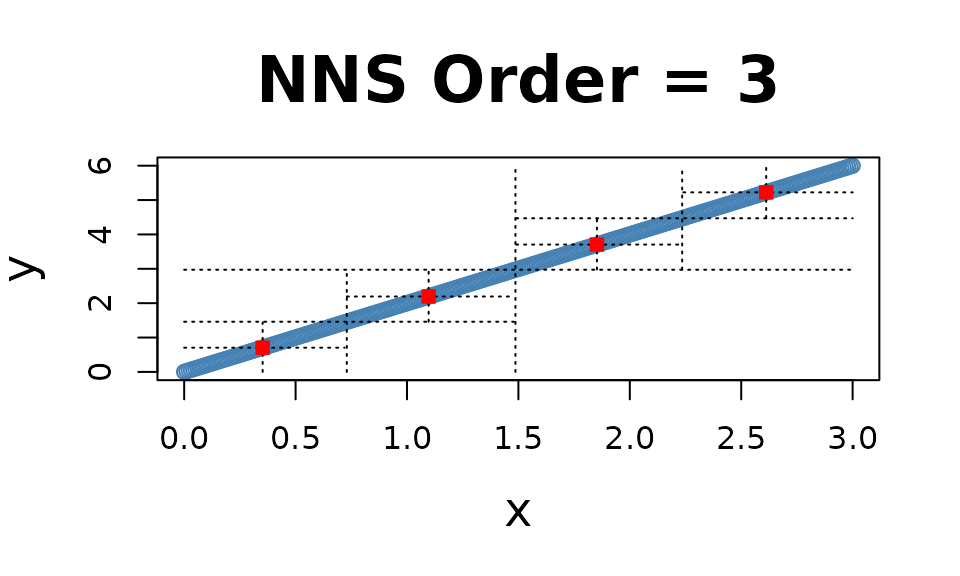
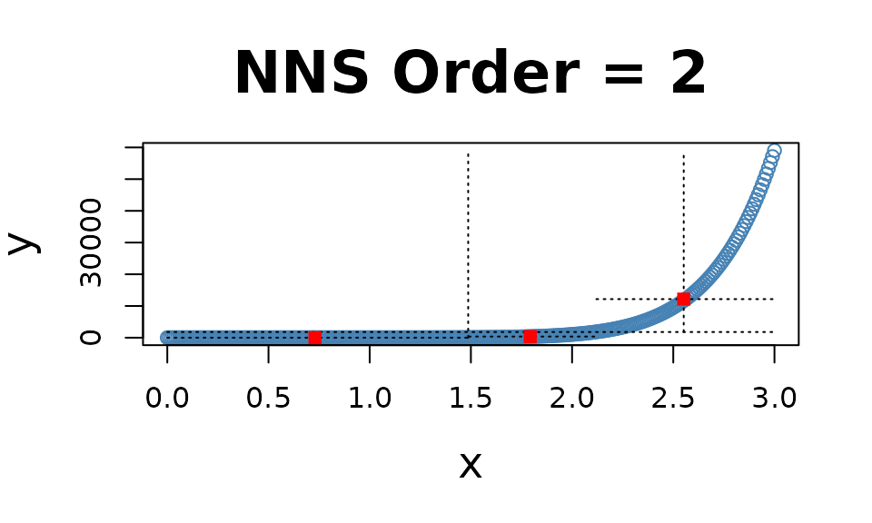
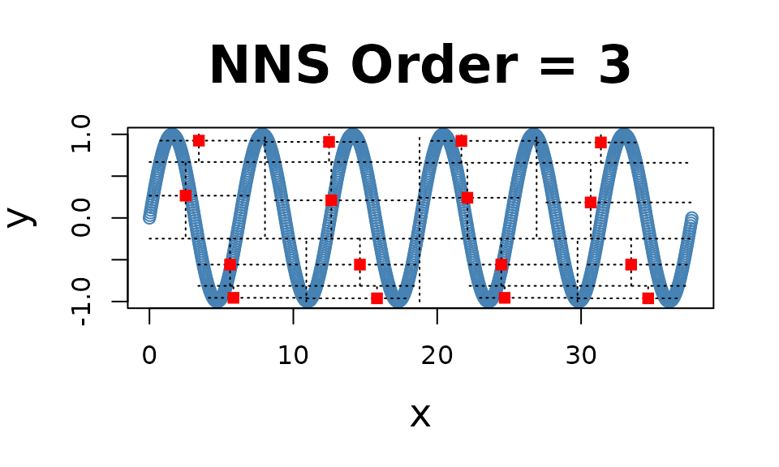
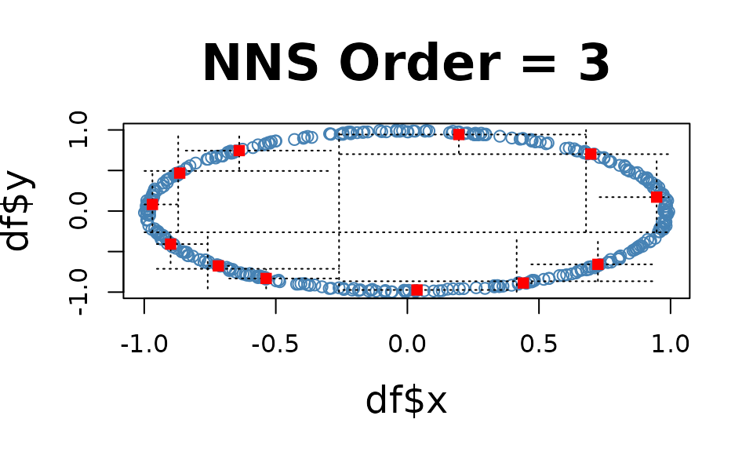
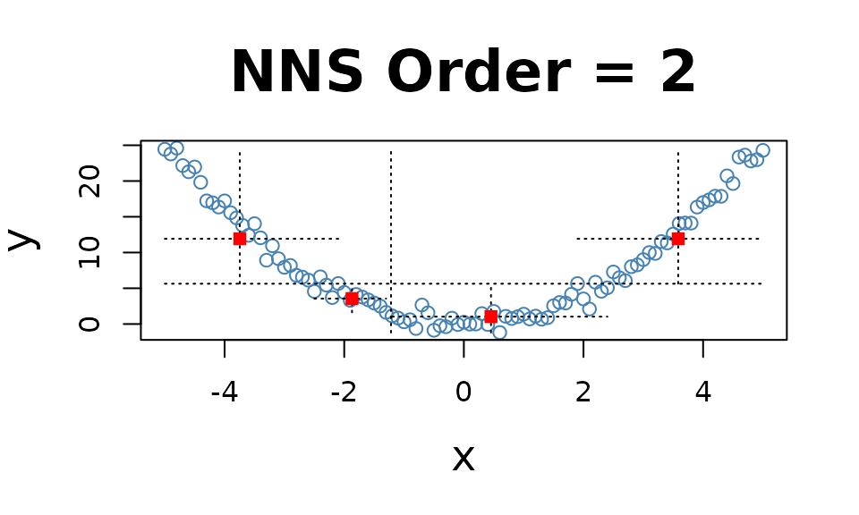
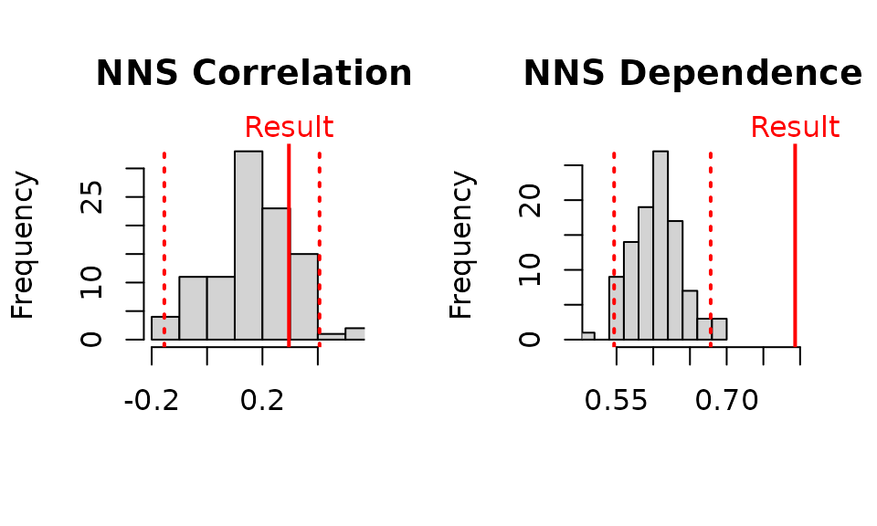

# Getting Started with NNS: Correlation and Dependence

``` r

library(NNS)
library(data.table)
require(knitr)
require(rgl)
```

## Correlation and Dependence

The limitations of linear correlation are well known. Often one uses
correlation, when dependence is the intended measure for defining the
relationship between variables. NNS dependence **`NNS.dep`** is a
signal:noise measure robust to nonlinear signals.

Below are some examples comparing NNS correlation **`NNS.cor`** and
**`NNS.dep`** with the standard Pearson’s correlation coefficient `cor`.

### Linear Equivalence

Note the fact that all observations occupy the co-partial moment
quadrants.

``` r

x = seq(0, 3, .01) ; y = 2 * x
```



``` r

cor(x, y)
```

    ## [1] 1

``` r

NNS.dep(x, y)
```

    ## $Correlation
    ## [1] 1
    ## 
    ## $Dependence
    ## [1] 1

### Nonlinear Relationship

Note the fact that all observations occupy the co-partial moment
quadrants.

``` r

x = seq(0, 3, .01) ; y = x ^ 10
```



``` r

cor(x, y)
```

    ## [1] 0.6610183

``` r

NNS.dep(x, y)
```

    ## $Correlation
    ## [1] 0.9595032
    ## 
    ## $Dependence
    ## [1] 0.9595032

### Cyclic Relationship

Even the difficult inflection points, which span both the co- and
divergent partial moment quadrants, are properly compensated for in
**`NNS.dep`**.

``` r

x = seq(0, 12*pi, pi/100) ; y = sin(x)
```



``` r

cor(x, y)
```

    ## [1] -0.1297766

``` r

NNS.dep(x, y)
```

    ## $Correlation
    ## [1] 0.202252
    ## 
    ## $Dependence
    ## [1] 0.8197963

### Asymmetrical Analysis

The asymmetrical analysis is critical for further determining a causal
path between variables which should be identifiable, i.e., it is
asymmetrical in causes and effects.

The previous cyclic example visually highlights the asymmetry of
dependence between the variables, which can be confirmed using
**`NNS.dep(..., asym = TRUE)`**.

``` r

cor(x, y)
```

    ## [1] -0.1297766

``` r

NNS.dep(x, y, asym = TRUE)
```

    ## $Correlation
    ## [1] 0.202252
    ## 
    ## $Dependence
    ## [1] 0.8197963

``` r

cor(y, x)
```

    ## [1] -0.1297766

``` r

NNS.dep(y, x, asym = TRUE)
```

    ## $Correlation
    ## [1] 0.07270847
    ## 
    ## $Dependence
    ## [1] 0.4086234

### Dependence

Note the fact that all observations occupy only co- or divergent partial
moment quadrants for a given subquadrant.

``` r

set.seed(123)
df = data.frame(x = runif(10000, -1, 1), y = runif(10000, -1, 1))
df = subset(df, (x ^ 2 + y ^ 2 <= 1 & x ^ 2 + y ^ 2 >= 0.95))
```



``` r

NNS.dep(df$x, df$y)
```

    ## $Correlation
    ## [1] 0.05834412
    ## 
    ## $Dependence
    ## [1] 0.46764

## p-values for `NNS.dep()`

p-values and confidence intervals can be obtained from sampling random
permutations of $`y \rightarrow y_p`$ and running **`NNS.dep(x,$y_p$)`**
to compare against a null hypothesis of 0 correlation, or independence
between $`(x, y)`$.

Simply set **`NNS.dep(..., p.value = TRUE, print.map = TRUE)`** to run
100 permutations and plot the results.

``` r

## p-values for [NNS.dep]
set.seed(123)
x = seq(-5, 5, .1); y = x^2 + rnorm(length(x))
```



``` r

NNS.dep(x, y, p.value = TRUE, print.map = TRUE)
```



    ## $Correlation
    ## [1] 0.2957015
    ## 
    ## $`Correlation p.value`
    ## [1] 0.18
    ## 
    ## $`Correlation 95% CIs`
    ##       2.5%      97.5% 
    ## -0.1544429  0.4062421 
    ## 
    ## $Dependence
    ## [1] 0.7932674
    ## 
    ## $`Dependence p.value`
    ## [1] 0
    ## 
    ## $`Dependence 95% CIs`
    ##      2.5%     97.5% 
    ## 0.5467152 0.6782456

## Multivariate Dependence `NNS.copula()`

These partial moment insights permit us to extend the analysis to
multivariate instances and deliver a dependence measure $`(D)`$ such
that $`D \in [0,1]`$. This level of analysis is simply impossible with
Pearson or other rank based correlation methods, which are restricted to
bivariate cases.

``` r

set.seed(123)
x = rnorm(1000); y = rnorm(1000); z = rnorm(1000)
NNS.copula(cbind(x, y, z), plot = TRUE, independence.overlay = TRUE)
```

    ## [1] 0.3278775

## References

If the user is so motivated, detailed arguments and proofs are provided
within the following:

- [Nonlinear Nonparametric Statistics: Using Partial
  Moments](https://ovvo-financial.github.io/NNS/book/)

- [Nonlinear Correlation and Dependence Using
  NNS](https://doi.org/10.2139/ssrn.3010414)

- [Deriving Nonlinear Correlation Coefficients from Partial
  Moments](https://doi.org/10.2139/ssrn.2148522)

- [Beyond Correlation: Using the Elements of Variance for Conditional
  Means and Probabilities](https://doi.org/10.2139/ssrn.2745308)
