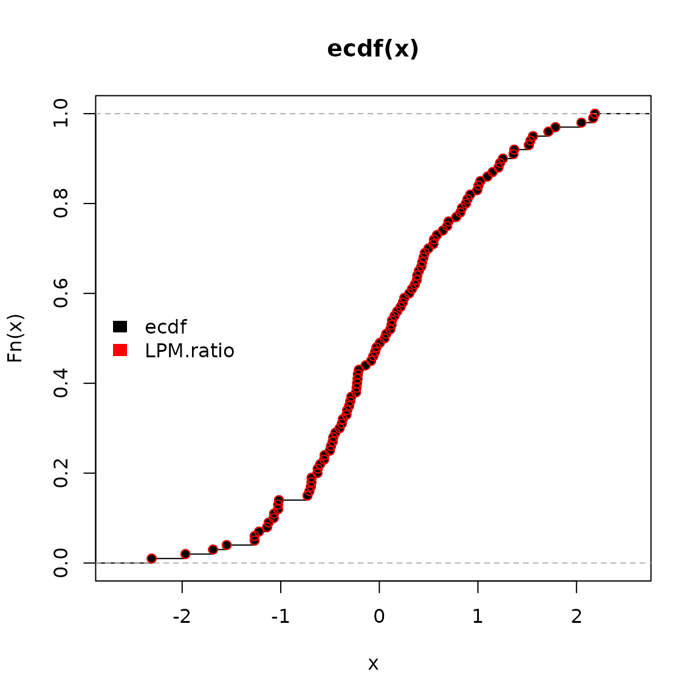
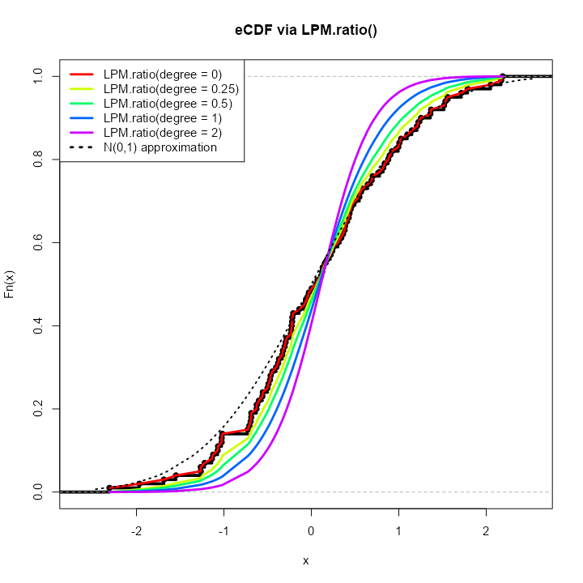
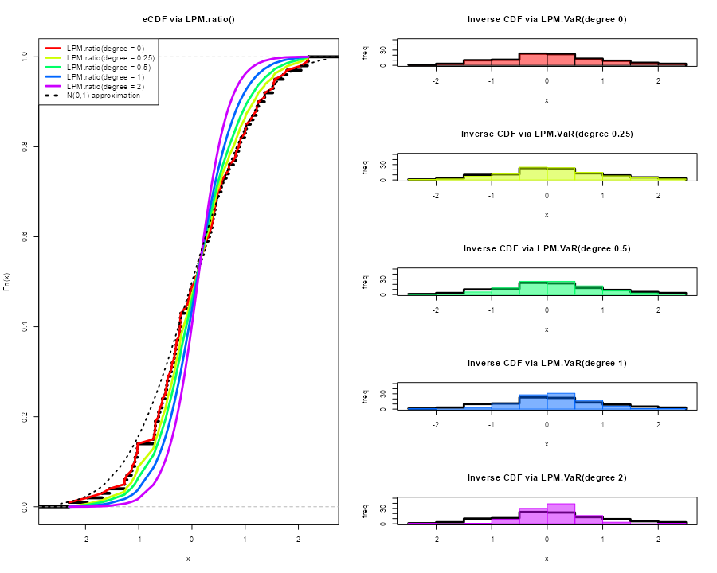
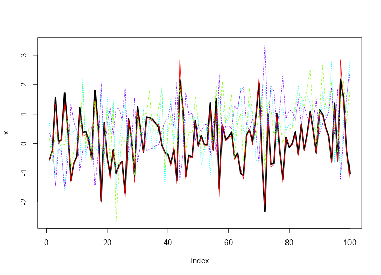
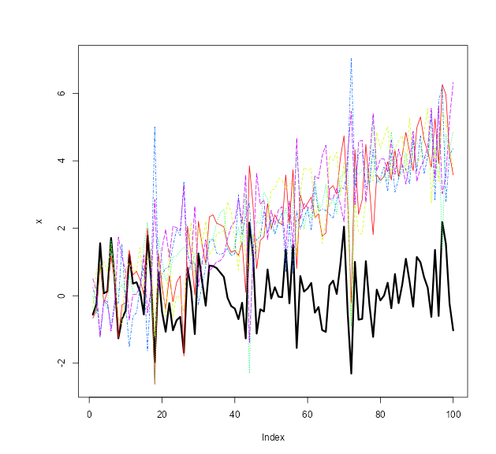

# Getting Started with NNS: Sampling and Simulation

``` r

library(NNS)
library(data.table)
require(knitr)
require(rgl)
```

`NNS` offers several novel sampling methods from any distribution, as
well as simulating variables while maintaining their dependence.

## Sampling

### CDFs

Cumulative distribution functions (CDFs) represent the probability a
variable $`X`$ will take a value less than or equal to $`x`$.
``` math
F(x) = P(X \leq x)
```

#### Empirical CDF

The empirical CDF is a simple construct, provided in the base package of
R. We can generate an empirical CDF with the `ecdf` function and create
a function `(P)` to return the CDF of a given value of $`X`$.

``` r

set.seed(123); x = rnorm(100)
ecdf(x)
```

    ## Empirical CDF 
    ## Call: ecdf(x)
    ##  x[1:100] = -2.3092, -1.9666, -1.6867,  ...,  2.169, 2.1873

``` r

P = ecdf(x)
P(0); P(1)
```

    ## [1] 0.48

    ## [1] 0.83

#### Lower Partial Moment CDF (**`LPM.ratio`**)

The empirical CDF and Lower Partial Moment CDF (**`LPM.ratio`**) are
identical when the degree term of the `LPM.ratio` is set to zero.

Degree 0 LPM:
``` math
LPM(0,t,X)=\frac{1}{N}\sum_{n=1}^{N}[max(t-X_n),0]^0
```
`LPM.ratio` is equivalent to the following form for any target $`(t)`$
and variable $`X`$:
``` math
LPM(0,t,X)=\frac{LPM(0,t,X)}{LPM(0,t,X)+UPM(0,t,X)}
```

Using the same targets from our `ecdf` example above (0,1) we can
compare **`LPM.ratio`**s.

``` r

LPM.ratio(degree = 0, target = 0, variable = x); LPM.ratio(degree = 0, target = 1, variable = x)
```

    ## [1] 0.48

    ## [1] 0.83

Calculating the probability for every `target` value in $`X`$, we can
plot both methods visualizing their identical results. `ecdf` function
in black and **`LPM.ratio`** in red.



#### **`LPM.ratio`** degree \> 0

By simply increasing the `degree` parameter to any positive real number,
we can generate different CDFs of our initial distribution $`x`$.



#### Generating PDFs with (**`LPM.VaR`**)

We can now generate distributions using the same insights and `degree`
manipulation in the corresponding **`LPM.VaR`** function, a la
value-at-risk, providing inverse CDF estimates.

The general form in the following plots is:

**`LPM.VaR(percentile = seq(0, 1, length.out = 100), degree = 0, x = x)`**

Any length `percentile` can be used to sample from the underlying
distribution $`x`$.



Viewing the first 10 samples from each of the `degree`s compared to our
original $`X`$.

``` r
degree.0.samples = LPM.VaR(percentile = seq(0, 1, length.out = 100), degree = 0, x = x)
degree.0.25.samples = LPM.VaR(percentile = seq(0, 1, length.out = 100), degree = 0.25, x = x)
degree.0.5.samples = LPM.VaR(percentile = seq(0, 1, length.out = 100), degree = 0.5, x = x)
degree.1.samples = LPM.VaR(percentile = seq(0, 1, length.out = 100), degree = 1, x = x)
degree.2.samples = LPM.VaR(percentile = seq(0, 1, length.out = 100), degree = 2, x = x)

head(data.table::data.table(cbind("original x" = sort(x), degree.0.samples, 
                                                          degree.0.25.samples, 
                                                          degree.0.5.samples, 
                                                          degree.1.samples, 
                                                          degree.2.samples)), 10)

     original x degree.0.samples degree.0.25.samples degree.0.5.samples
  1:  -2.309169        -2.309169           -2.309097         -2.3090915
  2:  -1.966617        -1.966617           -1.941190         -1.6935509
  3:  -1.686693        -1.686693           -1.599486         -1.4541494
  4:  -1.548753        -1.548753           -1.382553         -1.2462731
  5:  -1.265396        -1.265396           -1.250823         -1.1453748
  6:  -1.265061        -1.265061           -1.176436         -1.0745440
  7:  -1.220718        -1.220718           -1.119655         -1.0252742
  8:  -1.138137        -1.138137           -1.067793         -0.9868693
  9:  -1.123109        -1.123109           -1.026429         -0.9322105
 10:  -1.071791        -1.071791           -1.014276         -0.8710942
     degree.1.samples degree.2.samples
  1:       -2.3091021       -2.3091170
  2:       -1.4744653       -1.1614908
  3:       -1.2159961       -0.9709972
  4:       -1.0823023       -0.8610192
  5:       -0.9968028       -0.7810300
  6:       -0.9290505       -0.7169770
  7:       -0.8666886       -0.6631888
  8:       -0.8090433       -0.6170691
  9:       -0.7556644       -0.5765608
 10:       -0.7069835       -0.5403318
```

## Simulation

### Bootstrapping (**`NNS.meboot`**)

**`NNS.meboot`** is based on the maximum entropy bootstrap, available in
the R-package `meboot`. This procedure is specifically designed for
time-series and avoids the IID assumption in traditional methods.

The ability to sample from specified correlations ensures the full
spectrum of future paths is sampled from. Typical Monte Carlo samples
are restricted to \[-0.3, 0.3\] correlations to the original data.

We will generate 1 replicate of $`X`$ for each value of a sequence of
$`\rho`$ values (the $`ensemble`$), and then plot the results compared
to our original $`X`$ (black line). **`NNS.MC`** is a streamlined
wrapper function for this functionality of **`NNS.meboot`**.

``` r

boots = NNS.MC(x, reps = 1, lower_rho = -1, upper_rho = 1, by = .5)$replicates
reps = do.call(cbind, boots)


matplot(reps, type = "l", col = rainbow(length(boots)))
lines(x, type = "l", lwd = 3, ylim = c(min(reps), max(reps)))
```



Checking our replicate correlations:

``` r
sapply(boots, function(r) cor(r, x, method = "spearman"))

    rho = 1   rho = 0.5     rho = 0  rho = -0.5    rho = -1 
 0.99732373  0.51147915  0.01036904 -0.48720072 -0.98294629 
```

More replicates and ensembles thereof can be generated for any number of
$`\rho`$ values.

#### `target_drift` Specification

We can also specify a target drift in our replicates with the
`target_drift` parameter.

``` r

boots = NNS.MC(x, reps = 1, lower_rho = -1, upper_rho = 1, by = .5, target_drift = 0.05)$replicates
reps = do.call(cbind, boots)

plot(x, type = "l", lwd = 3, ylim = c(min(c(x, reps)), max(c(x, reps))))
matplot(reps, type = "l", col = rainbow(length(boots)), add = TRUE)
```



Please see the full **`NNS.meboot`** and **`NNS.MC`** argument
documentation.

### Simulating a Multivariate Dependence Structure

Analogous to an empirical copula transformation, we can generate
`new data` from the dependence structure of our `original data` via the
following steps:

- **Determine the dependence structure:**

This is accomplished using **`LPM.ratio(1, x, x)`** for continuous
variables, and **`LPM.ratio(0, x, x)`** for discrete variables, which
are the empirical CDFs of the marginal variables.

- **Generate or supply `new data`:**

`new data` does not have to be of the same distribution or dimension as
the `original data`, nor does each dimension of `new data` have to share
a distribution type.

- **Apply dependence structure to `new data`:**

We then utilize **`LPM.VaR`** to ascertain `new data` values
corresponding to `original data` position mappings, and return a matrix
of these transformed values with the same dimensions as `new.data`.

``` r

set.seed(123)
x = rnorm(1000); y = rnorm(1000); z = rnorm(1000)

# Add variable x to original data to avoid total independence (example only)
original.data = cbind(x, y, z, x)

# Determine dependence structure
dep.structure = apply(original.data, 2, function(x) LPM.ratio(degree = 1, target = x, variable = x))
  
# Generate new data with different mean, sd and length (or distribution type)
new.data = sapply(1:ncol(original.data), function(x) rnorm(nrow(original.data)*2, mean = 10, sd = 20))

# Apply dependence structure to new data
new.dep.data = sapply(1:ncol(original.data), function(x) LPM.VaR(percentile = dep.structure[,x], degree = 1, x = new.data[,x]))
```

#### Compare Multivariate Dependence Structures

Similar dependence with radically different values, since we used
$`N(10, 20)`$ in place of our original $`N(0,1)`$ observations.

``` r
NNS.copula(original.data)
NNS.copula(new.dep.data)

[1] 0.4743531
[1] 0.4753264
```

``` r
head(original.data)
head(new.dep.data)

               x           y          z           x
[1,] -0.56047565 -0.99579872 -0.5116037 -0.56047565
[2,] -0.23017749 -1.03995504  0.2369379 -0.23017749
[3,]  1.55870831 -0.01798024 -0.5415892  1.55870831
[4,]  0.07050839 -0.13217513  1.2192276  0.07050839
[5,]  0.12928774 -2.54934277  0.1741359  0.12928774
[6,]  1.71506499  1.04057346 -0.6152683  1.71506499
          [,1]       [,2]       [,3]      [,4]
[1,] -2.028109 -10.498044 -0.2090467 -1.682949
[2,]  4.608303 -11.390485 15.6213689  4.852534
[3,] 39.478741   8.836581 -0.8508203 40.585505
[4,] 10.683731   6.609255 36.0328589 10.877677
[5,] 11.866922 -47.955235 14.3111350 12.064633
[6,] 42.665726  29.639640 -2.4141874 43.797025
```

### Alternative Using **`NNS.meboot`**

Alternatively, if we wish to keep the simulated values close to the
original data, we can apply the **`NNS.meboot`** procedure to each of
the variables.

We will generate 1 replicate (for brevity) of $`\rho = 0.95`$ to our
`original.data`, use their `ensemble` and note the multivariate
dependence among our `new.boot.dep.data`.

``` r

# Apply bootstrap to each variable
new.boot.dep.data = apply(original.data, 2, function(r) NNS.meboot(r, reps = 100, rho = .95))

# Reformat into vectors
boot.ensemble.vectors = lapply(new.boot.dep.data, function(z) unlist(z["ensemble",]))

# Create matrix from vectors
new.boot.dep.matrix = do.call(cbind, boot.ensemble.vectors)
```

Checking `ensemble` correlations with `original.data`:

``` r
for(i in 1:4) print(cor(new.boot.dep.matrix[,i], original.data[,i], method = "spearman"))

[1] 0.9452863
[1] 0.9499478
[1] 0.945878
[1] 0.9442845
```

#### Compare Multivariate Dependence Structures

Similar dependence with similar values.

``` r
NNS.copula(original.data)
NNS.copula(new.boot.dep.matrix)

[1] 0.4743531
[1] 0.4517661
```

``` r
head(original.data)
head(new.boot.dep.matrix)

               x           y          z           x
[1,] -0.56047565 -0.99579872 -0.5116037 -0.56047565
[2,] -0.23017749 -1.03995504  0.2369379 -0.23017749
[3,]  1.55870831 -0.01798024 -0.5415892  1.55870831
[4,]  0.07050839 -0.13217513  1.2192276  0.07050839
[5,]  0.12928774 -2.54934277  0.1741359  0.12928774
[6,]  1.71506499  1.04057346 -0.6152683  1.71506499
                   x          y          z          x
ensemble1 -0.4268047 -0.7794553 -0.6364458 -0.4642642
ensemble2 -0.2965744 -1.0682197  0.3297265 -0.2531178
ensemble3  1.3302149  0.3054734 -0.4014515  1.4914884
ensemble4  0.2257378  0.3108846  1.0603892  0.1728540
ensemble5  0.4716743 -3.3344967 -0.1917697  0.4309379
ensemble6  1.3984978  1.1881374 -0.5295386  1.5326055
```

## References

If the user is so motivated, detailed arguments and proofs are provided
within the following:

- [Nonlinear Nonparametric Statistics: Using Partial
  Moments](https://ovvo-financial.github.io/NNS/book/)

- [Continuous CDFs and ANOVA with
  NNS](https://doi.org/10.2139/ssrn.3007373)

- [Nonlinear Correlation and Dependence Using
  NNS](https://doi.org/10.2139/ssrn.3010414)

- [Maximum Entropy Bootstrap for Time Series: The meboot R
  Package](https://doi.org/10.18637/jss.v029.i05)

- [Arbitrary Spearman’s Rank Correlations in Maximum Entropy Bootstrap
  and Improved Monte Carlo
  Simulations](https://doi.org/10.2139/ssrn.3621614)

- [Value-at-Risk (VaR) and Probability Bounds
  Analysis](https://doi.org/10.2139/ssrn.5310345)
