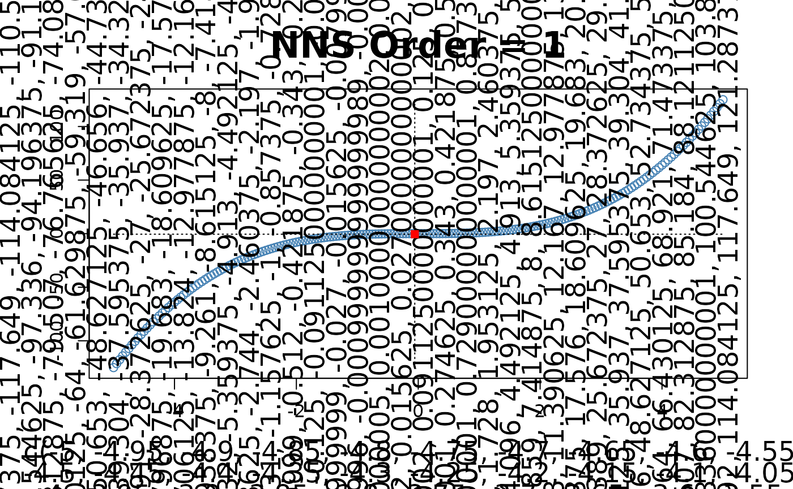
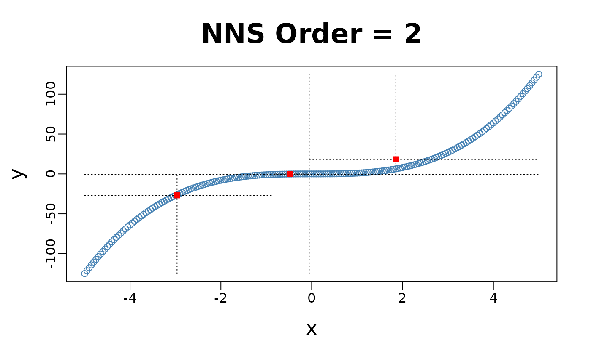
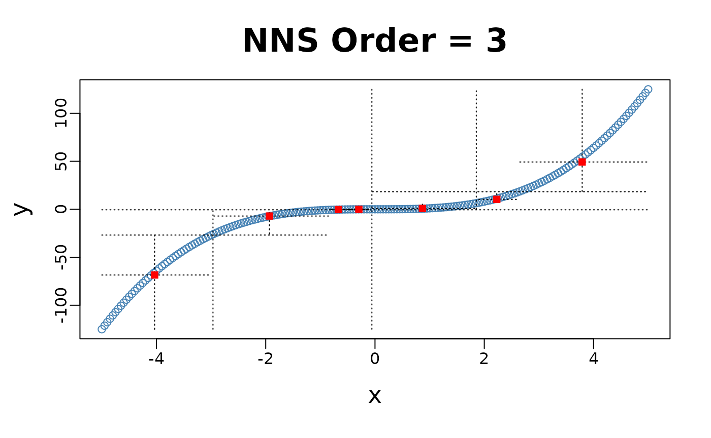
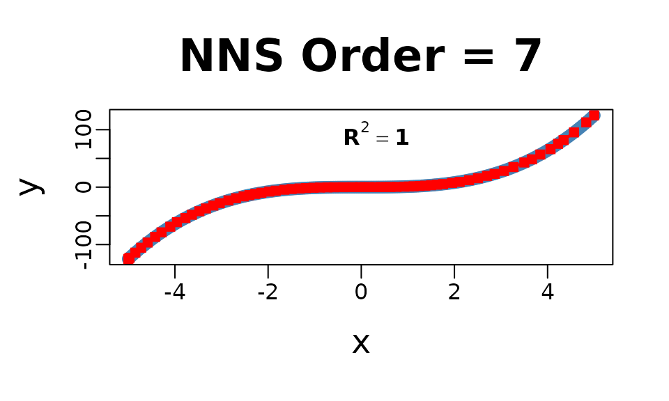
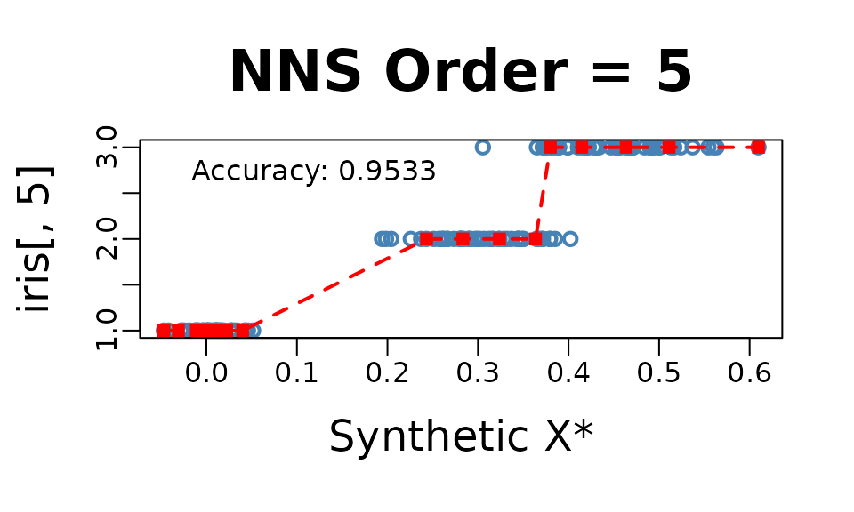
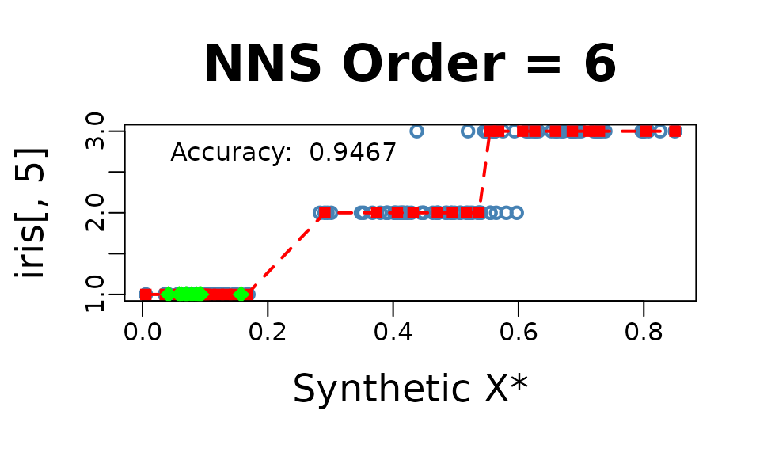
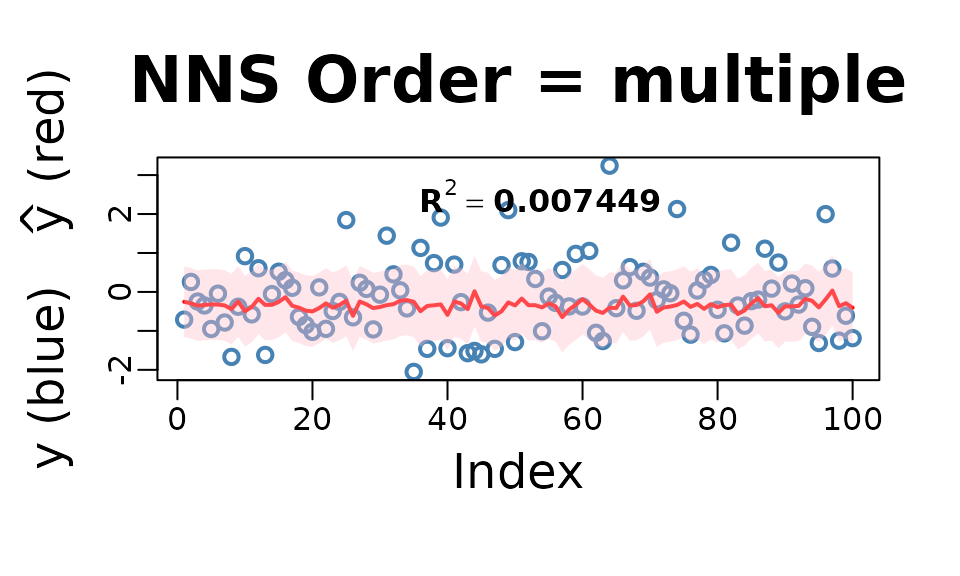
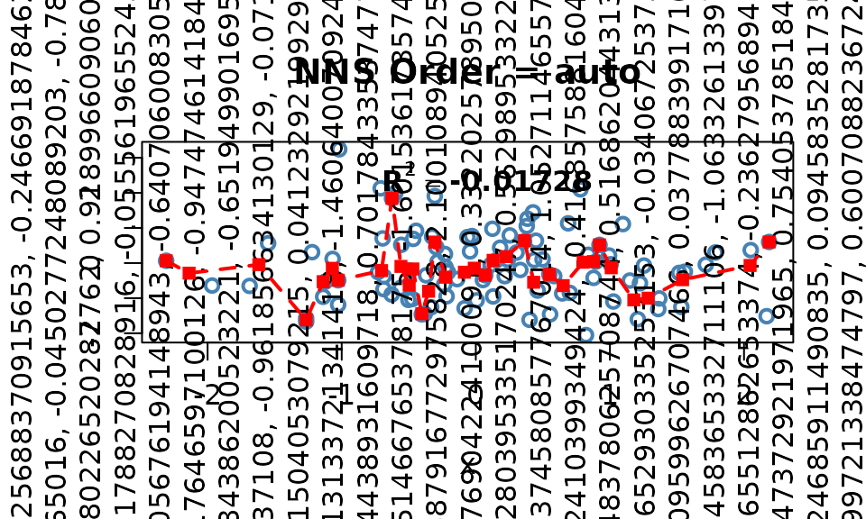

# Getting Started with NNS: Clustering and Regression

``` r

library(NNS)
require(knitr)
require(rgl)
```

## Clustering and Regression

Below are some examples demonstrating unsupervised learning with NNS
clustering and nonlinear regression using the resulting clusters. As
always, for a more thorough description and definition, please view the
References.

### NNS Partitioning `NNS.part()`

**`NNS.part`** is both a partitional and hierarchical clustering method.
`NNS` iteratively partitions the joint distribution into partial moment
quadrants, and then assigns a quadrant identification (1:4) at each
partition.

**`NNS.part`** returns a `data.frame` of observations along with their
final quadrant identification. It also returns the regression points,
which are the quadrant means used in **`NNS.reg`**.

``` r

x = seq(-5, 5, .05); y = x ^ 3

for(i in 1 : 4){NNS.part(x, y, order = i, Voronoi = TRUE, obs.req = 0)}
```



#### X-only Partitioning

**`NNS.part`** offers a partitioning based on $`x`$ values only
**`NNS.part(x, y, type = "XONLY", ...)`**, using the entire bandwidth in
its regression point derivation, and shares the same limit condition as
partitioning via both $`x`$ and $`y`$ values.

``` r

for(i in 1 : 4){NNS.part(x, y, order = i, type = "XONLY", Voronoi = TRUE)}
```


Note the partition identifications are limited to 1’s and 2’s (left and
right of the partition respectively), not the 4 values per the $`x`$ and
$`y`$ partitioning.

    ## $order
    ## [1] 4
    ## 
    ## $dt
    ##       x         y quadrant prior.quadrant
    ## 1 -5.00 -125.0000    q1111           q111
    ## 2 -4.95 -121.2874    q1111           q111
    ## 3 -4.90 -117.6490    q1111           q111
    ## 4 -4.85 -114.0841    q1111           q111
    ## 5 -4.80 -110.5920    q1111           q111
    ## 6 -4.75 -107.1719    q1111           q111
    ## ---
    ##        x        y quadrant prior.quadrant
    ## 196 4.75 107.1719    q2222           q222
    ## 197 4.80 110.5920    q2222           q222
    ## 198 4.85 114.0841    q2222           q222
    ## 199 4.90 117.6490    q2222           q222
    ## 200 4.95 121.2874    q2222           q222
    ## 201 5.00 125.0000    q2222           q222
    ## --- [ 201 rows x 4 cols ]; showing first and last 6. Use as.data.frame(x) for all. ---
    ## 
    ## $regression.points
    ##   quadrant          x            y
    ## 1     q111 -4.4523966 -89.31996002
    ## 2     q112 -3.2250000 -31.51531806
    ## 3     q121 -2.0023966  -7.46341667
    ## 4     q122 -0.7590415  -0.51890098
    ## 5     q211  0.3739355   0.08338409
    ## 6     q212  1.3499632   2.26930682
    ## 7     q221  2.6206250  16.42843100
    ## 8     q222  4.1955267  75.78894504

### Clusters Used in Regression

The right column of plots shows the corresponding regression (plus
endpoints and central point) for the order of `NNS` partitioning.

``` r

for(i in 1 : 3){NNS.part(x, y, order = i, obs.req = 0, Voronoi = TRUE, type = "XONLY") ; NNS.reg(x, y, order = i, ncores = 1)}
```


## NNS Regression `NNS.reg()`

**`NNS.reg`** can fit any $`f(x)`$, for both uni- and multivariate
cases. **`NNS.reg`** returns a self-evident list of values provided
below.

### Univariate:

``` r

NNS.reg(x, y, ncores = 1)
```



    ## $R2
    ## [1] 0.9999858
    ## 
    ## $SE
    ## [1] 0.1822738
    ## 
    ## $Prediction.Accuracy
    ## NULL
    ## 
    ## $equation
    ## NULL
    ## 
    ## $x.star
    ## NULL
    ## 
    ## $derivative
    ##   Coefficient X.Lower.Range X.Upper.Range
    ## 2    74.25250     -5.000000     -4.975000
    ## 3    72.47650     -4.975000     -4.850000
    ## 4    68.69350     -4.850000     -4.725000
    ## 5    64.88657     -4.725000     -4.585417
    ## 6    61.01481     -4.585417     -4.425000
    ## 7    57.64629     -4.425000     -4.287500
    ## ---
    ## 62    42.67514      3.843750      4.062500
    ## 63    57.09308      4.062500      4.225000
    ## 64    55.24079      4.225000      4.343750
    ## 65    59.68593      4.343750      4.567158
    ## 66    66.33741      4.567158      4.830103
    ## 67    72.01977      4.830103      5.000000
    ## --- [ 66 rows x 3 cols ]; showing first and last 6. Use as.data.frame(x) for all. ---
    ## 
    ## $Point.est
    ## NULL
    ## 
    ## $pred.int
    ## NULL
    ## 
    ## $regression.points
    ##           x          y
    ## 1 -5.000000 -125.00000
    ## 2 -4.975000 -123.14369
    ## 3 -4.850000 -114.08412
    ## 4 -4.725000 -105.49744
    ## 5 -4.585417  -96.44035
    ## 6 -4.425000  -86.65256
    ## ---
    ##           x         y
    ## 62 4.062500  66.14919
    ## 63 4.225000  75.42681
    ## 64 4.343750  81.98666
    ## 65 4.567158  95.32100
    ## 66 4.830103 112.76406
    ## 67 5.000000 125.00000
    ## --- [ 67 rows x 2 cols ]; showing first and last 6. Use as.data.frame(x) for all. ---
    ## 
    ## $Fitted.xy
    ##       x         y     y.hat   NNS.ID gradient residuals standard.errors
    ## 1 -5.00 -125.0000 -125.0000 q1111111  74.2525   0.00000      0.00000000
    ## 2 -4.95 -121.2874 -121.3318 q1111112  72.4765  -0.04440      0.07380015
    ## 3 -4.90 -117.6490 -117.7080 q1111121  72.4765  -0.05895      0.07380015
    ## 4 -4.85 -114.0841 -114.0841 q1111121  68.6935   0.00000      0.05069967
    ## 5 -4.80 -110.5920 -110.6495 q1111122  68.6935  -0.05745      0.05069967
    ## 6 -4.75 -107.1719 -107.2148 q1111211  68.6935  -0.04290      0.05069967
    ## ---
    ##        x        y    y.hat   NNS.ID gradient residuals standard.errors
    ## 196 4.75 107.1719 107.4502 q2222221 66.33741 0.2783568       0.2762022
    ## 197 4.80 110.5920 110.7671 q2222221 66.33741 0.1751022       0.2762022
    ## 198 4.85 114.0841 114.1970 q2222222 72.01977 0.1129090       0.1257231
    ## 199 4.90 117.6490 117.7980 q2222222 72.01977 0.1490227       0.1257231
    ## 200 4.95 121.2874 121.3990 q2222222 72.01977 0.1116363       0.1257231
    ## 201 5.00 125.0000 125.0000 q2222222 72.01977 0.0000000       0.1257231
    ## --- [ 201 rows x 7 cols ]; showing first and last 6. Use as.data.frame(x) for all. ---

### Multivariate:

Multivariate regressions return a plot of $`y`$ and $`\hat{y}`$, as well
as the regression points (`$RPM`) and partitions (`$rhs.partitions`) for
each regressor.

``` r

f = function(x, y) x ^ 3 + 3 * y - y ^ 3 - 3 * x
y = x ; z <- expand.grid(x, y)
g = f(z[ , 1], z[ , 2])
NNS.reg(z, g, order = "max", plot = FALSE, ncores = 1)
```

    ## $R2
    ## [1] 1
    ## 
    ## $rhs.partitions
    ##    Var1 Var2
    ## 1 -5.00   -5
    ## 2 -4.95   -5
    ## 3 -4.90   -5
    ## 4 -4.85   -5
    ## 5 -4.80   -5
    ## 6 -4.75   -5
    ## ---
    ## 40396 4.75    5
    ## 40397 4.80    5
    ## 40398 4.85    5
    ## 40399 4.90    5
    ## 40400 4.95    5
    ## 40401 5.00    5
    ## --- [ 40401 rows x 2 cols ]; showing first and last 6. Use as.data.frame(x) for all. ---
    ## 
    ## $RPM
    ##   Var1  Var2         y.hat
    ## 1 -4.8 -4.80  7.105427e-15
    ## 2 -4.8 -2.55 -8.726063e+01
    ## 3 -4.8 -2.50 -8.806700e+01
    ## 4 -4.8 -2.45 -8.883587e+01
    ## 5 -4.8 -2.40 -8.956800e+01
    ## 6 -4.8 -2.35 -9.026413e+01
    ## ---
    ##       Var1  Var2        y.hat
    ## 40396 -2.6 -2.85 4.823125e+00
    ## 40397 -2.6 -2.80 3.776000e+00
    ## 40398 -2.6 -2.75 2.770875e+00
    ## 40399 -2.6 -2.70 1.807000e+00
    ## 40400 -2.6 -2.65 8.836250e-01
    ## 40401 -2.6 -2.60 1.776357e-15
    ## --- [ 40401 rows x 3 cols ]; showing first and last 6. Use as.data.frame(x) for all. ---
    ## 
    ## $Point.est
    ## NULL
    ## 
    ## $pred.int
    ## NULL
    ## 
    ## $Fitted.xy
    ##    Var1 Var2         y     y.hat   NNS.ID residuals
    ## 1 -5.00   -5  0.000000  0.000000  201.201         0
    ## 2 -4.95   -5  3.562625  3.562625  402.201         0
    ## 3 -4.90   -5  7.051000  7.051000  603.201         0
    ## 4 -4.85   -5 10.465875 10.465875  804.201         0
    ## 5 -4.80   -5 13.808000 13.808000 1005.201         0
    ## 6 -4.75   -5 17.078125 17.078125 1206.201         0
    ## ---
    ##       Var1 Var2          y      y.hat      NNS.ID residuals
    ## 40396 4.75    5 -17.078125 -17.078125 39396.40401         0
    ## 40397 4.80    5 -13.808000 -13.808000 39597.40401         0
    ## 40398 4.85    5 -10.465875 -10.465875 39798.40401         0
    ## 40399 4.90    5  -7.051000  -7.051000 39999.40401         0
    ## 40400 4.95    5  -3.562625  -3.562625 40200.40401         0
    ## 40401 5.00    5   0.000000   0.000000 40401.40401         0
    ## --- [ 40401 rows x 6 cols ]; showing first and last 6. Use as.data.frame(x) for all. ---

### Inter/Extrapolation

`NNS.reg` can inter- or extrapolate any point of interest. The
**`NNS.reg(x, y, point.est = ...)`** parameter permits any sized data of
similar dimensions to $`x`$ and called specifically with
**`NNS.reg(...)$Point.est`**.

### NNS Dimension Reduction Regression

**`NNS.reg`** also provides a dimension reduction regression by
including a parameter **`NNS.reg(x, y, dim.red.method = "cor", ...)`**.
Reducing all regressors to a single dimension using the returned
equation **`NNS.reg(..., dim.red.method = "cor", ...)$equation`**.

``` r

NNS.reg(iris[ , 1 : 4], iris[ , 5], dim.red.method = "cor", location = "topleft", ncores = 1)$equation
```



    ##                  Variable Coefficient
    ## Sepal.Length Sepal.Length   0.7980781
    ## Sepal.Width   Sepal.Width  -0.4402896
    ## Petal.Length Petal.Length   0.9354305
    ## Petal.Width   Petal.Width   0.9381792
    ## 1             DENOMINATOR   4.0000000

Thus, our model for this regression would be:
``` math
Species = \frac{0.798*Sepal.Length -0.44*Sepal.Width +0.935*Petal.Length +0.938*Petal.Width}{4} 
```

#### Threshold

**`NNS.reg(x, y, dim.red.method = "cor", threshold = ...)`** offers a
method of reducing regressors further by controlling the absolute value
of required correlation.

``` r

NNS.reg(iris[ , 1 : 4], iris[ , 5], dim.red.method = "cor", threshold = .75, location = "topleft", ncores = 1)$equation
```


    ##                  Variable Coefficient
    ## Sepal.Length Sepal.Length   0.7980781
    ## Sepal.Width   Sepal.Width   0.0000000
    ## Petal.Length Petal.Length   0.9354305
    ## Petal.Width   Petal.Width   0.9381792
    ## 1             DENOMINATOR   3.0000000

Thus, our model for this further reduced dimension regression would be:
``` math
Species = \frac{\: 0.798*Sepal.Length + 0*Sepal.Width +0.935*Petal.Length +0.938*Petal.Width}{3} 
```

and the `point.est = (...)` operates in the same manner as the full
regression above, again called with **`NNS.reg(...)$Point.est`**.

``` r

NNS.reg(iris[ , 1 : 4], iris[ , 5], dim.red.method = "cor", threshold = .75, point.est = iris[1 : 10, 1 : 4], location = "topleft", ncores = 1)$Point.est
```



    ##  [1] 1 1 1 1 1 1 1 1 1 1

## Classification

For a classification problem, we simply set
**`NNS.reg(x, y, type = "CLASS", ...)`**.

**NOTE: Base category of response variable should be 1, not 0 for
classification problems.**

``` r

NNS.reg(iris[ , 1 : 4], iris[ , 5], type = "CLASS", point.est = iris[1 : 10, 1 : 4], location = "topleft", ncores = 1)$Point.est
```


    ##  [1] 1 1 1 1 1 1 1 1 1 1

## Cross-Validation `NNS.stack()`

The **`NNS.stack`** routine cross-validates for a given objective
function the `n.best` parameter in the multivariate **`NNS.reg`**
function as well as the `threshold` parameter in the dimension reduction
**`NNS.reg`** version. **`NNS.stack`** can be used for classification:

**`NNS.stack(..., type = "CLASS", ...)`**

or continuous dependent variables:

**`NNS.stack(..., type = NULL, ...)`**.

Any objective function `obj.fn` can be called using
[`expression()`](https://rdrr.io/r/base/expression.html) with the terms
`predicted` and `actual`, even from external packages such as `Metrics`.

**`NNS.stack(..., obj.fn = expression(Metrics::mape(actual, predicted)), objective = "min")`**.

``` r

NNS.stack(IVs.train = iris[ , 1 : 4], 
          DV.train = iris[ , 5], 
          IVs.test = iris[1 : 10, 1 : 4],
          dim.red.method = "cor",
          obj.fn = expression( mean(round(predicted) == actual) ),
          objective = "max", type = "CLASS", 
          folds = 1, ncores = 1)
```

``` r
Folds Remaining = 0 
Current NNS.reg(... , threshold = 0.9350 ) | eval(obj.fn) = 1.000000 | MAX Iterations Remaining = 2
Current NNS.reg(... , threshold = 0.7950 ) | eval(obj.fn) = 0.973684 | MAX Iterations Remaining = 1
Current NNS.reg(... , threshold = 0.4400 ) | eval(obj.fn) = 0.894737 | MAX Iterations Remaining = 0
Current NNS.reg(. , n.best = 1 ) | eval(obj.fn) = 0.868421 | MAX Iterations Remaining = 12
Current NNS.reg(. , n.best = 2 ) | eval(obj.fn) = 0.736842 | MAX Iterations Remaining = 11
Current NNS.reg(. , n.best = 3 ) | eval(obj.fn) = 0.763158 | MAX Iterations Remaining = 10
Current NNS.reg(. , n.best = 4 ) | eval(obj.fn) = 0.736842 | MAX Iterations Remaining = 9
$OBJfn.reg
[1] 0.9733333

$NNS.reg.n.best
[1] 1

$probability.threshold
[1] 0.495

$OBJfn.dim.red
[1] 0.9666667

$NNS.dim.red.threshold
[1] 0.935

$reg
 [1] 1 1 1 1 1 1 1 1 1 1

$reg.pred.int
NULL

$dim.red
 [1] 1 1 1 1 1 1 1 1 1 1

$dim.red.pred.int
NULL

$stack
 [1] 1 1 1 1 1 1 1 1 1 1

$pred.int
NULL
```

## Increasing Dimensions

Given multicollinearity is not an issue for nonparametric regressions as
it is for OLS, in the case of an ill-fit univariate model a better
option may be to increase the dimensionality of regressors with a copy
of itself and cross-validate the number of clusters `n.best` via:

**`NNS.stack(IVs.train = cbind(x, x), DV.train = y, method = 1, ...)`**.

``` r

set.seed(123)
x = rnorm(100); y = rnorm(100)

nns.params = NNS.stack(IVs.train = cbind(x, x),
                        DV.train = y,
                        method = 1, ncores = 1)
```

``` r

NNS.reg(cbind(x, x), y, 
        n.best = nns.params$NNS.reg.n.best,
        point.est = cbind(x, x), 
        residual.plot = TRUE,  
        ncores = 1, confidence.interval = .95)
```



## Smoothing Option

Smoothness is not required for curve fitting, but the `NNS.reg` function
offers an optional smoothed fit. This feature applies a smoothing spline
to regression points generated internally using the partitioning method
described earlier.

``` r

NNS.reg(x, y, smooth = TRUE)
```



## Imputation

Imputation in `NNS` is a direct application of nearest neighbor
regression. When values of $`y`$ are missing, we use the observed
$`(X,y)`$ pairs as the training set and the predictors of the missing
rows as `point.est`.

A key insight is that even in univariate regressions, `NNS.reg` benefits
from the increasing dimensions trick: by duplicating the predictor into
a multivariate form, e.g. `cbind(x, x)`, the distance function
underlying `NNS.reg` operates in a 2-D space. This sharpened distance
metric allows a more robust donor selection, effectively turning
univariate imputation into a special case of multivariate nearest
neighbor regression.

For multivariate predictors, the same form applies directly — supply the
full set of observed predictors in $`x`$, the observed responses in
$`y`$, and the incomplete rows in `point.est`. With
`order = "max", n.best = 1`, the imputation is always 1-NN donor-based:
each missing $`y`$ is filled in by the response of its closest donor
under the `NNS` hybrid distance. This ensures imputations remain
strictly within the support of the observed data.

**Categorical data** is handled analogously, only requiring
`NNS.reg(..., type = "CLASS")` in the procedure.

### Univariate Imputation

``` r

set.seed(123)

# Univariate predictor with nonlinear signal
n <- 400
x <- sort(runif(n, -3, 3))
y <- sin(x) + 0.2 * x^2 + rnorm(n, 0, 0.25)

# Induce ~25% MCAR missingness in y
miss <- rbinom(n, 1, 0.25) == 1
y_mis <- y
y_mis[miss] <- NA

# ---- Increasing dimensions trick ----
# Duplicate x so the distance operates in a 2D space: cbind(x, x).
# This sharpens nearest-neighbor selection even in a nominally univariate setting.
x2_train <- cbind(x[!miss], x[!miss])
x2_miss  <- cbind(x[miss],  x[miss])

# 1-NN donor imputation with NNS.reg
y_hat_uni <- NNS::NNS.reg(
  x         = x2_train,             # predictors (duplicated x)
  y         = y[!miss],             # observed responses
  point.est = x2_miss,              # rows to impute
  order     = "max",                # dependence-maximizing order
  n.best    = 1,                    # 1-NN donor
  plot      = FALSE
)$Point.est

# Fill back
y_completed_uni <- y_mis
y_completed_uni[miss] <- y_hat_uni

# Plot observed vs imputed (NNS 1-NN)
plot(x, y, pch = 1, col = "steelblue", cex = 1.5, lwd = 2,
     xlab = "x", ylab = "y", main = "NNS 1-NN Imputation")
points(x[miss], y_hat_uni, col = "red", pch = 15, cex = 1.3)

legend("topleft",
       legend = c("Observed", "Imputed (NNS 1-NN)"),
       col    = c("steelblue", "red"),
       pch    = c(1, 15),
       pt.lwd = c(2, NA),
       bty    = "n")
```


### Multivariate Imputation

``` r

set.seed(123)

# Multivariate predictors with nonlinear & interaction structure
n <- 800
X <- cbind(
  x1 = rnorm(n),
  x2 = runif(n, -2, 2),
  x3 = rnorm(n, 0, 1)
)

f <- function(x1, x2, x3) 1.1*x1 - 0.8*x2 + 0.5*x3 + 0.6*x1*x2 - 0.4*x2*x3 + 0.3*sin(1.3*x1)
y <- f(X[,1], X[,2], X[,3]) + rnorm(n, 0, 0.4)

# Induce ~30% MCAR missingness in y
miss <- rbinom(n, 1, 0.30) == 1
y_mis <- y
y_mis[miss] <- NA

# Training (observed) vs rows to impute
X_obs <- X[!miss, , drop = FALSE]
y_obs <- y[!miss]
X_mis <- X[ miss, , drop = FALSE]

# 1-NN donor imputation with NNS.reg
y_hat_mv <- NNS::NNS.reg(
  x         = X_obs,     # all observed predictors
  y         = y_obs,     # observed responses
  point.est = X_mis,     # rows to impute
  order     = "max",     # dependence-maximizing order
  n.best    = 1,         # 1-NN donor
  plot      = FALSE
)$Point.est

# Completed vector
y_completed_mv <- y_mis
y_completed_mv[miss] <- y_hat_mv

# Plot observed vs imputed (multivariate, NNS 1-NN)
plot(seq_along(y), y, 
     pch = 1, col = "steelblue", cex = 1.5, lwd = 2,
     xlab = "Observation index", ylab = "y",
     main = "NNS 1-NN Multivariate Imputation")

# Overlay imputed values
points(which(miss), y_hat_mv, pch = 15, col = "red", cex = 1.2)

# Legend
legend("topleft",
       legend = c("Observed", "Imputed (NNS 1-NN)"),
       col    = c("steelblue", "red"),
       pch    = c(1, 15),
       pt.lwd = c(2, NA),
       bty    = "n")
```


### A Note on Uncertainty Propagation

A common concern with local imputation methods is whether imputation
uncertainty propagates correctly into downstream inference. `NNS`
addresses this through bootstrap multiple imputation: resampling
complete cases across `m` iterations generates between-imputation
variance that flows through standard Rubin’s rules pooling identically
to any classical procedure.

Empirically, `NNS` bootstrap MI outperforms MICE with predictive mean
matching on nonlinear data — producing a pooled estimate closer to the
true parameter with a smaller pooled SE. The advantage comes not from
compressing uncertainty but from a more accurate imputation model, which
reduces between-imputation variance driven by model error rather than
genuine data uncertainty.

See [NNS Multiple Imputation vs
MICE](https://github.com/OVVO-Financial/NNS/blob/NNS-Beta-Version/examples/NNS_MI_vs_MICE.md)
for the full reproducible comparison.

## References

If the user is so motivated, detailed arguments further examples are
provided within the following:

- [Nonlinear Nonparametric Statistics: Using Partial
  Moments](https://ovvo-financial.github.io/NNS/book/)

- [Deriving Nonlinear Correlation Coefficients from Partial
  Moments](https://doi.org/10.2139/ssrn.2148522)

- [Nonparametric Regression Using
  Clusters](https://doi.org/10.1007/s10614-017-9713-5)

- [Clustering and Curve Fitting by Line
  Segments](https://doi.org/10.2139/ssrn.2861339)

- [Classification Using NNS Clustering
  Analysis](https://doi.org/10.2139/ssrn.2864711)

- [Partitional Estimation Using Partial
  Moments](https://doi.org/10.2139/ssrn.3592491)
