# Getting Started with NNS: Clustering and Regression

``` r

library(NNS)
library(data.table)
require(knitr)
require(rgl)
```

## Clustering and Regression

Below are some examples demonstrating unsupervised learning with NNS
clustering and nonlinear regression using the resulting clusters. As
always, for a more thorough description and definition, please view the
References.

### NNS Partitioning `NNS.part()`

**`NNS.part`** is both a partitional and hierarchical clustering method.
`NNS` iteratively partitions the joint distribution into partial moment
quadrants, and then assigns a quadrant identification (1:4) at each
partition.

**`NNS.part`** returns a `data.table` of observations along with their
final quadrant identification. It also returns the regression points,
which are the quadrant means used in **`NNS.reg`**.

``` r

x = seq(-5, 5, .05); y = x ^ 3

for(i in 1 : 4){NNS.part(x, y, order = i, Voronoi = TRUE, obs.req = 0)}
```

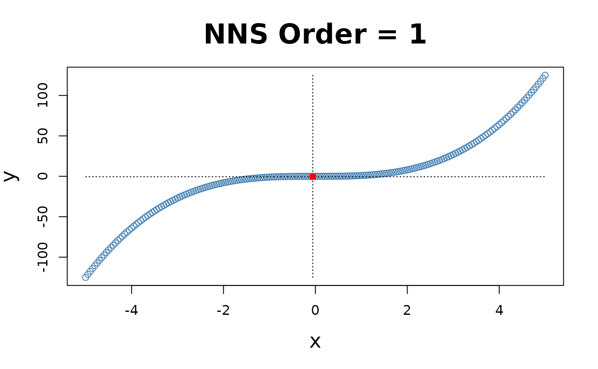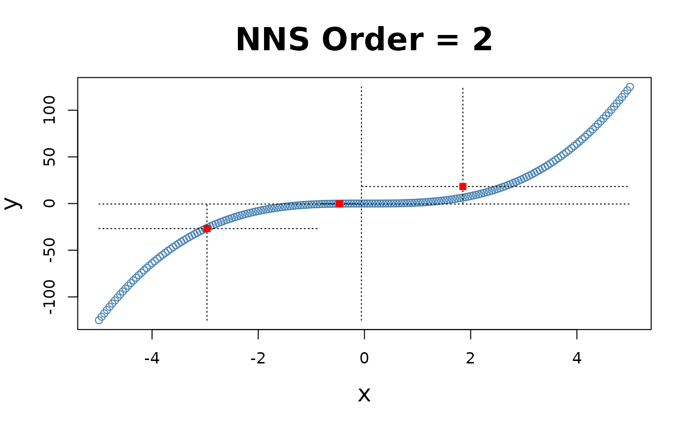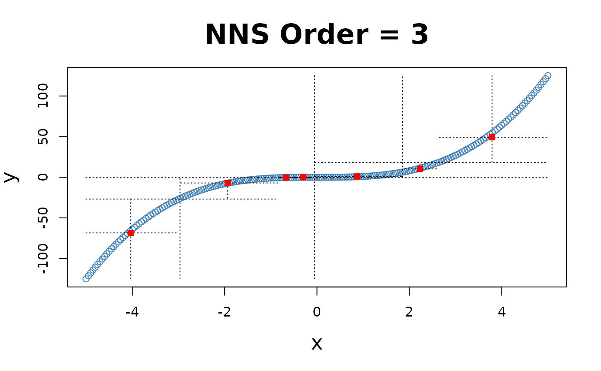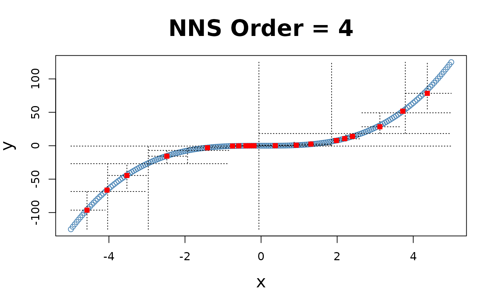

#### X-only Partitioning

**`NNS.part`** offers a partitioning based on $`x`$ values only
**`NNS.part(x, y, type = "XONLY", ...)`**, using the entire bandwidth in
its regression point derivation, and shares the same limit condition as
partitioning via both $`x`$ and $`y`$ values.

``` r

for(i in 1 : 4){NNS.part(x, y, order = i, type = "XONLY", Voronoi = TRUE)}
```


Note the partition identifications are limited to 1’s and 2’s (left and
right of the partition respectively), not the 4 values per the $`x`$ and
$`y`$ partitioning.

    ## $order
    ## [1] 4
    ## 
    ## $dt
    ##          x         y quadrant prior.quadrant
    ##      <num>     <num>   <char>         <char>
    ##   1: -5.00 -125.0000    q1111           q111
    ##   2: -4.95 -121.2874    q1111           q111
    ##   3: -4.90 -117.6490    q1111           q111
    ##   4: -4.85 -114.0841    q1111           q111
    ##   5: -4.80 -110.5920    q1111           q111
    ##  ---                                        
    ## 197:  4.80  110.5920    q2222           q222
    ## 198:  4.85  114.0841    q2222           q222
    ## 199:  4.90  117.6490    q2222           q222
    ## 200:  4.95  121.2874    q2222           q222
    ## 201:  5.00  125.0000    q2222           q222
    ## 
    ## $regression.points
    ##    quadrant          x            y
    ##      <char>      <num>        <num>
    ## 1:     q111 -4.4523966 -89.31996002
    ## 2:     q112 -3.2250000 -31.51531806
    ## 3:     q121 -2.0023966  -7.46341667
    ## 4:     q122 -0.7590415  -0.51890098
    ## 5:     q211  0.3739355   0.08338409
    ## 6:     q212  1.3499632   2.26930682
    ## 7:     q221  2.6206250  16.42843100
    ## 8:     q222  4.1955267  75.78894504

### Clusters Used in Regression

The right column of plots shows the corresponding regression (plus
endpoints and central point) for the order of `NNS` partitioning.

``` r

for(i in 1 : 3){NNS.part(x, y, order = i, obs.req = 0, Voronoi = TRUE, type = "XONLY") ; NNS.reg(x, y, order = i, ncores = 1)}
```


## NNS Regression `NNS.reg()`

**`NNS.reg`** can fit any $`f(x)`$, for both uni- and multivariate
cases. **`NNS.reg`** returns a self-evident list of values provided
below.

### Univariate:

``` r

NNS.reg(x, y, ncores = 1)
```

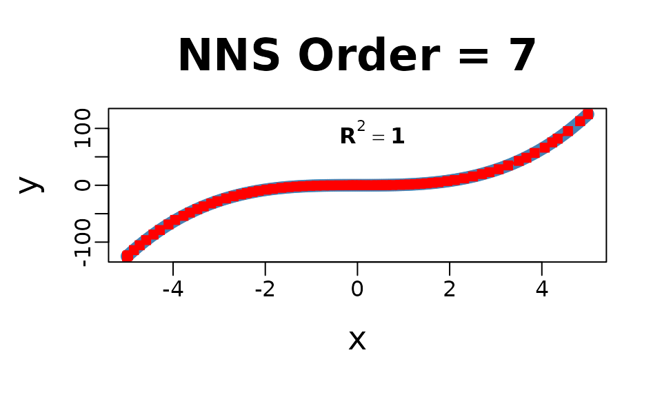

    ## $R2
    ## [1] 0.9999858
    ## 
    ## $SE
    ## [1] 0.1822738
    ## 
    ## $Prediction.Accuracy
    ## NULL
    ## 
    ## $equation
    ## NULL
    ## 
    ## $x.star
    ## NULL
    ## 
    ## $derivative
    ##     Coefficient X.Lower.Range X.Upper.Range
    ##           <num>         <num>         <num>
    ##  1: 74.25250000    -5.0000000    -4.9750000
    ##  2: 72.47650000    -4.9750000    -4.8500000
    ##  3: 68.69350000    -4.8500000    -4.7250000
    ##  4: 64.88656716    -4.7250000    -4.5854167
    ##  5: 61.01480519    -4.5854167    -4.4250000
    ##  6: 57.64628788    -4.4250000    -4.2875000
    ##  7: 52.29438889    -4.2875000    -4.1000000
    ##  8: 55.28971014    -4.1000000    -3.9562500
    ##  9: 39.55816092    -3.9562500    -3.7750000
    ## 10: 41.08694030    -3.7750000    -3.6354167
    ## 11: 38.01863636    -3.6354167    -3.4750000
    ## 12: 34.69626866    -3.4750000    -3.3354167
    ## 13: 31.88168831    -3.3354167    -3.1750000
    ## 14: 29.28265152    -3.1750000    -3.0375000
    ## 15: 25.79438889    -3.0375000    -2.8500000
    ## 16: 23.18416667    -2.8500000    -2.6875000
    ## 17: 20.17544872    -2.6875000    -2.5250000
    ## 18: 18.23350000    -2.5250000    -2.4000000
    ## 19: 16.36150000    -2.4000000    -2.2750000
    ## 20: 15.45634921    -2.2750000    -2.1437500
    ## 21: 12.10506173    -2.1437500    -1.9750000
    ## 22: 10.84291045    -1.9750000    -1.8354167
    ## 23:  9.17837079    -1.8354167    -1.6500000
    ## 24:  7.71713333    -1.6500000    -1.4937500
    ## 25:  5.67487654    -1.4937500    -1.3250000
    ## 26:  4.77015152    -1.3250000    -1.1875000
    ## 27:  3.65525641    -1.1875000    -1.0250000
    ## 28:  2.71828358    -1.0250000    -0.8854167
    ## 29:  1.97577922    -0.8854167    -0.7250000
    ## 30:  1.29696970    -0.7250000    -0.5875000
    ## 31:  0.71536082    -0.5875000    -0.3854167
    ## 32:  0.26031250    -0.3854167    -0.1854167
    ## 33:  0.08077922    -0.1854167    -0.1052083
    ## 34:  0.01168831    -0.1052083    -0.0250000
    ## 35:  0.00625000    -0.0250000     0.0750000
    ## 36:  0.05125000     0.0750000     0.1750000
    ## 37:  0.17050000     0.1750000     0.3000000
    ## 38:  0.40450000     0.3000000     0.4250000
    ## 39:  0.68125000     0.4250000     0.5250000
    ## 40:  0.99625000     0.5250000     0.6250000
    ## 41:  1.30261905     0.6250000     0.7562500
    ## 42:  2.23351852     0.7562500     0.9250000
    ## 43:  2.85625000     0.9250000     1.0250000
    ## 44:  3.47125000     1.0250000     1.1250000
    ## 45:  4.21750000     1.1250000     1.2500000
    ## 46:  5.19250000     1.2500000     1.3750000
    ## 47:  6.18250000     1.3750000     1.5000000
    ## 48:  7.35250000     1.5000000     1.6250000
    ## 49:  7.76690476     1.6250000     1.7562500
    ## 50: 10.84596774     1.7562500     1.9500000
    ## 51: 10.93692308     1.9500000     2.1125000
    ## 52: 14.30505155     2.1125000     2.3145833
    ## 53: 17.95467391     2.3145833     2.5062500
    ## 54: 21.46451613     2.5062500     2.7000000
    ## 55: 20.50807692     2.7000000     2.8625000
    ## 56: 26.01343750     2.8625000     3.0625000
    ## 57: 32.71687737     3.0625000     3.2671585
    ## 58: 34.19048114     3.2671585     3.5000000
    ## 59: 33.57759494     3.5000000     3.6645833
    ## 60: 46.95453488     3.6645833     3.8437500
    ## 61: 42.67514286     3.8437500     4.0625000
    ## 62: 57.09307692     4.0625000     4.2250000
    ## 63: 55.24078947     4.2250000     4.3437500
    ## 64: 59.68593153     4.3437500     4.5671585
    ## 65: 66.33740696     4.5671585     4.8301031
    ## 66: 72.01977335     4.8301031     5.0000000
    ##     Coefficient X.Lower.Range X.Upper.Range
    ##           <num>         <num>         <num>
    ## 
    ## $Point.est
    ## NULL
    ## 
    ## $pred.int
    ## NULL
    ## 
    ## $regression.points
    ##              x             y
    ##          <num>         <num>
    ##  1: -5.0000000 -1.250000e+02
    ##  2: -4.9750000 -1.231437e+02
    ##  3: -4.8500000 -1.140841e+02
    ##  4: -4.7250000 -1.054974e+02
    ##  5: -4.5854167 -9.644035e+01
    ##  6: -4.4250000 -8.665256e+01
    ##  7: -4.2875000 -7.872620e+01
    ##  8: -4.1000000 -6.892100e+01
    ##  9: -3.9562500 -6.097310e+01
    ## 10: -3.7750000 -5.380319e+01
    ## 11: -3.6354167 -4.806814e+01
    ## 12: -3.4750000 -4.196931e+01
    ## 13: -3.3354167 -3.712629e+01
    ## 14: -3.1750000 -3.201194e+01
    ## 15: -3.0375000 -2.798557e+01
    ## 16: -2.8500000 -2.314913e+01
    ## 17: -2.6875000 -1.938170e+01
    ## 18: -2.5250000 -1.610319e+01
    ## 19: -2.4000000 -1.382400e+01
    ## 20: -2.2750000 -1.177881e+01
    ## 21: -2.1437500 -9.750167e+00
    ## 22: -1.9750000 -7.707437e+00
    ## 23: -1.8354167 -6.193948e+00
    ## 24: -1.6500000 -4.492125e+00
    ## 25: -1.4937500 -3.286323e+00
    ## 26: -1.3250000 -2.328687e+00
    ## 27: -1.1875000 -1.672792e+00
    ## 28: -1.0250000 -1.078812e+00
    ## 29: -0.8854167 -6.993854e-01
    ## 30: -0.7250000 -3.824375e-01
    ## 31: -0.5875000 -2.041042e-01
    ## 32: -0.3854167 -5.954167e-02
    ## 33: -0.1854167 -7.479167e-03
    ## 34: -0.1052083 -1.000000e-03
    ## 35: -0.0250000 -6.250000e-05
    ## 36:  0.0750000  5.625000e-04
    ## 37:  0.1750000  5.687500e-03
    ## 38:  0.3000000  2.700000e-02
    ## 39:  0.4250000  7.756250e-02
    ## 40:  0.5250000  1.456875e-01
    ## 41:  0.6250000  2.453125e-01
    ## 42:  0.7562500  4.162813e-01
    ## 43:  0.9250000  7.931875e-01
    ## 44:  1.0250000  1.078813e+00
    ## 45:  1.1250000  1.425938e+00
    ## 46:  1.2500000  1.953125e+00
    ## 47:  1.3750000  2.602188e+00
    ## 48:  1.5000000  3.375000e+00
    ## 49:  1.6250000  4.294063e+00
    ## 50:  1.7562500  5.313469e+00
    ## 51:  1.9500000  7.414875e+00
    ## 52:  2.1125000  9.192125e+00
    ## 53:  2.3145833  1.208294e+01
    ## 54:  2.5062500  1.552425e+01
    ## 55:  2.7000000  1.968300e+01
    ## 56:  2.8625000  2.301556e+01
    ## 57:  3.0625000  2.821825e+01
    ## 58:  3.2671585  3.491404e+01
    ## 59:  3.5000000  4.287500e+01
    ## 60:  3.6645833  4.840131e+01
    ## 61:  3.8437500  5.681400e+01
    ## 62:  4.0625000  6.614919e+01
    ## 63:  4.2250000  7.542681e+01
    ## 64:  4.3437500  8.198666e+01
    ## 65:  4.5671585  9.532100e+01
    ## 66:  4.8301031  1.127641e+02
    ## 67:  5.0000000  1.250000e+02
    ##              x             y
    ##          <num>         <num>
    ## 
    ## $Fitted.xy
    ##          x         y     y.hat   NNS.ID gradient  residuals standard.errors
    ##      <num>     <num>     <num>   <char>    <num>      <num>           <num>
    ##   1: -5.00 -125.0000 -125.0000 q1111111 74.25250  0.0000000      0.00000000
    ##   2: -4.95 -121.2874 -121.3318 q1111112 72.47650 -0.0444000      0.07380015
    ##   3: -4.90 -117.6490 -117.7080 q1111121 72.47650 -0.0589500      0.07380015
    ##   4: -4.85 -114.0841 -114.0841 q1111121 68.69350  0.0000000      0.05069967
    ##   5: -4.80 -110.5920 -110.6495 q1111122 68.69350 -0.0574500      0.05069967
    ##  ---                                                                       
    ## 197:  4.80  110.5920  110.7671 q2222221 66.33741  0.1751022      0.27620216
    ## 198:  4.85  114.0841  114.1970 q2222222 72.01977  0.1129090      0.12572307
    ## 199:  4.90  117.6490  117.7980 q2222222 72.01977  0.1490227      0.12572307
    ## 200:  4.95  121.2874  121.3990 q2222222 72.01977  0.1116363      0.12572307
    ## 201:  5.00  125.0000  125.0000 q2222222 72.01977  0.0000000      0.12572307

### Multivariate:

Multivariate regressions return a plot of $`y`$ and $`\hat{y}`$, as well
as the regression points (`$RPM`) and partitions (`$rhs.partitions`) for
each regressor.

``` r

f = function(x, y) x ^ 3 + 3 * y - y ^ 3 - 3 * x
y = x ; z <- expand.grid(x, y)
g = f(z[ , 1], z[ , 2])
NNS.reg(z, g, order = "max", plot = FALSE, ncores = 1)
```

    ## $R2
    ## [1] 1
    ## 
    ## $rhs.partitions
    ##         Var1  Var2
    ##        <num> <num>
    ##     1: -5.00    -5
    ##     2: -4.95    -5
    ##     3: -4.90    -5
    ##     4: -4.85    -5
    ##     5: -4.80    -5
    ##    ---            
    ## 40397:  4.80     5
    ## 40398:  4.85     5
    ## 40399:  4.90     5
    ## 40400:  4.95     5
    ## 40401:  5.00     5
    ## 
    ## $RPM
    ##         Var1  Var2         y.hat
    ##        <num> <num>         <num>
    ##     1:  -4.8 -4.80  7.105427e-15
    ##     2:  -4.8 -2.55 -8.726063e+01
    ##     3:  -4.8 -2.50 -8.806700e+01
    ##     4:  -4.8 -2.45 -8.883587e+01
    ##     5:  -4.8 -2.40 -8.956800e+01
    ##    ---                          
    ## 40397:  -2.6 -2.80  3.776000e+00
    ## 40398:  -2.6 -2.75  2.770875e+00
    ## 40399:  -2.6 -2.70  1.807000e+00
    ## 40400:  -2.6 -2.65  8.836250e-01
    ## 40401:  -2.6 -2.60  1.776357e-15
    ## 
    ## $Point.est
    ## NULL
    ## 
    ## $pred.int
    ## NULL
    ## 
    ## $Fitted.xy
    ##         Var1  Var2          y      y.hat      NNS.ID residuals
    ##        <num> <num>      <num>      <num>      <char>     <num>
    ##     1: -5.00    -5   0.000000   0.000000     201.201         0
    ##     2: -4.95    -5   3.562625   3.562625     402.201         0
    ##     3: -4.90    -5   7.051000   7.051000     603.201         0
    ##     4: -4.85    -5  10.465875  10.465875     804.201         0
    ##     5: -4.80    -5  13.808000  13.808000    1005.201         0
    ##    ---                                                        
    ## 40397:  4.80     5 -13.808000 -13.808000 39597.40401         0
    ## 40398:  4.85     5 -10.465875 -10.465875 39798.40401         0
    ## 40399:  4.90     5  -7.051000  -7.051000 39999.40401         0
    ## 40400:  4.95     5  -3.562625  -3.562625 40200.40401         0
    ## 40401:  5.00     5   0.000000   0.000000 40401.40401         0

### Inter/Extrapolation

`NNS.reg` can inter- or extrapolate any point of interest. The
**`NNS.reg(x, y, point.est = ...)`** parameter permits any sized data of
similar dimensions to $`x`$ and called specifically with
**`NNS.reg(...)$Point.est`**.

### NNS Dimension Reduction Regression

**`NNS.reg`** also provides a dimension reduction regression by
including a parameter **`NNS.reg(x, y, dim.red.method = "cor", ...)`**.
Reducing all regressors to a single dimension using the returned
equation **`NNS.reg(..., dim.red.method = "cor", ...)$equation`**.

``` r

NNS.reg(iris[ , 1 : 4], iris[ , 5], dim.red.method = "cor", location = "topleft", ncores = 1)$equation
```

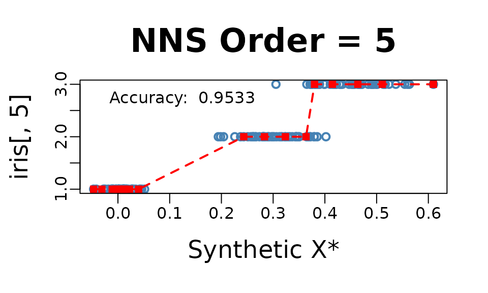

    ##        Variable Coefficient
    ##          <char>       <num>
    ## 1: Sepal.Length   0.7980781
    ## 2:  Sepal.Width  -0.4402896
    ## 3: Petal.Length   0.9354305
    ## 4:  Petal.Width   0.9381792
    ## 5:  DENOMINATOR   4.0000000

Thus, our model for this regression would be:
``` math
Species = \frac{0.798*Sepal.Length -0.44*Sepal.Width +0.935*Petal.Length +0.938*Petal.Width}{4} 
```

#### Threshold

**`NNS.reg(x, y, dim.red.method = "cor", threshold = ...)`** offers a
method of reducing regressors further by controlling the absolute value
of required correlation.

``` r

NNS.reg(iris[ , 1 : 4], iris[ , 5], dim.red.method = "cor", threshold = .75, location = "topleft", ncores = 1)$equation
```


    ##        Variable Coefficient
    ##          <char>       <num>
    ## 1: Sepal.Length   0.7980781
    ## 2:  Sepal.Width   0.0000000
    ## 3: Petal.Length   0.9354305
    ## 4:  Petal.Width   0.9381792
    ## 5:  DENOMINATOR   3.0000000

Thus, our model for this further reduced dimension regression would be:
``` math
Species = \frac{\: 0.798*Sepal.Length + 0*Sepal.Width +0.935*Petal.Length +0.938*Petal.Width}{3} 
```

and the `point.est = (...)` operates in the same manner as the full
regression above, again called with **`NNS.reg(...)$Point.est`**.

``` r

NNS.reg(iris[ , 1 : 4], iris[ , 5], dim.red.method = "cor", threshold = .75, point.est = iris[1 : 10, 1 : 4], location = "topleft", ncores = 1)$Point.est
```


    ##  [1] 1 1 1 1 1 1 1 1 1 1

## Classification

For a classification problem, we simply set
**`NNS.reg(x, y, type = "CLASS", ...)`**.

**NOTE: Base category of response variable should be 1, not 0 for
classification problems.**

``` r

NNS.reg(iris[ , 1 : 4], iris[ , 5], type = "CLASS", point.est = iris[1 : 10, 1 : 4], location = "topleft", ncores = 1)$Point.est
```

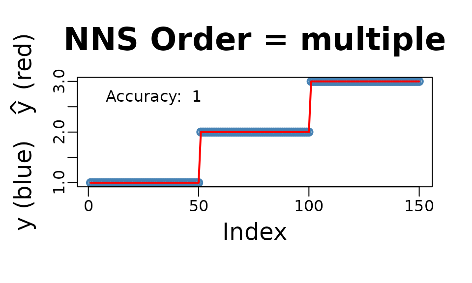

    ##  [1] 1 1 1 1 1 1 1 1 1 1

## Cross-Validation `NNS.stack()`

The **`NNS.stack`** routine cross-validates for a given objective
function the `n.best` parameter in the multivariate **`NNS.reg`**
function as well as the `threshold` parameter in the dimension reduction
**`NNS.reg`** version. **`NNS.stack`** can be used for classification:

**`NNS.stack(..., type = "CLASS", ...)`**

or continuous dependent variables:

**`NNS.stack(..., type = NULL, ...)`**.

Any objective function `obj.fn` can be called using
[`expression()`](https://rdrr.io/r/base/expression.html) with the terms
`predicted` and `actual`, even from external packages such as `Metrics`.

**`NNS.stack(..., obj.fn = expression(Metrics::mape(actual, predicted)), objective = "min")`**.

``` r

NNS.stack(IVs.train = iris[ , 1 : 4], 
          DV.train = iris[ , 5], 
          IVs.test = iris[1 : 10, 1 : 4],
          dim.red.method = "cor",
          obj.fn = expression( mean(round(predicted) == actual) ),
          objective = "max", type = "CLASS", 
          folds = 1, ncores = 1)
```

``` r
Folds Remaining = 0 
Current NNS.reg(... , threshold = 0.9350 ) | eval(obj.fn) = 1.000000 | MAX Iterations Remaining = 2
Current NNS.reg(... , threshold = 0.7950 ) | eval(obj.fn) = 0.973684 | MAX Iterations Remaining = 1
Current NNS.reg(... , threshold = 0.4400 ) | eval(obj.fn) = 0.894737 | MAX Iterations Remaining = 0
Current NNS.reg(. , n.best = 1 ) | eval(obj.fn) = 0.868421 | MAX Iterations Remaining = 12
Current NNS.reg(. , n.best = 2 ) | eval(obj.fn) = 0.736842 | MAX Iterations Remaining = 11
Current NNS.reg(. , n.best = 3 ) | eval(obj.fn) = 0.763158 | MAX Iterations Remaining = 10
Current NNS.reg(. , n.best = 4 ) | eval(obj.fn) = 0.736842 | MAX Iterations Remaining = 9
$OBJfn.reg
[1] 0.9733333

$NNS.reg.n.best
[1] 1

$probability.threshold
[1] 0.495

$OBJfn.dim.red
[1] 0.9666667

$NNS.dim.red.threshold
[1] 0.935

$reg
 [1] 1 1 1 1 1 1 1 1 1 1

$reg.pred.int
NULL

$dim.red
 [1] 1 1 1 1 1 1 1 1 1 1

$dim.red.pred.int
NULL

$stack
 [1] 1 1 1 1 1 1 1 1 1 1

$pred.int
NULL
```

## Increasing Dimensions

Given multicollinearity is not an issue for nonparametric regressions as
it is for OLS, in the case of an ill-fit univariate model a better
option may be to increase the dimensionality of regressors with a copy
of itself and cross-validate the number of clusters `n.best` via:

**`NNS.stack(IVs.train = cbind(x, x), DV.train = y, method = 1, ...)`**.

``` r

set.seed(123)
x = rnorm(100); y = rnorm(100)

nns.params = NNS.stack(IVs.train = cbind(x, x),
                        DV.train = y,
                        method = 1, ncores = 1)
```

``` r

NNS.reg(cbind(x, x), y, 
        n.best = nns.params$NNS.reg.n.best,
        point.est = cbind(x, x), 
        residual.plot = TRUE,  
        ncores = 1, confidence.interval = .95)
```

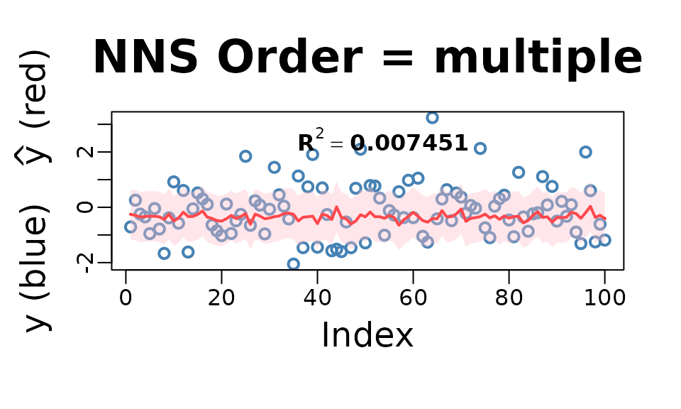

## Smoothing Option

Smoothness is not required for curve fitting, but the `NNS.reg` function
offers an optional smoothed fit. This feature applies a smoothing spline
to regression points generated internally using the partitioning method
described earlier.

``` r

NNS.reg(x, y, smooth = TRUE)
```

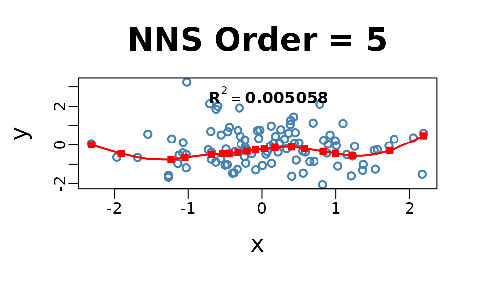

## Imputation

Imputation in `NNS` is a direct application of nearest neighbor
regression. When values of $`y`$ are missing, we use the observed
$`(X,y)`$ pairs as the training set and the predictors of the missing
rows as `point.est`.

A key insight is that even in univariate regressions, `NNS.reg` benefits
from the increasing dimensions trick: by duplicating the predictor into
a multivariate form, e.g. `cbind(x, x)`, the distance function
underlying `NNS.reg` operates in a 2-D space. This sharpened distance
metric allows a more robust donor selection, effectively turning
univariate imputation into a special case of multivariate nearest
neighbor regression.

For multivariate predictors, the same form applies directly — supply the
full set of observed predictors in $`x`$, the observed responses in
$`y`$, and the incomplete rows in `point.est`. With
`order = "max", n.best = 1`, the imputation is always 1-NN donor-based:
each missing $`y`$ is filled in by the response of its closest donor
under the `NNS` hybrid distance. This ensures imputations remain
strictly within the support of the observed data.

**Categorical data** is handled analogously, only requiring
`NNS.reg(..., type = "CLASS")` in the procedure.

### Univariate Imputation

``` r

set.seed(123)

# Univariate predictor with nonlinear signal
n <- 400
x <- sort(runif(n, -3, 3))
y <- sin(x) + 0.2 * x^2 + rnorm(n, 0, 0.25)

# Induce ~25% MCAR missingness in y
miss <- rbinom(n, 1, 0.25) == 1
y_mis <- y
y_mis[miss] <- NA

# ---- Increasing dimensions trick ----
# Duplicate x so the distance operates in a 2D space: cbind(x, x).
# This sharpens nearest-neighbor selection even in a nominally univariate setting.
x2_train <- cbind(x[!miss], x[!miss])
x2_miss  <- cbind(x[miss],  x[miss])

# 1-NN donor imputation with NNS.reg
y_hat_uni <- NNS::NNS.reg(
  x         = x2_train,             # predictors (duplicated x)
  y         = y[!miss],             # observed responses
  point.est = x2_miss,              # rows to impute
  order     = "max",                # dependence-maximizing order
  n.best    = 1,                    # 1-NN donor
  plot      = FALSE
)$Point.est

# Fill back
y_completed_uni <- y_mis
y_completed_uni[miss] <- y_hat_uni

# Plot observed vs imputed (NNS 1-NN)
plot(x, y, pch = 1, col = "steelblue", cex = 1.5, lwd = 2,
     xlab = "x", ylab = "y", main = "NNS 1-NN Imputation")
points(x[miss], y_hat_uni, col = "red", pch = 15, cex = 1.3)

legend("topleft",
       legend = c("Observed", "Imputed (NNS 1-NN)"),
       col    = c("steelblue", "red"),
       pch    = c(1, 15),
       pt.lwd = c(2, NA),
       bty    = "n")
```

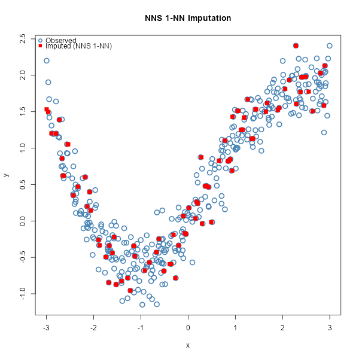

### Multivariate Imputation

``` r

set.seed(123)

# Multivariate predictors with nonlinear & interaction structure
n <- 800
X <- cbind(
  x1 = rnorm(n),
  x2 = runif(n, -2, 2),
  x3 = rnorm(n, 0, 1)
)

f <- function(x1, x2, x3) 1.1*x1 - 0.8*x2 + 0.5*x3 + 0.6*x1*x2 - 0.4*x2*x3 + 0.3*sin(1.3*x1)
y <- f(X[,1], X[,2], X[,3]) + rnorm(n, 0, 0.4)

# Induce ~30% MCAR missingness in y
miss <- rbinom(n, 1, 0.30) == 1
y_mis <- y
y_mis[miss] <- NA

# Training (observed) vs rows to impute
X_obs <- X[!miss, , drop = FALSE]
y_obs <- y[!miss]
X_mis <- X[ miss, , drop = FALSE]

# 1-NN donor imputation with NNS.reg
y_hat_mv <- NNS::NNS.reg(
  x         = X_obs,     # all observed predictors
  y         = y_obs,     # observed responses
  point.est = X_mis,     # rows to impute
  order     = "max",     # dependence-maximizing order
  n.best    = 1,         # 1-NN donor
  plot      = FALSE
)$Point.est

# Completed vector
y_completed_mv <- y_mis
y_completed_mv[miss] <- y_hat_mv

# Plot observed vs imputed (multivariate, NNS 1-NN)
plot(seq_along(y), y, 
     pch = 1, col = "steelblue", cex = 1.5, lwd = 2,
     xlab = "Observation index", ylab = "y",
     main = "NNS 1-NN Multivariate Imputation")

# Overlay imputed values
points(which(miss), y_hat_mv, pch = 15, col = "red", cex = 1.2)

# Legend
legend("topleft",
       legend = c("Observed", "Imputed (NNS 1-NN)"),
       col    = c("steelblue", "red"),
       pch    = c(1, 15),
       pt.lwd = c(2, NA),
       bty    = "n")
```

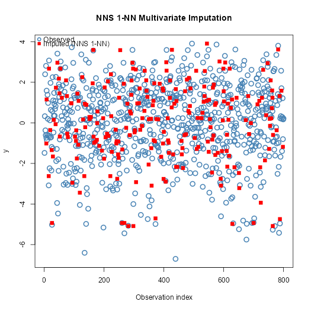

### A Note on Uncertainty Propagation

A common concern with local imputation methods is whether imputation
uncertainty propagates correctly into downstream inference. `NNS`
addresses this through bootstrap multiple imputation: resampling
complete cases across `m` iterations generates between-imputation
variance that flows through standard Rubin’s rules pooling identically
to any classical procedure.

Empirically, `NNS` bootstrap MI outperforms MICE with predictive mean
matching on nonlinear data — producing a pooled estimate closer to the
true parameter with a smaller pooled SE. The advantage comes not from
compressing uncertainty but from a more accurate imputation model, which
reduces between-imputation variance driven by model error rather than
genuine data uncertainty.

See [NNS Multiple Imputation vs
MICE](https://github.com/OVVO-Financial/NNS/blob/NNS-Beta-Version/examples/NNS_MI_vs_MICE.md)
for the full reproducible comparison.

## References

If the user is so motivated, detailed arguments further examples are
provided within the following:

- [Nonlinear Nonparametric Statistics: Using Partial
  Moments](https://ovvo-financial.github.io/NNS/book/)

- [Deriving Nonlinear Correlation Coefficients from Partial
  Moments](https://doi.org/10.2139/ssrn.2148522)

- [Nonparametric Regression Using
  Clusters](https://doi.org/10.1007/s10614-017-9713-5)

- [Clustering and Curve Fitting by Line
  Segments](https://doi.org/10.2139/ssrn.2861339)

- [Classification Using NNS Clustering
  Analysis](https://doi.org/10.2139/ssrn.2864711)

- [Partitional Estimation Using Partial
  Moments](https://doi.org/10.2139/ssrn.3592491)
