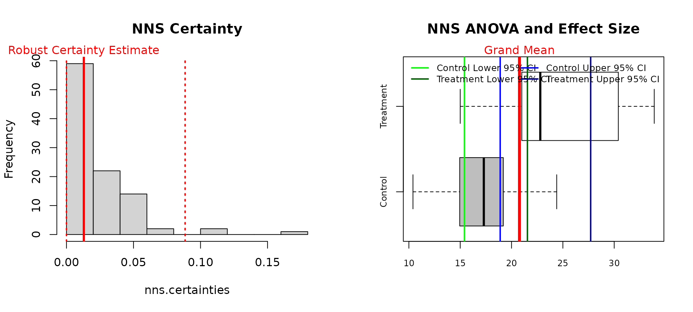
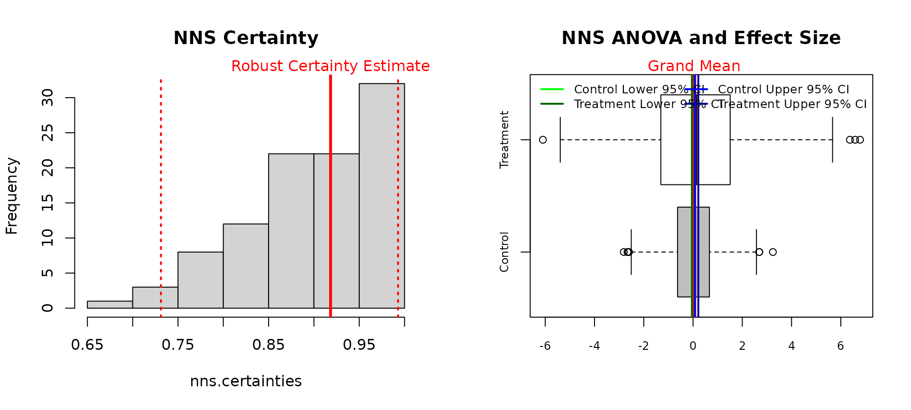
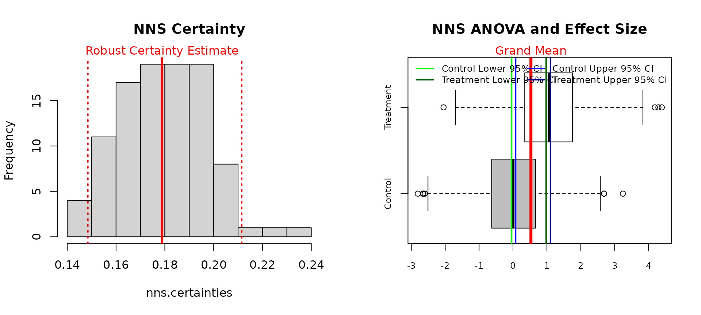
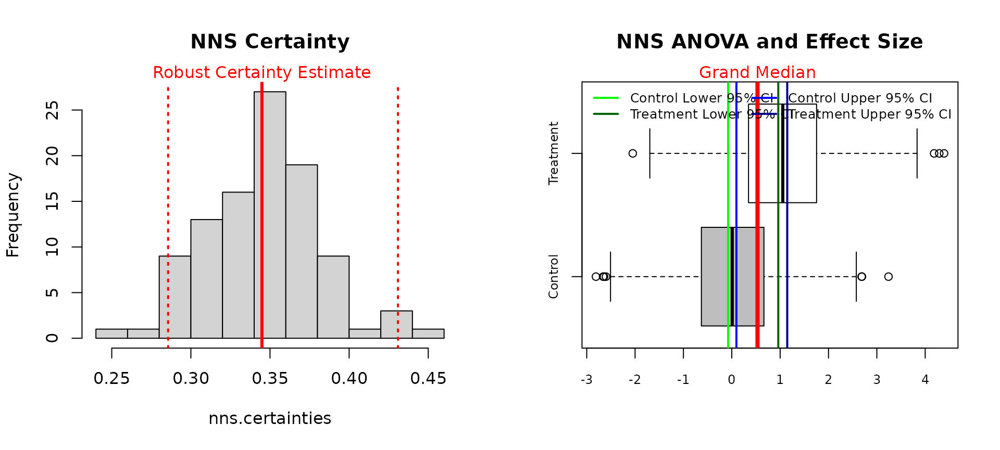
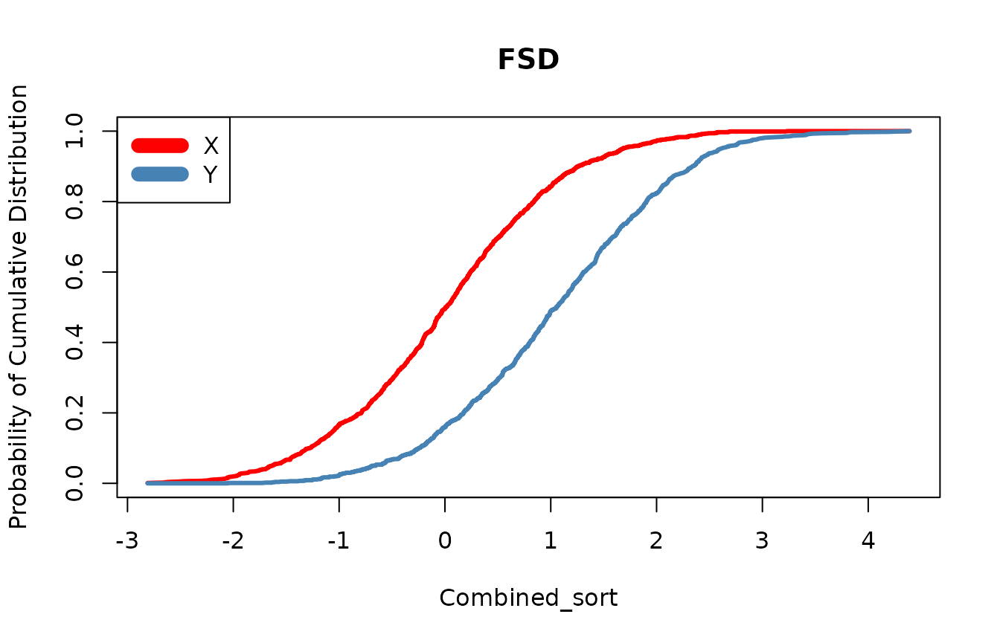

# Getting Started with NNS: Comparing Distributions

``` r

library(NNS)
library(data.table)
require(knitr)
require(rgl)
```

## Comparing Distributions

**`NNS`** offers a multitude of ways to test if distributions came from
the same population, or if they share the same mean or median. The
underlying function for these tests is
**[`NNS.ANOVA()`](https://OVVO-Financial.github.io/NNS/reference/NNS.ANOVA.md)**.

The output from
**[`NNS.ANOVA()`](https://OVVO-Financial.github.io/NNS/reference/NNS.ANOVA.md)**
is a `Certainty` statistic, which compares CDFs of distributions from
several shared quantiles and normalizes the similarity of these points
to be within the interval $`[0,1]`$, with 1 representing identical
distributions. For a complete analysis of `Certainty` to common p-values
and the role of power, please see the [References](#References).

### Test if Same Population

Below we run the analysis to whether automatic transmissions and manual
transmissions have significantly different `mpg` distributions per the
`mtcars` dataset.

The plot on the left shows the robust `Certainty` estimate, reflecting
the distribution of `Certainty` estimates over 100 random permutations
of both variables. The plot on the right illustrates the control and
treatment variables, along with the grand mean among variables, and the
confidence interval associated with the control mean.

``` r

mpg_auto_trans = mtcars[mtcars$am==1, "mpg"]
mpg_man_trans = mtcars[mtcars$am==0, "mpg"]

NNS.ANOVA(control = mpg_man_trans, treatment = mpg_auto_trans, robust = TRUE)
```



    ## $Control
    ## [1] 17.14737
    ## 
    ## $Treatment
    ## [1] 24.39231
    ## 
    ## $Grand_Statistic
    ## [1] 20.09063
    ## 
    ## $Control_CDF
    ## [1] 0.8708501
    ## 
    ## $Treatment_CDF
    ## [1] 0.1294878
    ## 
    ## $Certainty
    ## [1] 0.02345583
    ## 
    ## $`Effect_Size_LB.2.5%`
    ## [1] 2.651417
    ## 
    ## $`Effect_Size_UB.97.5%`
    ## [1] 12.29762
    ## 
    ## $Confidence_Level
    ## [1] 0.95
    ## 
    ## $`Robust Certainty Estimate`
    ## [1] 0.01293582
    ## 
    ## $`Lower 95% CI`
    ## [1] 0
    ## 
    ## $`Upper 95% CI`
    ## [1] 0.08849623

The `Certainty` shows that these two distributions clearly do not come
from the same population. This is verified with the
Mann-Whitney-Wilcoxon test, which also does not assume a normality to
the underlying data as a nonparametric test of identical distributions.

``` r

wilcox.test(mpg ~ am, data=mtcars) 
```

    ## 
    ##  Wilcoxon rank sum exact test
    ## 
    ## data:  mpg by am
    ## W = 42, p-value = 0.001159
    ## alternative hypothesis: true location shift is not equal to 0

### Test if means are Equal

Here we provide the output from
**[`NNS.ANOVA()`](https://OVVO-Financial.github.io/NNS/reference/NNS.ANOVA.md)**
and [`t.test()`](https://rdrr.io/r/stats/t.test.html) functions on two
Normal distribution samples, where we are pretty certain these two means
are equal.

``` r

set.seed(123)
x = rnorm(1000, mean = 0, sd = 1)
y = rnorm(1000, mean = 0, sd = 2)

NNS.ANOVA(control = x, treatment = y,
          means.only = TRUE, robust = TRUE, plot = TRUE)
```



    ## $Control
    ## [1] 0.01612787
    ## 
    ## $Treatment
    ## [1] 0.08493051
    ## 
    ## $Grand_Statistic
    ## [1] 0.05052919
    ## 
    ## $Control_CDF
    ## [1] 0.5218858
    ## 
    ## $Treatment_CDF
    ## [1] 0.4893919
    ## 
    ## $Certainty
    ## [1] 0.912545
    ## 
    ## $`Effect_Size_LB.2.5%`
    ## [1] -0.1215839
    ## 
    ## $`Effect_Size_UB.97.5%`
    ## [1] 0.2556542
    ## 
    ## $Confidence_Level
    ## [1] 0.95
    ## 
    ## $`Robust Certainty Estimate`
    ## [1] 0.9183685
    ## 
    ## $`Lower 95% CI`
    ## [1] 0.7311398
    ## 
    ## $`Upper 95% CI`
    ## [1] 0.9928339

``` r

t.test(x,y)
```

    ## 
    ##  Welch Two Sample t-test
    ## 
    ## data:  x and y
    ## t = -0.96711, df = 1454.4, p-value = 0.3336
    ## alternative hypothesis: true difference in means is not equal to 0
    ## 95 percent confidence interval:
    ##  -0.20835512  0.07074984
    ## sample estimates:
    ##  mean of x  mean of y 
    ## 0.01612787 0.08493051

### Test if means are Unequal

By altering the mean of the `y` variable, we can start to see the
sensitivity of the results from the two methods, where both firmly
reject the null hypothesis of identical means.

``` r

set.seed(123)
x = rnorm(1000, mean = 0, sd = 1)
y = rnorm(1000, mean = 1, sd = 1)

NNS.ANOVA(control = x, treatment = y,
          means.only = TRUE, robust = TRUE, plot = TRUE)
```



    ## $Control
    ## [1] 0.01612787
    ## 
    ## $Treatment
    ## [1] 1.042465
    ## 
    ## $Grand_Statistic
    ## [1] 0.5292966
    ## 
    ## $Control_CDF
    ## [1] 0.7862176
    ## 
    ## $Treatment_CDF
    ## [1] 0.2197938
    ## 
    ## $Certainty
    ## [1] 0.1824463
    ## 
    ## $`Effect_Size_LB.2.5%`
    ## [1] 0.900412
    ## 
    ## $`Effect_Size_UB.97.5%`
    ## [1] 1.148409
    ## 
    ## $Confidence_Level
    ## [1] 0.95
    ## 
    ## $`Robust Certainty Estimate`
    ## [1] 0.1788691
    ## 
    ## $`Lower 95% CI`
    ## [1] 0.1484567
    ## 
    ## $`Upper 95% CI`
    ## [1] 0.2114944

``` r

t.test(x,y)
```

    ## 
    ##  Welch Two Sample t-test
    ## 
    ## data:  x and y
    ## t = -22.933, df = 1997.4, p-value < 2.2e-16
    ## alternative hypothesis: true difference in means is not equal to 0
    ## 95 percent confidence interval:
    ##  -1.1141064 -0.9385684
    ## sample estimates:
    ##  mean of x  mean of y 
    ## 0.01612787 1.04246525

The effect size from
**[`NNS.ANOVA()`](https://OVVO-Financial.github.io/NNS/reference/NNS.ANOVA.md)**
is calculated from the confidence interval of the control mean and the
specified `y` shift of 1 is within the provided lower and upper effect
boundaries.

### Medians

In order to test medians instead of means, simply set both
`means.only = TRUE` and `medians = TRUE` in
**[`NNS.ANOVA()`](https://OVVO-Financial.github.io/NNS/reference/NNS.ANOVA.md)**.

``` r

NNS.ANOVA(control = x, treatment = y,
          means.only = TRUE, medians = TRUE, robust = TRUE, plot = TRUE)
```



    ## $Control
    ## [1] 0.009209639
    ## 
    ## $Treatment
    ## [1] 1.054852
    ## 
    ## $Grand_Statistic
    ## [1] 0.532031
    ## 
    ## $Control_CDF
    ## [1] 0.704
    ## 
    ## $Treatment_CDF
    ## [1] 0.305
    ## 
    ## $Certainty
    ## [1] 0.3497634
    ## 
    ## $`Effect_Size_LB.2.5%`
    ## [1] 0.8659585
    ## 
    ## $`Effect_Size_UB.97.5%`
    ## [1] 1.222394
    ## 
    ## $Confidence_Level
    ## [1] 0.95
    ## 
    ## $`Robust Certainty Estimate`
    ## [1] 0.3448958
    ## 
    ## $`Lower 95% CI`
    ## [1] 0.2856004
    ## 
    ## $`Upper 95% CI`
    ## [1] 0.4308527

## Stochastic Superiority

Stochastic superiority asks a different question than equality of means
or equality of distributions. Rather than testing whether two samples
came from the same population, or whether they share the same mean or
median, stochastic superiority measures the probability that a random
draw from one distribution exceeds a random draw from another.

For two random variables $`X`$ and $`Y`$, the stochastic superiority
probability is:

``` math
P(X > Y)
```

and with ties accounted for, the tie-adjusted stochastic superiority
measure is:

``` math
P^* = P(X > Y) + \frac{1}{2} P(X = Y)
```

A value of $`P^* = 0.5`$ indicates no directional advantage, values
above $`0.5`$ favor $`X`$, and values below $`0.5`$ favor $`Y`$.

This differs from stochastic dominance. Stochastic superiority is a
pairwise exceedance probability, while stochastic dominance requires one
distribution to be preferred to another over the entire shared support.

Below is an example using the same data generating process from the
unequal means example.

``` r

set.seed(123)
x = rnorm(1000, mean = 0, sd = 1)
y = rnorm(1000, mean = 1, sd = 1)

NNS.SS(x, y)
```

    ## $p_gt
    ## [1] 0.233915
    ## 
    ## $p_tie
    ## [1] 0
    ## 
    ## $p_star
    ## [1] 0.233915

Since $`y`$ was generated with a higher mean, the stochastic superiority
probability for $`x`$ relative to $`y`$ should be less than $`0.5`$,
indicating that a draw from $`x`$ is less likely to exceed a draw from
$`y`$.

We can also obtain confidence intervals for the tie-adjusted superiority
probability using maximum entropy bootstrap replicates.

``` r
NNS.SS(x, y, confidence.interval = TRUE, reps = 999, ci = 0.95)[1:5]

$p_gt
[1] 0.233915

$p_tie
[1] 0

$p_star
[1] 0.233915

$lower
[1] 0.2105631

$upper
[1] 0.2537789
```

This provides an interpretable effect size for directional comparison
between two distributions without requiring identical distributions or
equal variances.

For discrete variables, ties may occur with positive probability, and
the reported `p_tie` and `p_star` values reflect that adjustment
explicitly.

``` r

set.seed(123)
x = sample(1:5, 100, replace = TRUE)
y = sample(1:5, 100, replace = TRUE)

NNS.SS(x, y)
```

    ## $p_gt
    ## [1] 0.3982
    ## 
    ## $p_tie
    ## [1] 0.1992
    ## 
    ## $p_star
    ## [1] 0.4978

## Stochastic Dominance

Another method of comparing distributions involves a test for stochastic
dominance. The first, second, and third degree stochastic dominance
tests are available in **`NNS`** via:

- **[`NNS.FSD()`](https://OVVO-Financial.github.io/NNS/reference/NNS.FSD.md)**

- **[`NNS.SSD()`](https://OVVO-Financial.github.io/NNS/reference/NNS.SSD.md)**

- **[`NNS.TSD()`](https://OVVO-Financial.github.io/NNS/reference/NNS.TSD.md)**

``` r

set.seed(123)
x = rnorm(1000, mean = 0, sd = 1)
y = rnorm(1000, mean = 1, sd = 1)

NNS.FSD(x, y)
```



    ## [1] "Y FSD X"

**[`NNS.FSD()`](https://OVVO-Financial.github.io/NNS/reference/NNS.FSD.md)**
correctly identifies the shift in the `y` variable we specified when
testing for unequal means.

### Stochastic Dominant Efficient Sets

**`NNS`** also offers the ability to isolate a set of variables that do
not have any dominated constituents with the
**[`NNS.SD.efficient.set()`](https://OVVO-Financial.github.io/NNS/reference/NNS.SD.efficient.set.md)**
function.

`x2, x4, x6, x8` all dominate their preceding distributions yet do not
dominate one another, and are thus included in the first degree
stochastic dominance efficient set.

``` r

set.seed(123)
x1 = rnorm(1000)
x2 = x1 + 1
x3 = rnorm(1000)
x4 = x3 + 1
x5 = rnorm(1000)
x6 = x5 + 1
x7 = rnorm(1000)
x8 = x7 + 1

NNS.SD.efficient.set(cbind(x1, x2, x3, x4, x5, x6, x7, x8), degree = 1, status = FALSE)
```

    ## [1] "x4" "x2" "x8" "x6"

### Stochastic Dominant Clusters

Further, we can assign clusters to non dominated constituents and
represent the clustering in a dendrogram.

``` r

NNS.SD.cluster(cbind(x1, x2, x3, x4, x5, x6, x7, x8), degree = 1, dendrogram = TRUE)
```


    ## $Clusters
    ## $Clusters$Cluster_1
    ## [1] "x4" "x2" "x8" "x6"
    ## 
    ## $Clusters$Cluster_2
    ## [1] "x3" "x1" "x7" "x5"
    ## 
    ## 
    ## $Dendrogram
    ## 
    ## Call:
    ## hclust(d = dist_matrix, method = "complete")
    ## 
    ## Cluster method   : complete 
    ## Number of objects: 8

## References

If the user is so motivated, detailed arguments and proofs are provided
within the following:

- [Nonlinear Nonparametric Statistics: Using Partial
  Moments](https://ovvo-financial.github.io/NNS/book/)

- [Continuous CDFs and ANOVA with
  NNS](https://doi.org/10.2139/ssrn.3007373)

- [A Note on Stochastic Dominance](https://doi.org/10.2139/ssrn.3002675)

- [LPM Density Functions for the Computation of the SD Efficient
  Set](http://dx.doi.org/10.4236/jmf.2016.61012)
