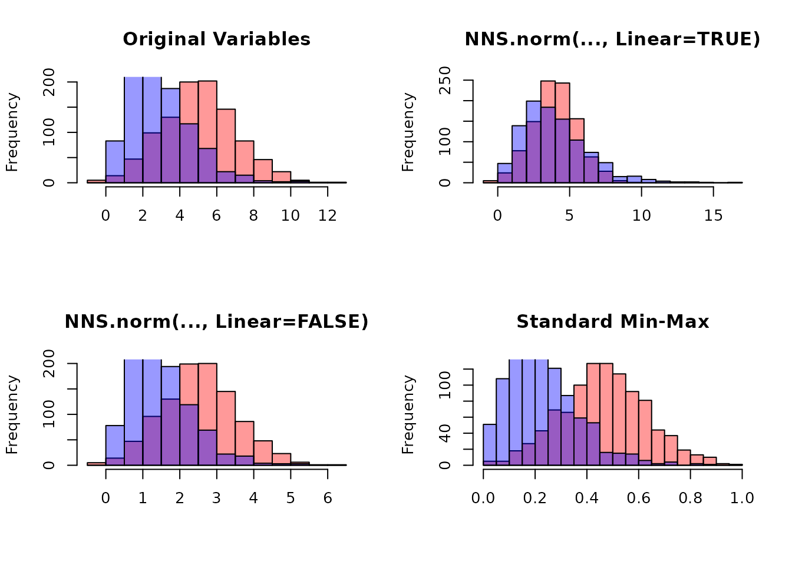

# Getting Started with NNS: Normalization and Rescaling

``` r
library(NNS)
library(data.table)
require(knitr)
require(rgl)
```

### Overview

This vignette covers two related tools:

- [`NNS.norm()`](https://OVVO-Financial.github.io/NNS/reference/NNS.norm.md)
  for cross‑variable normalization when comparing multiple series.
- [`NNS.rescale()`](https://OVVO-Financial.github.io/NNS/reference/NNS.rescale.md)
  for single‑vector rescaling with either min‑max or risk‑neutral
  targets.

Both functions perform deterministic affine transformations that
preserve rank structure while modifying scale.

------------------------------------------------------------------------

## `NNS.norm()`: Normalize Multiple Variables

[`NNS.norm()`](https://OVVO-Financial.github.io/NNS/reference/NNS.norm.md)
rescales variables to a common magnitude while preserving distributional
structure. The method can be **linear** (all variables forced to have
the same mean) or **nonlinear** (using dependence weights to produce a
more nuanced scaling). In the nonlinear case, the degree of association
between variables influences the final normalized values.

### Mathematical Structure

Let $X$ be an $n \times p$ matrix of variables.

#### Step 1: Compute Mean Vector

$$m_{j} = \text{mean}\left( X_{\cdot j} \right)$$

If any $m_{j} = 0$, it is replaced with $10^{- 10}$ to prevent division
by zero.

------------------------------------------------------------------------

#### Step 2: Construct Mean Ratio Matrix

$$RG_{ij} = \frac{m_{i}}{m_{j}}$$

In R this corresponds to:

``` r
RG <- outer(m, 1 / m)
```

------------------------------------------------------------------------

#### Step 3: Dependence Weight Matrix

If `linear = FALSE`:

- If number of variables $p < 10$: $$W = \left| {cor}(X) \right|$$
- Otherwise:
  $$W = |D|\quad{\text{where}\mspace{6mu}}D = \text{NNS.dep}(X)\$ Dependence$$[`NNS.dep()`](https://OVVO-Financial.github.io/NNS/reference/NNS.dep.md)
  returns a symmetric matrix of nonlinear dependence measures.

If `linear = TRUE`, the weighting effectively becomes:

$$W_{ij} = 1$$

------------------------------------------------------------------------

#### Step 4: Scaling Factors

$$s_{j} = \frac{1}{p}\sum\limits_{i = 1}^{p}RG_{ij}W_{ij}$$

Each column is scaled:

$$X_{\cdot j}^{*} = s_{j}X_{\cdot j}$$

------------------------------------------------------------------------

### Linear Case Proof

If $W_{ij} = 1$:

$$s_{j} = \frac{1}{p}\sum\limits_{i = 1}^{p}\frac{m_{i}}{m_{j}} = \frac{\bar{m}}{m_{j}}$$

Then:

$$\text{mean}\left( X_{\cdot j}^{*} \right) = s_{j}m_{j} = \bar{m}$$

All variables share the same mean.

------------------------------------------------------------------------

### Nonlinear Case Interpretation

$$\text{mean}\left( X_{\cdot j}^{*} \right) = \frac{1}{p}\sum\limits_{i = 1}^{p}m_{i}W_{ij}$$

Thus, the normalized mean becomes a dependence‑weighted average of
original means. Variables more strongly dependent with higher‑mean
variables scale upward more.

------------------------------------------------------------------------

### Examples

#### Basic Multivariate Example

This holds for any distribution type and can be applied to vectors of
different lengths.

``` r
set.seed(123)

A <- rnorm(100, mean = 0, sd = 1)
B <- rnorm(100, mean = 0, sd = 5)
C <- rnorm(100, mean = 10, sd = 1)
D <- rnorm(100, mean = 10, sd = 10)

X <- data.frame(A, B, C, D)

# Linear scaling
lin_norm <- NNS.norm(X, linear = TRUE, chart.type = NULL)
head(lin_norm)
     A Normalized B Normalized C Normalized D Normalized
[1,]   -29.929719    31.889828     5.819152    1.4264014
[2,]   -12.291609   -11.531393     5.396317    1.2388239
[3,]    83.235911    11.073887     4.643781    0.3078703
[4,]     3.765188    15.601030     5.029380   -0.2630481
[5,]     6.904039    42.717726     4.572611    2.8193657
[6,]    91.585447     2.021274     4.543080    6.6681079

# Verify means are equal
apply(lin_norm, 2, function(x) c(mean = mean(x), sd = sd(x)))

     A Normalized B Normalized C Normalized D Normalized
mean     4.827727     4.827727    4.8277270     4.827727
sd      48.744888    43.407590    0.4531172     5.203436
```

Now compare with **nonlinear scaling**:

``` r
nonlin_norm <- NNS.norm(X, linear = FALSE, chart.type = NULL)
head(nonlin_norm)
     A Normalized B Normalized C Normalized D Normalized
[1,]   -2.7834653   0.32807768     3.178568    0.7439872
[2,]   -1.1431202  -0.11863321     2.947605    0.6461499
[3,]    7.7409438   0.11392645     2.536550    0.1605800
[4,]    0.3501627   0.16050101     2.747174   -0.1372015
[5,]    0.6420759   0.43947344     2.497676    1.4705341
[6,]    8.5174510   0.02079456     2.481545    3.4779738

apply(nonlin_norm, 2, function(x) c(mean = mean(x), sd = sd(x)))

     A Normalized B Normalized C Normalized D Normalized
mean    0.4489788   0.04966692     2.637026     2.518062
sd      4.5332769   0.44657066     0.247504     2.714025
```

Note that the means differ and the standard deviations are smaller than
in the linear case, reflecting the dependence structure.

##### Normalize list of unequal vector lengths

``` r
set.seed(123)
vec1 <- rnorm(n = 10, mean = 0, sd = 1)
vec2 <- rnorm(n = 5, mean = 5, sd = 5)
vec3 <- rnorm(n = 8, mean = 10, sd = 10)

vec_list <- list(vec1, vec2, vec3)

NNS.norm(vec_list)

$`x_1 Normalized`
 [1]  13.074058  -3.004912 -11.745878  25.406891  -4.647966  -5.481229   6.225165   5.920719   6.113733   9.640242

$`x_2 Normalized`
[1]  2.875960212  0.008876158  1.230826150  5.855582361 10.779166523

$`x_3 Normalized`
[1]  4.0749062  2.2395840  0.4067264  0.7457562 15.6445780  5.1941416  2.3326665  2.5622994
```

------------------------------------------------------------------------

#### Quantile Normalization Comparison

Quantile normalization forces distributions to be identical. This is
literally the opposite intended effect of `NNS.norm`, which preserves
individual distribution shapes while aligning ranges. The quantile
normalized series become identical in distribution, while the `NNS`
methods retain the original patterns.

------------------------------------------------------------------------

### Practical Applications

Normalization eliminates the need for multiple y‑axis charts and
prevents their misuse. By placing variables on the same axes with shared
ranges, we enable more relevant conditional probability analyses. This
technique, combined with time normalization, is used in
[`NNS.caus()`](https://OVVO-Financial.github.io/NNS/reference/NNS.caus.md)
to identify causal relationships between variables.

------------------------------------------------------------------------

## `NNS.rescale()`: Distribution Rescaling

[`NNS.rescale()`](https://OVVO-Financial.github.io/NNS/reference/NNS.rescale.md)
performs one‑dimensional affine transformations.

Function signature:

    NNS.rescale(x, a, b, method = "minmax", T = NULL, type = "Terminal")

------------------------------------------------------------------------

### 1) Min-Max Scaling

If `method = "minmax"`:

$$x^{*} = a + (b - a)\frac{x - \min(x)}{\max(x) - \min(x)}$$

Properties:

- Preserves order
- Maps support to $\lbrack a,b\rbrack$
- Linear transformation

------------------------------------------------------------------------

#### Example

``` r
raw_vals <- c(-2.5, 0.2, 1.1, 3.7, 5.0)

scaled_minmax <- NNS.rescale(
  x = raw_vals,
  a = 5,
  b = 10,
  method = "minmax",
  T = NULL,
  type = "Terminal"
)

cbind(raw_vals, scaled_minmax)
#>      raw_vals scaled_minmax
#> [1,]     -2.5      5.000000
#> [2,]      0.2      6.800000
#> [3,]      1.1      7.400000
#> [4,]      3.7      9.133333
#> [5,]      5.0     10.000000
range(scaled_minmax)
#> [1]  5 10
```

------------------------------------------------------------------------

### 2) Risk-Neutral Scaling

If `method = "riskneutral"`:

Let:

- $S_{0} = a$
- $r = b$
- $T$ = time horizon

#### Terminal Type

Target:

$${\mathbb{E}}\left\lbrack S_{T} \right\rbrack = S_{0}e^{rT}$$

Transformation form:

$$x^{*} = x \cdot \frac{S_{0}e^{rT}}{\text{mean}(x)}$$

This enforces the required expectation.

------------------------------------------------------------------------

#### Discounted Type

Target:

$${\mathbb{E}}\left\lbrack e^{- rT}S_{T} \right\rbrack = S_{0}$$

Equivalent to:

$${\mathbb{E}}\left\lbrack S_{T} \right\rbrack = S_{0}e^{rT}$$

but the returned series is scaled so that its discounted mean equals
$S_{0}$. In practice, the function applies the same multiplicative
factor as above, because:

$$\text{mean}\left( e^{- rT}x^{*} \right) = e^{- rT} \cdot \text{mean}\left( x^{*} \right) = e^{- rT} \cdot S_{0}e^{rT} = S_{0}.$$

------------------------------------------------------------------------

### Risk-Neutral Example

``` r
set.seed(123)
S0 <- 100
r <- 0.05
T <- 1

# Simulate a price path
prices <- S0 * exp(cumsum(rnorm(250, 0.0005, 0.02)))

rn_terminal <- NNS.rescale(
  x = prices,
  a = S0,
  b = r,
  method = "riskneutral",
  T = T,
  type = "Terminal"
)

c(
  mean_original = mean(prices),
  mean_rescaled = mean(rn_terminal),
  target = S0 * exp(r * T)
)

mean_original mean_rescaled        target 
     109.7019      105.1271      105.1271 
```

------------------------------------------------------------------------

### Discounted Example

``` r
rn_discounted <- NNS.rescale(
  x = prices,
  a = S0,
  b = r,
  method = "riskneutral",
  T = T,
  type = "Discounted"
)

c(
  mean_rescaled = mean(rn_discounted),
  target_discounted_mean = S0
)

         mean_rescaled target_discounted_mean 
                   100                    100 
```

------------------------------------------------------------------------

## Conceptual Summary

#### `NNS.norm()`

- Multivariate
- Dependence‑aware scaling
- Equalizes means only in linear mode
- Preserves shape and order

#### `NNS.rescale()`

- Univariate
- Affine transformation
- Either range‑targeted or expectation‑targeted
- Preserves rank structure

Both functions maintain monotonicity and are therefore compatible with
NNS copula and dependence modeling frameworks.

``` r
set.seed(123)

x <- rnorm(1000, 5, 2)
y <- rgamma(1000, 3, 1)

# Combine variables
X <- cbind(x, y)

# NNS normalization
X_norm_lin <- NNS.norm(X, linear = TRUE)
X_norm_nonlin <- NNS.norm(X, linear = FALSE)

# Standard min-max normalization
minmax <- function(v) (v - min(v)) / (max(v) - min(v))
X_minmax <- apply(X, 2, minmax)
```



------------------------------------------------------------------------

## References

If the user is so motivated, detailed arguments further examples are
provided within the following:

- [Nonlinear Nonparametric Statistics: Using Partial
  Moments](https://ovvo-financial.github.io/NNS/book/)

- [Nonlinear Scaling Normalization with
  NNS](https://github.com/OVVO-Financial/NNS/blob/NNS-Beta-Version/examples/Normalization.pdf)

- [Distributional Equivalence in GBM: Outcome Transformation for
  Efficient Risk-Neutral Pricing](https://doi.org/10.2139/ssrn.5742907)
