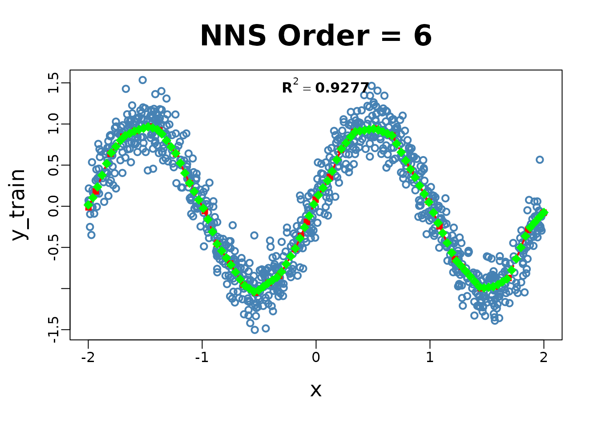
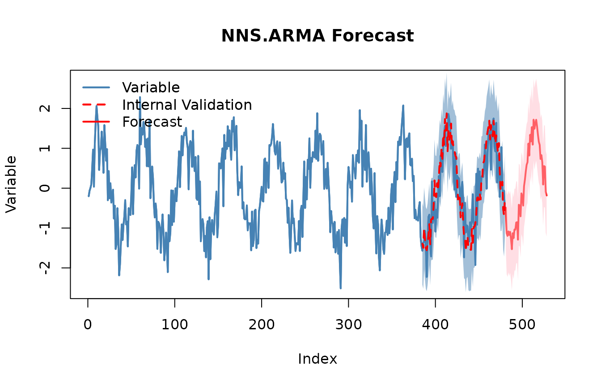

# Getting Started with NNS: Overview

``` r
# Prereqs (uncomment if needed):
# install.packages("NNS")
# install.packages(c("data.table","xts","zoo","Rfast"))

library(NNS)
```

    ## Warning in rgl.init(initValue, onlyNULL): RGL: unable to open X11 display

    ## Warning: 'rgl.init' failed, will use the null device.
    ## See '?rgl.useNULL' for ways to avoid this warning.

``` r
library(data.table)
```

## Orientation

**Goal.** A complete, hands‑on curriculum for Nonlinear Nonparametric
Statistics (NNS) using **partial moments**. Each section blends
narrative intuition, precise math, and executable code.

**Structure.**

1.  Foundations — partial moments & variance decomposition
2.  Descriptive & distributional tools
3.  Dependence & nonlinear association
4.  Hypothesis testing & ANOVA (LPM‑CDF)
5.  Regression, boosting, stacking & causality
6.  Time series & forecasting
7.  Normalziation & Rescaling
8.  Simulation (max‑entropy) & Monte Carlo
9.  Portfolio & stochastic dominance

**Notation.** For a random variable $X$ and threshold/target $t$, the
population $n$‑th **partial moments** are defined as

$$\operatorname{LPM}(n,t,X) = \int_{- \infty}^{t}(t - x)^{n}\, dF_{X}(x),\qquad\operatorname{UPM}(n,t,X) = \int_{t}^{\infty}(x - t)^{n}\, dF_{X}(x).$$

The **empirical** estimators replace $F_{X}$ with the empirical CDF
${\widehat{F}}_{n}$ (or, equivalently, use indicator functions):

$${\widehat{\operatorname{LPM}}}_{n}(t;X) = \frac{1}{n}\sum\limits_{i = 1}^{n}\left( t - x_{i} \right)^{n}\,\mathbf{1}_{\{ x_{i} \leq t\}},\qquad{\widehat{\operatorname{UPM}}}_{n}(t;X) = \frac{1}{n}\sum\limits_{i = 1}^{n}\left( x_{i} - t \right)^{n}\,\mathbf{1}_{\{ x_{i} > t\}}.$$

These correspond to integrals over the measurable subsets
$\{ X \leq t\}$ and $\{ X > t\}$ in a $\sigma$‑algebra; the empirical
sums are discrete analogues of Lebesgue integrals.

------------------------------------------------------------------------

## 1. Foundations — Partial Moments & Variance Decomposition

### 1.1 Why partial moments

- Classical variance treats upside and downside symmetrically. Partial
  moments separate them, allowing **asymmetric risk/reward** analysis
  around a chosen target $t$ (often the mean or a benchmark).
- At $t = \mu_{X}$:
  $$\operatorname{Var}(X) = \operatorname{UPM}\left( 2,\mu_{X},X \right) + \operatorname{LPM}\left( 2,\mu_{X},X \right)\quad\text{(exact empirical identity)}.$$
  This **is not** the same as splitting conditional variances around a
  threshold; partial moments use a *global* reference, preserving the
  between‑group contribution.

### 1.2 Core functions and headers

- `LPM(degree, target, variable)`
- `UPM(degree, target, variable)`

### 1.3 Code: variance decomposition & CDF

``` r
set.seed(42)

# Normal sample
y <- rnorm(3000)
mu <- mean(y)
L2 <- LPM(2, mu, y); U2 <- UPM(2, mu, y)
cat(sprintf("LPM2 + UPM2 = %.6f vs var(y)=%.6f\n", (L2+U2)*(length(y) / (length(y) - 1)), var(y)))
```

    ## LPM2 + UPM2 = 1.011889 vs var(y)=1.011889

``` r
# Empirical CDF via LPM.ratio(0, t, x)
for (t in c(-1,0,1)) {
  cdf_lpm <- LPM.ratio(0, t, y)
  cat(sprintf("CDF at t=%+.1f : LPM.ratio=%.4f | empirical=%.4f\n", t, cdf_lpm, mean(y<=t)))
}
```

    ## CDF at t=-1.0 : LPM.ratio=0.1633 | empirical=0.1633
    ## CDF at t=+0.0 : LPM.ratio=0.5043 | empirical=0.5043
    ## CDF at t=+1.0 : LPM.ratio=0.8480 | empirical=0.8480

``` r
# Asymmetry on a skewed distribution
z <- rexp(3000)-1; mu_z <- mean(z)
cat(sprintf("Skewed z: LPM2=%.4f, UPM2=%.4f (expect imbalance)\n", LPM(2,mu_z,z), UPM(2,mu_z,z)))
```

    ## Skewed z: LPM2=0.2780, UPM2=0.7682 (expect imbalance)

**Interpretation.** The equality `LPM2 + UPM2 == var(x)` (Bessel
adjustment used) holds because deviations are measured against the
*global* mean. `LPM.ratio(0, t, x)` constructs an empirical CDF directly
from partial‑moment counts.

------------------------------------------------------------------------

## 2. Descriptive & Distributional Tools

### 2.1 Higher moments from partial moments

Define asymmetric analogues of skewness/kurtosis using
$\operatorname{UPM}_{3}$, $\operatorname{LPM}_{3}$ (and degree 4),
yielding robust tail diagnostics without parametric assumptions.

**Header.** `NNS.moments(x)`

``` r
M <- NNS.moments(y)
M
```

    ## $mean
    ## [1] -0.0114498
    ## 
    ## $variance
    ## [1] 1.011552
    ## 
    ## $skewness
    ## [1] -0.007412142
    ## 
    ## $kurtosis
    ## [1] 0.06723772

### 2.2 Mode estimation (no bin‑or‑bandwidth angst)

**Header.** `NNS.mode(x)`

``` r
set.seed(23)
multimodal <- c(rnorm(1500,-2,.5), rnorm(1500,2,.5))
NNS.mode(multimodal,multi = TRUE)
```

    ## [1] -2.049405  1.987674

### 2.3 CDF tables via LPM ratios

**Headers.**

- `LPM.ratio(degree = 0, target, variable)` (empirical CDF when
  `degree=0`)
- `UPM.ratio(degree = 0, target, variable)`
- `LPM.VaR(p, degree, variable)` (quantiles via partial‑moment CDFs)
- `UPM.VaR(p, degree, variable)`

``` r
qgrid <- LPM.VaR(seq(0.05,0.95,.1),0,z) # equivalent to quantile(z,probs = seq(0.05,0.95,by=0.1))
CDF_tbl <- data.table(threshold = as.numeric(qgrid), CDF = LPM.ratio(0,qgrid,z))
CDF_tbl
```

    ##       threshold   CDF
    ##           <num> <num>
    ##  1: -0.94052127  0.05
    ##  2: -0.83748109  0.15
    ##  3: -0.71317882  0.25
    ##  4: -0.57443327  0.35
    ##  5: -0.41017671  0.45
    ##  6: -0.20424962  0.55
    ##  7:  0.06850182  0.65
    ##  8:  0.41462712  0.75
    ##  9:  0.94307172  0.85
    ## 10:  2.09633977  0.95

------------------------------------------------------------------------

## 3. Dependence & Nonlinear Association

### 3.1 Why move beyond Pearson $r$

Pearson captures linear monotone relationships. Many structures
(U‑shapes, saturation, asymmetric tails) produce near‑zero $r$ despite
strong dependence. Partial‑moment dependence metrics respond to such
structure.

**Headers.**

- `Co.LPM(degree_lpm, x, y, target_x, target_y, degree_y)` /
  `Co.UPM(...)` (co‑partial moments)
- `PM.matrix(LPM_degree, UPM_degree, target=NULL, variable, pop_adj=TRUE)`
- `NNS.dep(x, y)` (scalar dependence coefficient)
- `NNS.copula(X, target=NULL, continuous=TRUE, plot=FALSE, independence.overlay=FALSE)`

### 3.2 Code: nonlinear dependence

``` r
set.seed(1)
x <- runif(2000,-1,1)
y <- x^2 + rnorm(2000, sd=.05)
cat(sprintf("Pearson r = %.4f\n", cor(x,y)))
```

    ## Pearson r = 0.0006

``` r
cat(sprintf("NNS.dep  = %.4f\n", NNS.dep(x,y)$Dependence))
```

    ## NNS.dep  = 0.7097

``` r
X <- data.frame(a=x, b=y, c=x*y + rnorm(2000, sd=.05))
pm <- PM.matrix(1, 1, target = "means", variable=X, pop_adj=TRUE)
pm
```

    ## $cupm
    ##            a          b          c
    ## a 0.17384174 0.05668152 0.10450858
    ## b 0.05668152 0.05566363 0.04414923
    ## c 0.10450858 0.04414923 0.07529373
    ## 
    ## $dupm
    ##              a          b            c
    ## a 0.0000000000 0.05675501 0.0005598221
    ## b 0.0143108307 0.00000000 0.0036839026
    ## c 0.0004239566 0.04430691 0.0000000000
    ## 
    ## $dlpm
    ##              a           b            c
    ## a 0.0000000000 0.014310831 0.0004239566
    ## b 0.0567550147 0.000000000 0.0443069142
    ## c 0.0005598221 0.003683903 0.0000000000
    ## 
    ## $clpm
    ##            a           b           c
    ## a 0.16803827 0.014485430 0.102709867
    ## b 0.01448543 0.037120650 0.003051617
    ## c 0.10270987 0.003051617 0.074865823
    ## 
    ## $cov.matrix
    ##              a             b            c
    ## a 0.3418800141  0.0001011068  0.206234664
    ## b 0.0001011068  0.0927842833 -0.000789973
    ## c 0.2062346637 -0.0007899730  0.150159552

``` r
cop <- NNS.copula(X, continuous=TRUE, plot=FALSE)
cop
```

    ## [1] 0.5692785

### 3.3 Code: copula

``` r
# Data
set.seed(123); x = rnorm(100); y = rnorm(100); z = expand.grid(x, y)

# Plot
rgl::plot3d(z[,1], z[,2], Co.LPM(0, z[,1], z[,2], z[,1], z[,2]), col = "red")

# Uniform values
u_x = LPM.ratio(0, x, x); u_y = LPM.ratio(0, y, y); z = expand.grid(u_x, u_y)

# Plot
rgl::plot3d(z[,1], z[,2], Co.LPM(0, z[,1], z[,2], z[,1], z[,2]), col = "blue")
```

**Interpretation.** `NNS.dep` remains high for curved relationships;
`PM.matrix` collects co‑partial moments across variables; `NNS.copula`
summarizes higher‑dimensional dependence using partial‑moment ratios.
Copulas are returned and evaluated via `Co.LPM` functions.

------------------------------------------------------------------------

## 4. Normalization and Rescaling

NNS provides two main tools for scaling data while preserving rank
structure and distributional shape. Both operate via deterministic
affine transformations.

### 4.1 Normalization

[`NNS.norm()`](https://OVVO-Financial.github.io/NNS/reference/NNS.norm.md)
rescales variables to a common magnitude while preserving distributional
structure. The method can be **linear** (all variables forced to have
the same mean) or **nonlinear** (using dependence weights to produce a
more nuanced scaling). In the nonlinear case, the degree of association
between variables influences the final normalized values.

**Header.**

- `NNS.norm(x, linear=TRUE, chart.type = NULL)`

``` r
A <- rnorm(100, mean = 0, sd = 1)
B <- rnorm(100, mean = 0, sd = 5)
C <- rnorm(100, mean = 10, sd = 1)
D <- rnorm(100, mean = 10, sd = 10)

X <- data.frame(A, B, C, D)

# Linear scaling
lin_norm <- NNS.norm(X, linear = TRUE, chart.type=NULL, location=NULL)
```

**Interpretation.**
[`NNS.norm()`](https://OVVO-Financial.github.io/NNS/reference/NNS.norm.md)
brings variables to a common scale without distorting their
distributional shape. Linear mode equalizes means; nonlinear mode
additionally weights each variable by its dependence with others, so
more correlated variables exert greater influence on the final scaling.

### 4.2 Risk‑neutral rescale (pricing context)

[`NNS.rescale()`](https://OVVO-Financial.github.io/NNS/reference/NNS.rescale.md)
performs one‑dimensional affine transformations.

**Header.**

- `NNS.rescale(x, a, b, method=c("minmax","riskneutral"), T=NULL, type=c("Terminal","Discounted"))`

``` r
px <- 100 + cumsum(rnorm(260, sd = 1))
rn <- NNS.rescale(px, a=100, b=0.03, method="riskneutral", T=1, type="Terminal")
c( target = 100*exp(0.03*1), mean_rn = mean(rn) )
```

    ##   target  mean_rn 
    ## 103.0455 103.0455

**Interpretation.** `riskneutral` shifts the mean to match $S_{0}e^{rT}$
(Terminal) or $S_{0}$ (Discounted), preserving distributional shape.

------------------------------------------------------------------------

## 5. Hypothesis Testing & ANOVA (LPM‑CDF)

### 5.1 Concept

Instead of distributional assumptions, compare groups via **LPM‑based
CDFs**. Output is a *degree of certainty* (not a p‑value) for equality
of populations or means.

**Header.**

- `NNS.ANOVA(control, treatment, means.only=FALSE, medians=FALSE, confidence.interval=.95, tails=c("Both","left","right"), pairwise=FALSE, plot=TRUE, robust=FALSE)`

### 5.2 Code: two‑sample & multi‑group

``` r
ctrl <- rnorm(200, 0, 1)
trt  <- rnorm(180, 0.35, 1.2)
NNS.ANOVA(control=ctrl, treatment=trt, means.only=FALSE, plot=FALSE)
```

    ## $Control
    ## [1] 0.05568255
    ## 
    ## $Treatment
    ## [1] 0.2771257
    ## 
    ## $Grand_Statistic
    ## [1] 0.1605767
    ## 
    ## $Control_CDF
    ## [1] 0.5670595
    ## 
    ## $Treatment_CDF
    ## [1] 0.4385169
    ## 
    ## $Certainty
    ## [1] 0.6905166
    ## 
    ## $Effect_Size_LB
    ##        2.5% 
    ## -0.07055716 
    ## 
    ## $Effect_Size_UB
    ##     97.5% 
    ## 0.5317766 
    ## 
    ## $Confidence_Level
    ## [1] 0.95

``` r
A <- list(g1=rnorm(150,0.0,1.1), g2=rnorm(150,0.2,1.0), g3=rnorm(150,-0.1,0.9))
NNS.ANOVA(control=A, means.only=TRUE, plot=FALSE)
```

    ## Certainty 
    ## 0.6876008

**Math sketch.** For each quantile/threshold $t$, compare CDFs built
from `LPM.ratio(0, t, •)` (possibly with one‑sided tails). Aggregate
across $t$ to a certainty score.

------------------------------------------------------------------------

## 6. Regression, Boosting, Stacking & Causality

### 6.1 Philosophy

`NNS.reg` learns **partitioned** relationships using partial‑moment
weights — linear where appropriate, nonlinear where needed — avoiding
fragile global parametric forms.

**Headers.**

- `NNS.reg(x, y, order=NULL, smooth=TRUE, ncores=1, ...)` →
  `$Fitted.xy`, `$Point.est`, …
- `NNS.boost(IVs.train, DV.train, IVs.test, epochs, learner.trials, status, balance, type, folds)`
- `NNS.stack(IVs.train, DV.train, IVs.test, type, balance, ncores, folds)`
- `NNS.caus(x, y)` (directional causality score via conditional
  dependence)

### 6.2 Code: classification via regression + ensembles

``` r
# Example 1: Nonlinear regression
set.seed(123)
x_train <- runif(1000, -2, 2)
y_train <- sin(pi * x_train) + rnorm(1000, sd = 0.2)

x_test <- seq(-2, 2, length.out = 100)

NNS.reg(x = x_train, y = y_train, order = NULL, point.est = x_test)
```



    ## $R2
    ## [1] 0.9276761
    ## 
    ## $SE
    ## [1] 0.2015258
    ## 
    ## $Prediction.Accuracy
    ## NULL
    ## 
    ## $equation
    ## NULL
    ## 
    ## $x.star
    ## NULL
    ## 
    ## $derivative
    ##     Coefficient X.Lower.Range X.Upper.Range
    ##           <num>         <num>         <num>
    ##  1:   3.0485215  -1.998138604  -1.934370540
    ##  2:   3.5169373  -1.934370540  -1.804387149
    ##  3:   1.8605016  -1.804387149  -1.692769075
    ##  4:   0.6783073  -1.692769075  -1.590915710
    ##  5:   0.4272848  -1.590915710  -1.465816449
    ##  6:  -0.5144026  -1.465816449  -1.376464546
    ##  7:  -1.9381128  -1.376464546  -1.229726997
    ##  8:  -3.0106084  -1.229726997  -1.110428636
    ##  9:  -2.5210796  -1.110428636  -0.976623793
    ## 10:  -3.7347021  -0.976623793  -0.870193992
    ## 11:  -2.0861598  -0.870193992  -0.754706576
    ## 12:  -2.1796417  -0.754706576  -0.636846031
    ## 13:  -0.9300308  -0.636846031  -0.533099369
    ## 14:   1.0359249  -0.533099369  -0.417818767
    ## 15:   0.9115004  -0.417818767  -0.323764665
    ## 16:   2.3250859  -0.323764665  -0.184330858
    ## 17:   3.0769180  -0.184330858  -0.132632209
    ## 18:   3.3162510  -0.132632209  -0.080933560
    ## 19:   3.5323950  -0.080933560  -0.004108338
    ## 20:   2.1862481  -0.004108338   0.121863569
    ## 21:   3.4805229   0.121863569   0.216987038
    ## 22:   1.8001452   0.216987038   0.336388996
    ## 23:   0.2295375   0.336388996   0.516729182
    ## 24:  -0.5625172   0.516729182   0.668479078
    ## 25:  -2.5532272   0.668479078   0.830264570
    ## 26:  -2.4765129   0.830264570   0.988320504
    ## 27:  -3.1248612   0.988320504   1.083380900
    ## 28:  -2.9622550   1.083380900   1.218812429
    ## 29:  -1.5047059   1.218812429   1.279773569
    ## 30:  -1.5723118   1.279773569   1.445979675
    ## 31:   0.1804598   1.445979675   1.571628940
    ## 32:   0.8726461   1.571628940   1.689536565
    ## 33:   3.4198918   1.689536565   1.860999223
    ## 34:   1.5206901   1.860999223   1.997618112
    ##     Coefficient X.Lower.Range X.Upper.Range
    ##           <num>         <num>         <num>
    ## 
    ## $Point.est
    ##   [1]  0.01571202  0.10442684  0.23470933  0.37680781  0.51890629  0.65039140
    ##   [7]  0.72556318  0.80073496  0.85698998  0.88439634  0.91180269  0.93033285
    ##  [13]  0.94759688  0.96486091  0.95248720  0.93170326  0.87827479  0.79996720
    ##  [19]  0.72165961  0.64335202  0.52449573  0.40285499  0.28121424  0.17901835
    ##  [25]  0.07715655 -0.02470525 -0.15949123 -0.31038828 -0.45880078 -0.54309006
    ##  [31] -0.62737935 -0.71234468 -0.80041101 -0.88847734 -0.96331853 -1.00089554
    ##  [37] -1.03847254 -1.02090671 -0.97905116 -0.93719561 -0.89956805 -0.86273975
    ##  [43] -0.79660165 -0.70265879 -0.60871593 -0.51288396 -0.38856404 -0.25667590
    ##  [49] -0.11829230  0.02443074  0.13442845  0.22276171  0.31109496  0.42473203
    ##  [55]  0.56535922  0.69718932  0.76992246  0.84265560  0.90432326  0.91359751
    ##  [61]  0.92287175  0.93214599  0.94142023  0.92794242  0.90521445  0.88248648
    ##  [67]  0.85975852  0.76020581  0.65704511  0.55388442  0.45072372  0.35051056
    ##  [73]  0.25044944  0.15038831  0.04930377 -0.07695325 -0.20321027 -0.32495818
    ##  [79] -0.44464525 -0.56433232 -0.66432673 -0.72512293 -0.78817431 -0.85170206
    ##  [85] -0.91522981 -0.97875756 -0.99186193 -0.98457062 -0.97727932 -0.95314667
    ##  [91] -0.91788824 -0.88262981 -0.77697785 -0.63880041 -0.50062296 -0.36244551
    ##  [97] -0.25805231 -0.19661029 -0.13516826 -0.07526941
    ## 
    ## $pred.int
    ## NULL
    ## 
    ## $regression.points
    ##                x           y
    ##            <num>       <num>
    ##  1: -1.998138604 -0.01307124
    ##  2: -1.934370540  0.18132707
    ##  3: -1.804387149  0.63847051
    ##  4: -1.692769075  0.84613612
    ##  5: -1.590915710  0.91522399
    ##  6: -1.465816449  0.96867700
    ##  7: -1.376464546  0.92271416
    ##  8: -1.229726997  0.63832023
    ##  9: -1.110428636  0.27915958
    ## 10: -0.976623793 -0.05817308
    ## 11: -0.870193992 -0.45565668
    ## 12: -0.754706576 -0.69658188
    ## 13: -0.636846031 -0.95347564
    ## 14: -0.533099369 -1.04996323
    ## 15: -0.417818767 -0.93054118
    ## 16: -0.323764665 -0.84481083
    ## 17: -0.184330858 -0.52061525
    ## 18: -0.132632209 -0.36154275
    ## 19: -0.080933560 -0.19009705
    ## 20: -0.004108338  0.08127998
    ## 21:  0.121863569  0.35668582
    ## 22:  0.216987038  0.68776523
    ## 23:  0.336388996  0.90270609
    ## 24:  0.516729182  0.94410093
    ## 25:  0.668479078  0.85873901
    ## 26:  0.830264570  0.44566388
    ## 27:  0.988320504  0.05423632
    ## 28:  1.083380900 -0.24281423
    ## 29:  1.218812429 -0.64399694
    ## 30:  1.279773569 -0.73572553
    ## 31:  1.445979675 -0.99705336
    ## 32:  1.571628940 -0.97437872
    ## 33:  1.689536565 -0.87148709
    ## 34:  1.860999223 -0.28510334
    ## 35:  1.997618112 -0.07734835
    ##                x           y
    ##            <num>       <num>
    ## 
    ## $Fitted.xy
    ##                x          y      y.hat  NNS.ID   gradient    residuals
    ##            <num>      <num>      <num>  <char>      <num>        <num>
    ##    1: -0.8496899 -0.5752368 -0.4984314 q121122 -2.0861598  0.076805376
    ##    2:  1.1532205 -0.6617217 -0.4496971 q221122 -2.9622550  0.212024652
    ##    3: -0.3640923 -0.7048691 -0.8815695 q122122  0.9115004 -0.176700402
    ##    4:  1.5320696 -0.8447168 -0.9815176 q222121  0.1804598 -0.136800802
    ##    5:  1.7618691 -0.9820881 -0.6241175 q222212  3.4198918  0.357970569
    ##   ---                                                                 
    ##  996:  1.3184955 -0.7988901 -0.7966085 q221222 -1.5723118  0.002281548
    ##  997:  0.5684553  1.1554781  0.9150041 q212122 -0.5625172 -0.240473993
    ##  998: -0.4340050 -0.7748325 -0.9473089 q122121  1.0359249 -0.172476359
    ##  999:  0.8383194  0.7041960  0.4257159 q212222 -2.4765129 -0.278480031
    ## 1000: -1.5647037  0.9467853  0.9264240 q111222  0.4272848 -0.020361366
    ##       standard.errors
    ##                 <num>
    ##    1:       0.1769692
    ##    2:       0.1783713
    ##    3:       0.1905081
    ##    4:       0.2044300
    ##    5:       0.2636784
    ##   ---                
    ##  996:       0.1971693
    ##  997:       0.2137362
    ##  998:       0.1831159
    ##  999:       0.2108312
    ## 1000:       0.2078031

``` r
# Simple train/test for boosting & stacking
test.set = 141:150
 
boost <- NNS.boost(IVs.train = iris[-test.set, 1:4], 
              DV.train = iris[-test.set, 5],
              IVs.test = iris[test.set, 1:4],
              epochs = 10, learner.trials = 10, 
              status = FALSE, balance = TRUE,
              type = "CLASS", folds = 5)


mean(boost$results == as.numeric(iris[test.set,5]))
[1] 1


boost$feature.weights; boost$feature.frequency

stacked <- NNS.stack(IVs.train = iris[-test.set, 1:4], 
                     DV.train = iris[-test.set, 5],
                     IVs.test = iris[test.set, 1:4],
                     type = "CLASS", balance = TRUE,
                     ncores = 1, folds = 1)
mean(stacked$stack == as.numeric(iris[test.set,5]))
[1] 1
```

### 6.3 Code: directional causality

``` r
NNS.caus(mtcars$hp,  mtcars$mpg)  # hp -> mpg
```

    ## Causation.x.given.y Causation.y.given.x           C(x--->y) 
    ##           0.2607148           0.3863580           0.3933374

``` r
NNS.caus(mtcars$mpg, mtcars$hp)   # hp -> mpg
```

    ## Causation.x.given.y Causation.y.given.x           C(y--->x) 
    ##           0.3863580           0.2607148           0.3933374

**Interpretation.** Examine asymmetry in scores to infer direction. The
method conditions partial‑moment dependence on candidate drivers.

------------------------------------------------------------------------

## 7. Time Series & Forecasting

**Headers.**

- `NNS.ARMA`
- `NNS.ARMA.optim`
- `NNS.seas`
- `NNS.VAR`

``` r
# Univariate nonlinear ARMA
z <- as.numeric(scale(sin(1:480/8) + rnorm(480, sd=.35)))

# Seasonality detection (prints a summary)
seasonal_period <- NNS.seas(z, plot = FALSE)
head(seasonal_period$all.periods)
```

    ##   Period Coefficient.of.Variation Variable.Coefficient.of.Variation
    ## 1    200                0.4267885                      8.540159e+16
    ## 2     96                0.4425880                      8.540159e+16
    ## 3     49                0.4615546                      8.540159e+16
    ## 4    198                0.4812956                      8.540159e+16
    ## 5    199                0.4885608                      8.540159e+16
    ## 6    146                0.4901054                      8.540159e+16

``` r
# Validate seasonal periods
NNS.ARMA.optim(z, h = 48, seasonal.factor = seasonal_period$periods, plot = TRUE, ncores = 1)
```

    ## [1] "CURRNET METHOD: lin"
    ## [1] "COPY LATEST PARAMETERS DIRECTLY FOR NNS.ARMA() IF ERROR:"
    ## [1] "NNS.ARMA(... method =  'lin' , seasonal.factor =  c( 51 ) ...)"
    ## [1] "CURRENT lin OBJECTIVE FUNCTION = 0.398327414917885"
    ## [1] "BEST method = 'lin', seasonal.factor = c( 51 )"
    ## [1] "BEST lin OBJECTIVE FUNCTION = 0.398327414917885"
    ## [1] "CURRNET METHOD: nonlin"
    ## [1] "COPY LATEST PARAMETERS DIRECTLY FOR NNS.ARMA() IF ERROR:"
    ## [1] "NNS.ARMA(... method =  'nonlin' , seasonal.factor =  c( 51 ) ...)"
    ## [1] "CURRENT nonlin OBJECTIVE FUNCTION = 2.75408671013046"
    ## [1] "BEST method = 'nonlin' PATH MEMBER = c( 51 )"
    ## [1] "BEST nonlin OBJECTIVE FUNCTION = 2.75408671013046"
    ## [1] "CURRNET METHOD: both"
    ## [1] "COPY LATEST PARAMETERS DIRECTLY FOR NNS.ARMA() IF ERROR:"
    ## [1] "NNS.ARMA(... method =  'both' , seasonal.factor =  c( 51 ) ...)"
    ## [1] "CURRENT both OBJECTIVE FUNCTION = 0.778172239627562"
    ## [1] "BEST method = 'both' PATH MEMBER = c( 51 )"
    ## [1] "BEST both OBJECTIVE FUNCTION = 0.778172239627562"



    ## $periods
    ## [1] 51
    ## 
    ## $weights
    ## NULL
    ## 
    ## $obj.fn
    ## [1] 0.3983274
    ## 
    ## $method
    ## [1] "lin"
    ## 
    ## $shrink
    ## [1] FALSE
    ## 
    ## $nns.regress
    ## [1] FALSE
    ## 
    ## $bias.shift
    ## [1] 0.01738357
    ## 
    ## $errors
    ##  [1] -0.4754897523 -0.4609730867 -0.3018876142  0.0439513384 -0.1128600832
    ##  [6]  0.9193835234  0.0160010547 -0.7516578805 -0.8195384972 -0.1274709629
    ## [11] -0.0093477175  0.1480424491  0.0345888303  0.0009331215 -0.2819915138
    ## [16] -0.3474821395 -1.2543849202 -0.5442948705 -0.0049610072 -0.4702036102
    ## [21]  0.1846614137  1.6541950586 -0.2046795992  0.9691745476  1.1460606178
    ## [26] -0.5141738440 -1.3562787956  0.3853973272 -0.3364881552 -0.5604890777
    ## [31] -0.3175309175 -0.1677932189 -0.1511705981  0.4541183441 -0.1377055180
    ## [36]  0.4279932502  1.3576081283 -0.0645315976  1.1430476887  0.1399600873
    ## [41]  0.0874395694 -0.3703494531  0.3046994756  0.2057574931 -0.7602832912
    ## [46]  0.6902933417  0.2238850985 -0.2775974238 -0.8250763050  0.5817787408
    ## [51] -0.8733350647  0.2906911996  0.1863210948 -0.2484232855  0.1444232735
    ## [56]  1.1655644133  0.0821221969 -0.2813315730 -0.7959981329 -0.3601165470
    ## [61] -0.4617740020 -0.0593491905  0.0143389607  0.1016580238  0.0300275332
    ## [66] -1.7237406556 -0.0930802461 -0.9348574200 -0.7189682901  0.0700766333
    ## [71] -0.3547205444  0.2333233909  0.6840012123 -0.0779445509  0.8409902584
    ## [76]  0.0130711684  0.8074727217 -1.1462424589  0.0926963526 -0.4674150054
    ## [81]  0.1308248298 -0.6493713604  0.0713668583  0.4889233461  0.4293197750
    ## [86] -0.4397639878  0.4261287370  0.7556075116  0.6016698079 -0.1086690282
    ## [91]  0.6426872057 -0.4175612763  0.0250816728  0.9344147185  0.5444153587
    ## [96] -0.8746369897
    ## 
    ## $results
    ##  [1] -0.495145166 -0.629911085 -0.423647703 -1.217211533 -1.313660334
    ##  [6] -1.507558621 -1.512809568 -1.244102492 -0.765300445 -2.402307464
    ## [11] -1.325990243 -0.928756118 -1.819067479 -0.855732188 -1.152690586
    ## [16] -1.039006594 -0.562011496 -1.103503510 -0.685097085 -0.727417601
    ## [21] -0.044018500 -0.030435409  0.002633325 -0.314902491  0.232587264
    ## [26]  1.030889038  0.556722546  0.680351082  1.101193382  0.941245213
    ## [31]  1.648626820  1.225992916  1.806473740  0.964372963  1.627354696
    ## [36]  0.460925955  1.318674310  1.692295367  0.854538440  0.768654797
    ## [41]  0.739228654  1.582319086  0.402156303  0.902802567  0.718513288
    ## [46]  0.086635865  0.193748286  0.283357285
    ## 
    ## $lower.pred.int
    ##  [1] -1.67077922 -1.80554514 -1.59928176 -2.39284559 -2.48929439 -2.68319268
    ##  [7] -2.68844363 -2.41973655 -1.94093450 -3.57794152 -2.50162430 -2.10439018
    ## [13] -2.99470154 -2.03136624 -2.32832464 -2.21464065 -1.73764555 -2.27913757
    ## [19] -1.86073114 -1.90305166 -1.21965256 -1.20606947 -1.17300073 -1.49053655
    ## [25] -0.94304679 -0.14474502 -0.61891151 -0.49528298 -0.07444068 -0.23438884
    ## [31]  0.47299276  0.05035886  0.63083968 -0.21126109  0.45172064 -0.71470810
    ## [37]  0.14304025  0.51666131 -0.32109562 -0.40697926 -0.43640540  0.40668503
    ## [43] -0.77347775 -0.27283149 -0.45712077 -1.08899819 -0.98188577 -0.89227677
    ## 
    ## $upper.pred.int
    ##  [1]  0.68048889  0.54572297  0.75198635 -0.04157748 -0.13802628 -0.33192456
    ##  [7] -0.33717551 -0.06846843  0.41033361 -1.22667341 -0.15035619  0.24687794
    ## [13] -0.64343342  0.31990187  0.02294347  0.13662746  0.61362256  0.07213055
    ## [19]  0.49053697  0.44821646  1.13161556  1.14519865  1.17826738  0.86073157
    ## [25]  1.40822132  2.20652310  1.73235660  1.85598514  2.27682744  2.11687927
    ## [31]  2.82426088  2.40162697  2.98210780  2.14000702  2.80298875  1.63656001
    ## [37]  2.49430837  2.86792942  2.03017250  1.94428885  1.91486271  2.75795314
    ## [43]  1.57779036  2.07843662  1.89414735  1.26226992  1.36938234  1.45899134

**Notes.** NNS seasonality uses coefficient of variation instead of
ACF/PACFs, and NNS ARMA blends multiple seasonal periods into the linear
or nonlinear regression forecasts.

------------------------------------------------------------------------

## 8. Simulation & Bootstrap & Risk‑Neutral Rescaling

### 8.1 Maximum entropy bootstrap (shape‑preserving)

**Header.**

- `NNS.meboot(x, reps=999, rho=NULL, type="spearman", drift=TRUE, ...)`

``` r
x_ts <- cumsum(rnorm(350, sd=.7))
mb <- NNS.meboot(x_ts, reps=5, rho = 1)
dim(mb["replicates", ]$replicates)
```

    ## [1] 350   5

### 8.2 Monte Carlo over the full correlation space

**Header.**

- `NNS.MC(x, reps=30, lower_rho=-1, upper_rho=1, by=.01, exp=1, type="spearman", ...)`

``` r
mc <- NNS.MC(x_ts, reps=5, lower_rho=-1, upper_rho=1, by=.5, exp=1)
length(mc$ensemble); names(mc$replicates)
```

    ## [1] 350

    ## [1] "rho = 1"    "rho = 0.5"  "rho = 0"    "rho = -0.5" "rho = -1"

``` r
head(mc$replicates$`rho = 0`)
```

    ##      Replicate 1 Replicate 2 Replicate 3 Replicate 4 Replicate 5
    ## [1,]    8.561720   11.097841   12.140974    3.478574    16.25845
    ## [2,]    4.989649    9.142348    6.298598    2.573488    11.23749
    ## [3,]    5.489892   11.635826    9.151404    4.146175    13.61840
    ## [4,]    7.175210   13.194315   11.614209    5.906763    19.23707
    ## [5,]    8.443500   12.157572   13.263425    4.369562    13.40513
    ## [6,]    7.386515   10.979258   11.705842    2.410838    15.31133

------------------------------------------------------------------------

## 9. Portfolio & Stochastic Dominance

Stochastic dominance orders uncertain prospects for broad classes of
risk‑averse utilities; partial moments supply practical, nonparametric
estimators.

**Headers.**

- `NNS.FSD.uni(x, y)`
- `NNS.SSD.uni(x, y)`
- `NNS.TSD.uni(x, y)`
- `NNS.SD.cluster(R)`
- `NNS.SD.efficient.set(R)`

``` r
RA <- rnorm(240, 0.005, 0.03)
RB <- rnorm(240, 0.003, 0.02)
RC <- rnorm(240, 0.006, 0.04)

NNS.FSD.uni(RA, RB)
```

    ## [1] 0

``` r
NNS.SSD.uni(RA, RB)
```

    ## [1] 0

``` r
NNS.TSD.uni(RA, RB)
```

    ## [1] 0

``` r
Rmat <- cbind(A=RA, B=RB, C=RC)
try(NNS.SD.cluster(Rmat, degree = 1))
```

    ## $Clusters
    ## $Clusters$Cluster_1
    ## [1] "C" "A" "B"

``` r
try(NNS.SD.efficient.set(Rmat, degree = 1))
```

    ## Checking 1 of 2Checking 2 of 2

    ## [1] "C" "A" "B"

------------------------------------------------------------------------

## Appendix A — Measure‑theoretic sketch (why partial moments are rigorous)

Let $(\Omega,\mathcal{F},{\mathbb{P}})$ be a probability space,
$\left. X:\Omega\rightarrow{\mathbb{R}} \right.$ measurable. For any
fixed $t \in {\mathbb{R}}$, the sets $\{ X \leq t\}$ and $\{ X > t\}$
are in $\mathcal{F}$ because they are preimages of Borel sets. The
**population** partial moments are

$$\operatorname{LPM}(k,t,X) = \int_{- \infty}^{t}(t - x)^{k}\, dF_{X}(x),\qquad\operatorname{UPM}(k,t,X) = \int_{t}^{\infty}(x - t)^{k}\, dF_{X}(x).$$

The **empirical** versions correspond to replacing $F_{X}$ with the
empirical measure ${\mathbb{P}}_{n}$ (or CDF ${\widehat{F}}_{n}$):

$${\widehat{\operatorname{LPM}}}_{k}(t;X) = \int_{( - \infty,t\rbrack}(t - x)^{k}\, d{\mathbb{P}}_{n}(x),\qquad{\widehat{\operatorname{UPM}}}_{k}(t;X) = \int_{(t,\infty)}(x - t)^{k}\, d{\mathbb{P}}_{n}(x).$$

Centering at $t = \mu_{X}$ yields the variance decomposition identity in
Section 1.

------------------------------------------------------------------------

## Appendix B — Quick Reference (Grouped by Topic)

### Overall Theory

- [Nonlinear Nonparametric Statistics: Using Partial
  Moments](https://ovvo-financial.github.io/NNS/book/)

### 1. Partial Moments & Ratios

- `LPM(degree, target, variable)` — lower partial moment of order
  `degree` at `target`.
- `UPM(degree, target, variable)` — upper partial moment of order
  `degree` at `target`.
- `LPM.ratio(degree, target, variable)`; `UPM.ratio(...)` — normalized
  shares; `degree=0` gives CDF.
- `LPM.VaR(p, degree, variable)` — partial-moment quantile at
  probability `p`.
- `Co.LPM(degree_lpm, x, y, target_x, target_y, degree_y)` — co-lower
  partial moment between two variables.
- `Co.UPM(degree_upm, x, y, target_x, target_y, degree_y)` — co-upper
  partial moment between two variables.
- `D.LPM(degree, target, variable)` — divergent lower partial moment
  (away from `target`).
- `D.UPM(degree, target, variable)` — divergent upper partial moment
  (away from `target`).
- `NNS.CDF(x, target = NULL, points = NULL, plot = TRUE/FALSE)` — CDF
  from partial moments.
- `NNS.moments(x)` — mean/var/skew/kurtosis via partial moments.

### 2. Descriptive Statistics & Distributions

- `NNS.mode(x, multi = FALSE)` — nonparametric mode(s).
- `PM.matrix(l_degree, u_degree, target, variable, pop_adj)` —
  co-/divergent partial-moment matrices.
- `NNS.gravity(x, w = NULL)` — partial-moment weighted location (gravity
  center).

See NNS Vignette: [Getting Started with NNS: Partial
Moments](https://CRAN.R-project.org/package=NNS/vignettes/NNSvignette_Partial_Moments.html)

### 3. Dependence & Association

- `NNS.dep(x, y)` — nonlinear dependence coefficient.
- `NNS.copula(X, target, continuous, plot, independence.overlay)` —
  dependence from co-partial moments.

See NNS Vignette: [Getting Started with NNS: Correlation and
Dependence](https://CRAN.R-project.org/package=NNS/vignettes/NNSvignette_Correlation_and_Dependence.html)

### 4. Normalization & Rescaling

- `NNS.norm(x, linear=FALSE)` — normalization retaining target moments.
- `NNS.rescale(x, a, b, method=c("minmax","riskneutral"), T=NULL, type=c("Terminal","Discounted"))`
  — risk-neutral or min–max rescaling.

See NNS Vignette: [Getting Started with NNS: Normalization and
Rescaling](https://CRAN.R-project.org/package=NNS/vignettes/NNSvignette_Normalization_and_Rescaling.html)

### 5. Hypothesis Testing

- `NNS.ANOVA(control, treatment, ...)` — certainty of equality
  (distributions or means).

See NNS Vignette: [Getting Started with NNS: Comparing
Distributions](https://CRAN.R-project.org/package=NNS/vignettes/NNSvignette_Comparing_Distributions.html)

### 6. Regression, Classification & Causality

- `NNS.part(x, y, ...)` — partition analysis for variable segmentation.
- `NNS.reg(x, y, ...)` — partition-based regression/classification
  (`$Fitted.xy`, `$Point.est`).
- `NNS.boost(IVs, DV, ...)`, `NNS.stack(IVs, DV, ...)` — ensembles using
  `NNS.reg` base learners.
- `NNS.caus(x, y)` — directional causality score.

See NNS Vignette: [Getting Started with NNS: Clustering and
Regression](https://CRAN.R-project.org/package=NNS/vignettes/NNSvignette_Clustering_and_Regression.html)

See NNS Vignette: [Getting Started with NNS:
Classification](https://CRAN.R-project.org/package=NNS/vignettes/NNSvignette_Classification.html)

### 7. Differentiation & Slope Measures

- `dy.dx(x, y)` — numerical derivative of `y` with respect to `x` via
  `NNS.reg`.
- `dy.d_(x, Y, var)` — partial derivative of multivariate `Y` w.r.t.
  `var`.
- `NNS.diff(x, y)` — derivative via secant projections.

### 8. Time Series & Forecasting

- `NNS.ARMA(...)`, `NNS.ARMA.optim(...)` — nonlinear ARMA modeling.
- `NNS.seas(...)` — detect seasonality.
- `NNS.VAR(...)` — nonlinear VAR modeling.
- `NNS.nowcast(x, h, ...)` — near-term nonlinear forecast.

See NNS Vignette: [Getting Started with NNS:
Forecasting](https://CRAN.R-project.org/package=NNS/vignettes/NNSvignette_Forecasting.html)

### 9. Simulation & Bootstrap

- `NNS.meboot(...)` — maximum entropy bootstrap.
- `NNS.MC(...)` — Monte Carlo over correlation space.

See NNS Vignette: [Getting Started with NNS: Sampling and
Simulation](https://CRAN.R-project.org/package=NNS/vignettes/NNSvignette_Sampling.html)

### 10. Portfolio Analysis & Stochastic Dominance

- `NNS.FSD.uni(x, y)`, `NNS.SSD.uni(x, y)`, `NNS.TSD.uni(x, y)` —
  univariate stochastic dominance tests.
- `NNS.SD.cluster(R)`, `NNS.SD.efficient.set(R)` — dominance-based
  portfolio sets.

For complete references, please see the Vignettes linked above and their
specific referenced materials.
