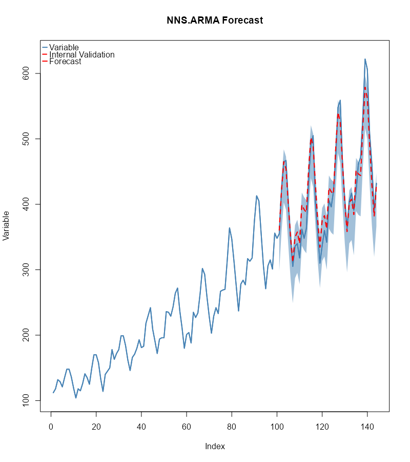
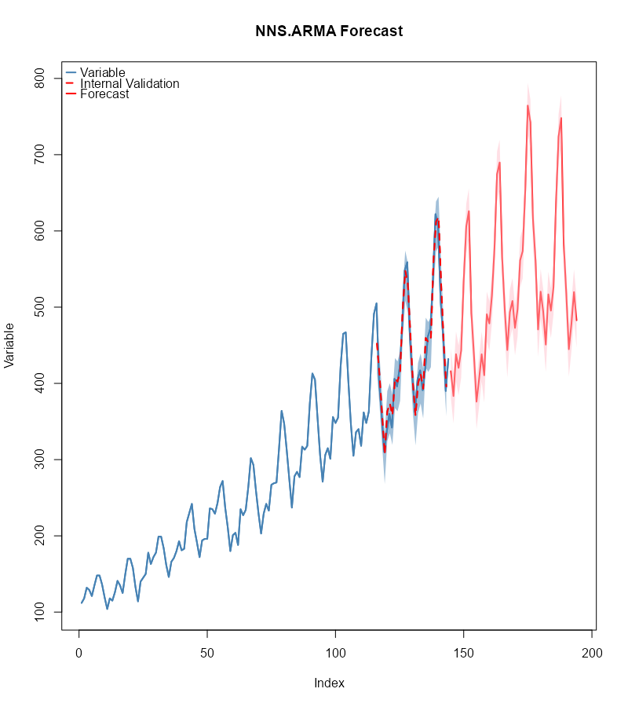

```{r setup, include=FALSE, message=FALSE}
knitr::opts_chunk$set(echo = TRUE)
library(NNS)
library(data.table)
data.table::setDTthreads(2L)
options(mc.cores = 1)
Sys.setenv("OMP_THREAD_LIMIT" = 2)
```

```{r setup2, message=FALSE, warning = FALSE}
library(NNS)
library(data.table)
require(knitr)
require(rgl)
```

# Forecasting

The underlying assumptions of traditional autoregressive models are well known. The resulting complexity with these models leads to observations such as,

*\`\`We have found that choosing the wrong model or parameters can often yield poor results, and it is unlikely that even experienced analysts can choose the correct model and parameters efficiently given this array of choices.''*

`NNS` simplifies the forecasting process. Below are some examples demonstrating **`NNS.ARMA`** and its **assumption free, minimal parameter** forecasting method.

## Linear Regression

**`NNS.ARMA`** has the ability to fit a linear regression to the relevant component series, yielding very fast results. For our running example we will use the `AirPassengers` dataset loaded in base R.

We will forecast 44 periods `h = 44` of `AirPassengers` using the first 100 observations `training.set = 100`, returning estimates of the final 44 observations. We will then test this against our validation set of `tail(AirPassengers,44)`.

Since this is monthly data, we will try a `seasonal.factor = 12`.

Below is the linear fit and associated root mean squared error (RMSE) using `method = "lin"`.

```{r linear,fig.width=5,fig.height=3,fig.align = "center", warning=FALSE}
nns_lin = NNS.ARMA(AirPassengers, 
               h = 44, 
               training.set = 100, 
               method = "lin", 
               plot = TRUE, 
               seasonal.factor = 12, 
               seasonal.plot = FALSE)

sqrt(mean((nns_lin - tail(AirPassengers, 44)) ^ 2))
```

## Nonlinear Regression

Now we can try using a nonlinear regression on the relevant component series using `method = "nonlin"`.

```{r nonlinear,fig.width=5,fig.height=3,fig.align = "center", eval = FALSE}
nns_nonlin = NNS.ARMA(AirPassengers, 
               h = 44, 
               training.set = 100, 
               method = "nonlin", 
               plot = FALSE, 
               seasonal.factor = 12, 
               seasonal.plot = FALSE)

sqrt(mean((nns_nonlin - tail(AirPassengers, 44)) ^ 2))
```

```{r nonlinearres, eval = FALSE}
[1] 19.08952
```

## Cross-Validation

We can test a series of `seasonal.factors` and select the best one to fit. The largest period to consider would be `0.5 * length(variable)`, since we need more than 2 points for a regression! Remember, we are testing the first 100 observations of `AirPassengers`, not the full 144 observations.

```{r seasonal test, eval=TRUE}
seas = t(sapply(1 : 25, function(i) c(i, sqrt( mean( (NNS.ARMA(AirPassengers, h = 44, training.set = 100, method = "lin", seasonal.factor = i, plot=FALSE) - tail(AirPassengers, 44)) ^ 2) ) ) ) )

colnames(seas) = c("Period", "RMSE")
seas
```

Now we know `seasonal.factor = 12` is our best fit, we can see if there's any benefit from using a nonlinear regression. Alternatively, we can define our best fit as the corresponding `seas$Period` entry of the minimum value in our `seas$RMSE` column.

```{r best fit, eval=TRUE}
a = seas[which.min(seas[ , 2]), 1]
```

Below you will notice the use of `seasonal.factor = a` generates the same output.

```{r best nonlinear,fig.width=5,fig.height=3,fig.align = "center", eval=TRUE}
nns = NNS.ARMA(AirPassengers, 
               h = 44, 
               training.set = 100, 
               method = "nonlin", 
               seasonal.factor = a, 
               plot = TRUE, seasonal.plot = FALSE)

sqrt(mean((nns - tail(AirPassengers, 44)) ^ 2))
```

**Note:** You may experience instances with monthly data that report `seasonal.factor` close to multiples of 3, 4, 6 or 12. For instance, if the reported `seasonal.factor = {37, 47, 71, 73}` use `(seasonal.factor = c(36, 48, 72))` by setting the `modulo` parameter in **`NNS.seas(..., modulo = 12)`**. The same suggestion holds for daily data and multiples of 7, or any other time series with logically inferred cyclical patterns. The nearest periods to that `modulo` will be in the expanded output.

```{r modulo, eval=TRUE}
NNS.seas(AirPassengers, modulo = 12, plot = FALSE)
```

## Cross-Validating All Combinations of `seasonal.factor`

NNS also offers a wrapper function **`NNS.ARMA.optim()`** to test a given vector of `seasonal.factor` and returns the optimized objective function (in this case RMSE written as `obj.fn = expression( sqrt(mean((predicted - actual)^2)) )`) and the corresponding periods, as well as the **`NNS.ARMA`** regression method used. Alternatively, using external package objective functions work as well such as `obj.fn = expression(Metrics::rmse(actual, predicted))`.

**`NNS.ARMA.optim()`** will also test whether to regress the underlying data first, `shrink` the estimates to their subset mean values, include a `bias.shift` based on its internal validation errors, and compare different `weights` of both linear and nonlinear estimates.

Given our monthly dataset, we will try multiple years by setting `seasonal.factor = seq(12, 60, 6)` every 6 months based on our **NNS.seas()** insights above.

```{r best optim, eval=FALSE}
nns.optimal = NNS.ARMA.optim(AirPassengers,
                             training.set = 100, 
                             seasonal.factor = seq(12, 60, 6),
                             obj.fn = expression( sqrt(mean((predicted - actual)^2)) ),
                             objective = "min",
                             pred.int = .95, plot = TRUE)

nns.optimal
```

```{r optimres, eval=FALSE}
[1] "CURRNET METHOD: lin"
[1] "COPY LATEST PARAMETERS DIRECTLY FOR NNS.ARMA() IF ERROR:"
[1] "NNS.ARMA(... method =  'lin' , seasonal.factor =  c( 12 ) ...)"
[1] "CURRENT lin OBJECTIVE FUNCTION = 35.3996540135277"
[1] "BEST method = 'lin', seasonal.factor = c( 12 )"
[1] "BEST lin OBJECTIVE FUNCTION = 35.3996540135277"
[1] "CURRNET METHOD: nonlin"
[1] "COPY LATEST PARAMETERS DIRECTLY FOR NNS.ARMA() IF ERROR:"
[1] "NNS.ARMA(... method =  'nonlin' , seasonal.factor =  c( 12 ) ...)"
[1] "CURRENT nonlin OBJECTIVE FUNCTION = 19.0895171392988"
[1] "BEST method = 'nonlin' PATH MEMBER = c( 12 )"
[1] "BEST nonlin OBJECTIVE FUNCTION = 19.0895171392988"
[1] "CURRNET METHOD: both"
[1] "COPY LATEST PARAMETERS DIRECTLY FOR NNS.ARMA() IF ERROR:"
[1] "NNS.ARMA(... method =  'both' , seasonal.factor =  c( 12 ) ...)"
[1] "CURRENT both OBJECTIVE FUNCTION = 20.0208827759805"
[1] "BEST method = 'both' PATH MEMBER = c( 12 )"
[1] "BEST both OBJECTIVE FUNCTION = 20.0208827759805"

$periods
[1] 12

$weights
NULL

$obj.fn
[1] 19.08952

$method
[1] "nonlin"

$shrink
[1] FALSE

$nns.regress
[1] FALSE

$bias.shift
[1] 12.98564

$errors
 [1] -12.0495905 -19.5023885 -18.2981119 -30.4665605 -21.9967015 -16.3628298 -12.6732257  -6.5326720  -2.6001984   2.4174837  16.6574755  24.0964052  12.0029210   7.8864972
[15]  -0.7526824 -26.4198893  13.6743157   1.1898601   9.1072756  21.4715719   6.7525111   4.8906862   4.2365576   7.3550199 -13.0332099  11.5312825 -13.3811215 -38.0718182
[29]  -9.1722183 -16.7654853 -15.6320492 -16.6258142 -20.9585009 -17.7797833  23.1094829 -26.2441253 -32.9356676 -10.9914301 -43.5503011 -42.9210270 -18.3345370 -41.0428440
[43] -16.6856697 -14.3112243

$results
 [1] 367.2436 434.2309 475.4251 466.0525 408.8137 351.4028 314.1035 349.9560 360.7297 344.0150 404.9673 395.9562 403.5391 481.8420 524.8017 514.4792 449.7271 383.9011 344.2954
[20] 381.7502 393.6684 374.3115 440.7254 430.6735 439.6573 529.9649 575.8305 563.5087 491.6055 417.3832 375.4477 415.3411 426.4797 404.3205 477.0713 465.6752 476.0429 577.7528
[39] 625.7779 612.1436 532.8523 450.2214 405.9714 447.7560

$lower.pred.int
 [1] 311.4778 378.4651 419.6593 410.2867 353.0479 295.6370 258.3377 294.1902 304.9639 288.2492 349.2015 340.1904 347.7733 426.0762 469.0359 458.7134 393.9613 328.1353 288.5296
[20] 325.9844 337.9026 318.5457 384.9596 374.9077 383.8915 474.1991 520.0647 507.7429 435.8397 361.6174 319.6819 359.5754 370.7139 348.5547 421.3055 409.9094 420.2771 521.9870
[39] 570.0121 556.3778 477.0865 394.4556 350.2056 391.9902

$upper.pred.int
 [1] 403.2159 470.2031 511.3974 502.0248 444.7859 387.3751 350.0757 385.9283 396.7020 379.9873 440.9395 431.9285 439.5114 517.8142 560.7740 550.4515 485.6994 419.8733 380.2677
[20] 417.7225 429.6407 410.2837 476.6977 466.6457 475.6296 565.9371 611.8028 599.4809 527.5778 453.3555 411.4200 451.3134 462.4520 440.2928 513.0435 501.6474 512.0151 613.7250
[39] 661.7502 648.1159 568.8246 486.1937 441.9437 483.7283

```

<center>

{width="600" height="400"}

</center>


## Extension of Estimates

We can forecast another 50 periods out-of-sample (`h = 50`), by dropping the `training.set` parameter while generating the 95% prediction intervals.

```{r extension,results='hide',fig.width=5,fig.height=3,fig.align = "center", eval=FALSE}
NNS.ARMA.optim(AirPassengers, 
                seasonal.factor = seq(12, 60, 6),
                obj.fn = expression( sqrt(mean((predicted - actual)^2)) ),
                objective = "min",
                pred.int = .95, h = 50, plot = TRUE)
```

<center>

{width="600" height="400"}

</center>

## Brief Notes on Other Parameters

-   `seasonal.factor = c(1, 2, ...)`

We included the ability to use any number of specified seasonal periods simultaneously, weighted by their strength of seasonality. Computationally expensive when used with nonlinear regressions and large numbers of relevant periods.

-   `weights`

Instead of weighting by the `seasonal.factor` strength of seasonality, we offer the ability to weight each per any defined compatible vector summing to 1.\
Equal weighting would be `weights = "equal"`.

-   `pred.int`

Provides the values for the specified prediction intervals within [0,1] for each forecasted point and plots the bootstrapped replicates for the forecasted points.

-   `seasonal.factor = FALSE`

We also included the ability to use all detected seasonal periods simultaneously, weighted by their strength of seasonality. Computationally expensive when used with nonlinear regressions and large numbers of relevant periods.

-   `best.periods`

This parameter restricts the number of detected seasonal periods to use, again, weighted by their strength. To be used in conjunction with `seasonal.factor = FALSE`.

-   `modulo`

To be used in conjunction with `seasonal.factor = FALSE`. This parameter will ensure logical seasonal patterns (i.e., `modulo = 7` for daily data) are included along with the results.

-   `mod.only`

To be used in conjunction with `seasonal.factor = FALSE & modulo != NULL`. This parameter will ensure empirical patterns are kept along with the logical seasonal patterns.

-   `dynamic = TRUE`

This setting generates a new seasonal period(s) using the estimated values as continuations of the variable, either with or without a `training.set`. Also computationally expensive due to the recalculation of seasonal periods for each estimated value.

-   `plot` , `seasonal.plot`

These are the plotting arguments, easily enabled or disabled with `TRUE` or `FALSE`. `seasonal.plot = TRUE` will not plot without `plot = TRUE`. If a seasonal analysis is all that is desired, `NNS.seas` is the function specifically suited for that task.

# Multivariate Time Series Forecasting

The extension to a generalized multivariate instance is provided in the following documentation of the **`NNS.VAR()`** function:

-   [Multivariate Time Series Forecasting: Nonparametric Vector Autoregression Using NNS](https://doi.org/10.2139/ssrn.3489550)

# References

If the user is so motivated, detailed arguments and proofs are provided within the following:

-   [Nonlinear Nonparametric Statistics: Using Partial Moments](https://github.com/OVVO-Financial/NNS/blob/NNS-Beta-Version/examples/index.md)

-   [Forecasting Using NNS](https://doi.org/10.2139/ssrn.3382300)

```{r threads, echo = FALSE}
Sys.setenv("OMP_THREAD_LIMIT" = "")
```