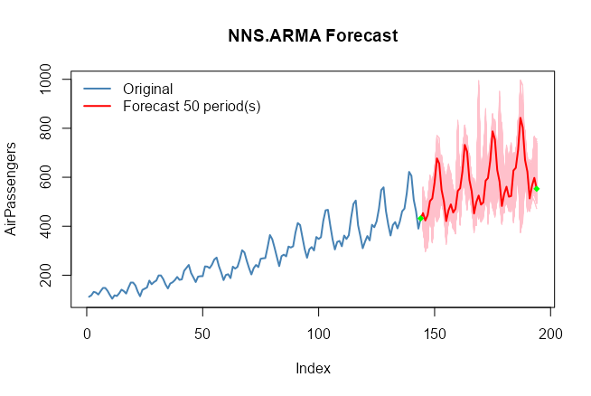

```{r setup, include=FALSE}
knitr::opts_chunk$set(echo = TRUE)
options(mc.cores=2)
```

```{r setup2, message=FALSE, warning = FALSE}
library(NNS)
library(data.table)
require(knitr)
require(rgl)
require(meboot)
```

# Forecasting

The underlying assumptions of traditional autoregressive models are well known. The resulting complexity with these models leads to observations such as,

*\`\`We have found that choosing the wrong model or parameters can often yield poor results, and it is unlikely that even experienced analysts can choose the correct model and parameters efficiently given this array of choices.''*

`NNS` simplifies the forecasting process. Below are some examples demonstrating **`NNS.ARMA`** and its **assumption free, minimal parameter** forecasting method.

## Linear Regression

**`NNS.ARMA`** has the ability to fit a linear regression to the relevant component series, yielding very fast results. For our running example we will use the `AirPassengers` dataset loaded in base R.

We will forecast 44 periods `h = 44` of `AirPassengers` using the first 100 observations `training.set = 100`, returning estimates of the final 44 observations. We will then test this against our validation set of `tail(AirPassengers,44)`.

Since this is monthly data, we will try a `seasonal.factor = 12`.

Below is the linear fit and associated root mean squared error (RMSE) using `method = "lin"`.

```{r linear,fig.width=5,fig.height=3,fig.align = "center", warning=FALSE}
nns = NNS.ARMA(AirPassengers, 
               h = 44, 
               training.set = 100, 
               method = "lin", 
               plot = TRUE, 
               seasonal.factor = 12, 
               seasonal.plot = FALSE)

sqrt(mean((nns - tail(AirPassengers, 44)) ^ 2))
```

## Nonlinear Regression

Now we can try using a nonlinear regression on the relevant component series using `method = "nonlin"`.

```{r nonlinear,fig.width=5,fig.height=3,fig.align = "center", eval = FALSE}
nns = NNS.ARMA(AirPassengers, 
               h = 44, 
               training.set = 100, 
               method = "nonlin", 
               plot = FALSE, 
               seasonal.factor = 12, 
               seasonal.plot = FALSE)

sqrt(mean((nns - tail(AirPassengers, 44)) ^ 2))
```

```{r nonlinearres, eval = FALSE}
[1] 19.49762
```

## Cross-Validation

We can test a series of `seasonal.factors` and select the best one to fit. The largest period to consider would be `0.5 * length(variable)`, since we need more than 2 points for a regression! Remember, we are testing the first 100 observations of `AirPassengers`, not the full 144 observations.

```{r seasonal test, eval=TRUE}
seas = t(sapply(1 : 25, function(i) c(i, sqrt( mean( (NNS.ARMA(AirPassengers, h = 44, training.set = 100, method = "lin", seasonal.factor = i, plot=FALSE) - tail(AirPassengers, 44)) ^ 2) ) ) ) )

colnames(seas) = c("Period", "RMSE")
seas
```

Now we know `seasonal.factor = 12` is our best fit, we can see if there's any benefit from using a nonlinear regression. Alternatively, we can define our best fit as the corresponding `seas$Period` entry of the minimum value in our `seas$RMSE` column.

```{r best fit, eval=TRUE}
a = seas[which.min(seas[ , 2]), 1]
```

Below you will notice the use of `seasonal.factor = a` generates the same output.

```{r best nonlinear,fig.width=5,fig.height=3,fig.align = "center", eval=TRUE}
nns = NNS.ARMA(AirPassengers, 
               h = 44, 
               training.set = 100, 
               method = "nonlin", 
               seasonal.factor = a, 
               plot = TRUE, seasonal.plot = FALSE)

sqrt(mean((nns - tail(AirPassengers, 44)) ^ 2))
```

**Note:** You may experience instances with monthly data that report `seasonal.factor` close to multiples of 3, 4, 6 or 12. For instance, if the reported `seasonal.factor = {37, 47, 71, 73}` use `(seasonal.factor = c(36, 48, 72))` by setting the `modulo` parameter in **`NNS.seas(..., modulo = 12)`**. The same suggestion holds for daily data and multiples of 7, or any other time series with logically inferred cyclical patterns. The nearest periods to that `modulo` will be in the expanded output.

```{r modulo, eval=TRUE}
NNS.seas(AirPassengers, modulo = 12, plot = FALSE)
```

## Cross-Validating All Combinations of `seasonal.factor`

NNS also offers a wrapper function **`NNS.ARMA.optim()`** to test a given vector of `seasonal.factor` and returns the optimized objective function (in this case RMSE written as `obj.fn = expression( sqrt(mean((predicted - actual)^2)) )`) and the corresponding periods, as well as the **`NNS.ARMA`** regression method used.

Given our monthly dataset, we will try multiple years by setting `seasonal.factor = seq(12, 36, 6)` every 6 months based on our **NNS.seas()** insights above.

```{r best optim, eval=FALSE}
nns.optimal = NNS.ARMA.optim(AirPassengers, 
                             training.set = 100, 
                             seasonal.factor = seq(12, 60, 6),
                             obj.fn = expression( sqrt(mean((predicted - actual)^2)) ),
                             objective = "min",
                             pred.int = .95)

nns.optimal
```

```{r optimres, eval=FALSE}
[1] "CURRNET METHOD: lin"
[1] "COPY LATEST PARAMETERS DIRECTLY FOR NNS.ARMA() IF ERROR:"
[1] "NNS.ARMA(... method =  'lin' , seasonal.factor =  c( 12 ) ...)"
[1] "CURRENT lin OBJECTIVE FUNCTION = 35.3996540135277"
[1] "BEST method = 'lin', seasonal.factor = c( 12 )"
[1] "BEST lin OBJECTIVE FUNCTION = 35.3996540135277"
[1] "CURRNET METHOD: nonlin"
[1] "COPY LATEST PARAMETERS DIRECTLY FOR NNS.ARMA() IF ERROR:"
[1] "NNS.ARMA(... method =  'nonlin' , seasonal.factor =  c( 12 ) ...)"
[1] "CURRENT nonlin OBJECTIVE FUNCTION = 19.4976178189546"
[1] "BEST method = 'nonlin' PATH MEMBER = c( 12 )"
[1] "BEST nonlin OBJECTIVE FUNCTION = 19.4976178189546"
[1] "CURRNET METHOD: both"
[1] "COPY LATEST PARAMETERS DIRECTLY FOR NNS.ARMA() IF ERROR:"
[1] "NNS.ARMA(... method =  'both' , seasonal.factor =  c( 12 ) ...)"
[1] "CURRENT both OBJECTIVE FUNCTION = 26.6112299452096"
[1] "BEST method = 'both' PATH MEMBER = c( 12 )"
[1] "BEST both OBJECTIVE FUNCTION = 26.6112299452096"
$periods
[1] 12

$weights
NULL

$obj.fn
[1] 19.49762

$method
[1] "nonlin"

$shrink
[1] FALSE

$nns.regress
[1] FALSE

$bias.shift
[1] 0

$errors
 [1] -12.0495905 -19.5023885 -18.2981119 -30.4665605 -21.9967015 -16.3628298
 [7] -12.6732257  -5.7137170  -2.6001984   2.2792659  17.1994048  24.2420635
[13]   6.6919485  -1.2269250  -8.4029057 -34.4569779   6.9539623  -2.5920976
[19]   4.8338436  18.5863427   1.8098569  -0.3087157  -1.1892791   2.5325891
[25] -22.4687006  -4.9819699 -27.7262972 -52.7041072 -21.5667488 -23.9122298
[31] -23.6982624 -23.0856682 -29.9142644 -27.1628466  12.6507957 -35.1714729
[37] -46.1877025 -34.0820674 -63.4664903 -63.3893474 -35.6270575 -51.0256013
[43] -27.9853043 -23.5848310

$results
 [1] 354.2580 421.2452 462.4395 453.0669 395.8280 338.4172 301.1178 338.6083
 [9] 347.7440 330.7530 393.0655 383.2619 390.9250 468.8563 511.8161 501.4936
[17] 436.7415 370.9154 331.3098 371.0849 380.7716 361.0259 430.2580 418.6685
[25] 427.7316 516.8815 561.5732 550.3086 478.0325 403.7194 361.7944 403.9807
[33] 413.6136 390.9586 467.3674 453.9804 464.4469 564.6356 611.0813 598.8694
[41] 519.0765 436.3233 392.0875 436.6022

$lower.pred.int
 [1] 291.6700 358.6573 399.8515 390.4789 333.2401 275.8292 238.5299 276.0203
 [9] 285.1561 268.1650 330.4775 320.6740 328.3370 406.2684 449.2281 438.9056
[17] 374.1535 308.3275 268.7218 308.4970 318.1836 298.4380 367.6701 356.0805
[25] 365.1437 454.2935 498.9853 487.7206 415.4446 341.1314 299.2065 341.3928
[33] 351.0256 328.3706 404.7794 391.3924 401.8589 502.0477 548.4933 536.2814
[41] 456.4885 373.7353 329.4996 374.0142

$upper.pred.int
 [1] 416.8459 483.8332 525.0274 515.6548 458.4160 401.0052 363.7058 401.1962
 [9] 410.3320 393.3409 455.6534 445.8499 453.5129 531.4443 574.4040 564.0815
[17] 499.3294 433.5034 393.8977 433.6729 443.3595 423.6139 492.8460 481.2564
[25] 490.3196 579.4694 624.1612 612.8965 540.6205 466.3074 424.3824 466.5687
[33] 476.2015 453.5465 529.9553 516.5683 527.0349 627.2236 673.6692 661.4573
[41] 581.6644 498.9112 454.6755 499.1901
```

```{r optimsubs, echo = FALSE}
nns.optimal = list()
nns.optimal$periods = 12
nns.optimal$weights = NULL
nns.optimal$method = "nonlin"
nns.optimal$shrink = FALSE
nns.optimal$results = c(354.2580, 421.2452, 462.4395, 453.0669, 395.8280, 338.4172, 301.1178, 338.6083, 347.7440, 330.7530, 393.0655, 383.2619, 390.9250, 468.8563, 511.8161, 501.4936, 436.7415, 370.9154, 331.3098, 371.0849, 380.7716, 361.0259, 430.2580, 418.6685, 427.7316, 516.8815, 561.5732, 550.3086, 478.0325, 403.7194, 361.7944, 403.9807, 413.6136, 390.9586, 467.3674, 453.9804, 464.4469, 564.6356, 611.0813, 598.8694, 519.0765, 436.3233, 392.0875, 436.6022)

nns.optimal$bias.shift = 0
```

Using our new parameters via the `nns.optimal$results` yields the same results:

```{r best optim2, eval=TRUE}
sqrt(mean((nns.optimal$results - tail(AirPassengers, 44)) ^ 2))
```

## `$bias.shift`

**`NNS.ARMA.optim`** will return a `$bias.shift`, which is to be added to the ultimate **`NNS.ARMA`** forecast when using the optimum parameters from the **`NNS.ARMA.optim`** call.

```{r best optim3, eval=TRUE}
sqrt(mean((nns+nns.optimal$bias.shift - tail(AirPassengers, 44)) ^ 2))
```

### Negative values and `$bias.shift`

If the variable cannot logically assume negative values, then simply limit the `NNS` estimates.

```{r neg, eval=TRUE}
nns <- pmax(0, nns + nns.optimal$bias.shift)
sqrt(mean((nns - tail(AirPassengers, 44)) ^ 2))
```

## Extension of Estimates

Using our cross-validated parameters (`seasonal.factor` and `method`) we can forecast another 50 periods out-of-sample (`h = 50`), by dropping the `training.set` parameter while generating the 95% confidence intervals.

```{r extension,results='hide',fig.width=5,fig.height=3,fig.align = "center", eval=FALSE}
NNS.ARMA(AirPassengers, 
         h = 50,
         pred.int = .95,
         seasonal.factor = nns.optimal$periods, 
         method  = nns.optimal$method, 
         weights = nns.optimal$weights, 
         shrink = nns.optimal$shrink,
         plot = TRUE, seasonal.plot = FALSE) + nns.optimal$bias.shift
```

<center>

{width="480" height="288"}

</center>

## Brief Notes on Other Parameters

-   `seasonal.factor = c(1, 2, ...)`

We included the ability to use any number of specified seasonal periods simultaneously, weighted by their strength of seasonality. Computationally expensive when used with nonlinear regressions and large numbers of relevant periods.

-   `weights`

Instead of weighting by the `seasonal.factor` strength of seasonality, we offer the ability to weight each per any defined compatible vector summing to 1.\
Equal weighting would be `weights = "equal"`.

-   `pred.int`

Provides the values for the specified prediction intervals within [0,1] for each forecasted point and plots the bootstrapped replicates for the forecasted points.

-   `seasonal.factor = FALSE`

We also included the ability to use all detected seasonal periods simultaneously, weighted by their strength of seasonality. Computationally expensive when used with nonlinear regressions and large numbers of relevant periods.

-   `best.periods`

This parameter restricts the number of detected seasonal periods to use, again, weighted by their strength. To be used in conjunction with `seasonal.factor = FALSE`.

-   `modulo`

To be used in conjunction with `seasonal.factor = FALSE`. This parameter will ensure logical seasonal patterns (i.e., `modulo = 7` for daily data) are included along with the results.

-   `mod.only`

To be used in conjunction with `seasonal.factor = FALSE & modulo != NULL`. This parameter will ensure empirical patterns are kept along with the logical seasonal patterns.

-   `dynamic = TRUE`

This setting generates a new seasonal period(s) using the estimated values as continuations of the variable, either with or without a `training.set`. Also computationally expensive due to the recalculation of seasonal periods for each estimated value.

-   `plot` , `seasonal.plot`

These are the plotting arguments, easily enabled or disabled with `TRUE` or `FALSE`. `seasonal.plot = TRUE` will not plot without `plot = TRUE`. If a seasonal analysis is all that is desired, `NNS.seas` is the function specifically suited for that task.

# Multivariate Time Series Forecasting

The extension to a generalized multivariate instance is provided in the following documentation of the **`NNS.VAR()`** function:

-   [Multivariate Time Series Forecasting: Nonparametric Vector Autoregression Using NNS](https://www.ssrn.com/abstract=3489550)

# References

If the user is so motivated, detailed arguments and proofs are provided within the following:

-   [Nonlinear Nonparametric Statistics: Using Partial Moments](https://www.amazon.com/dp/1490523995/ref=cm_sw_su_dp)

-   [Forecasting Using NNS](https://www.ssrn.com/abstract=3382300)
